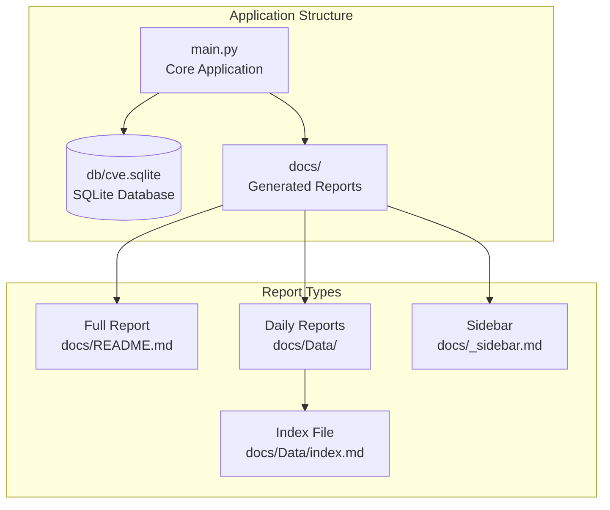
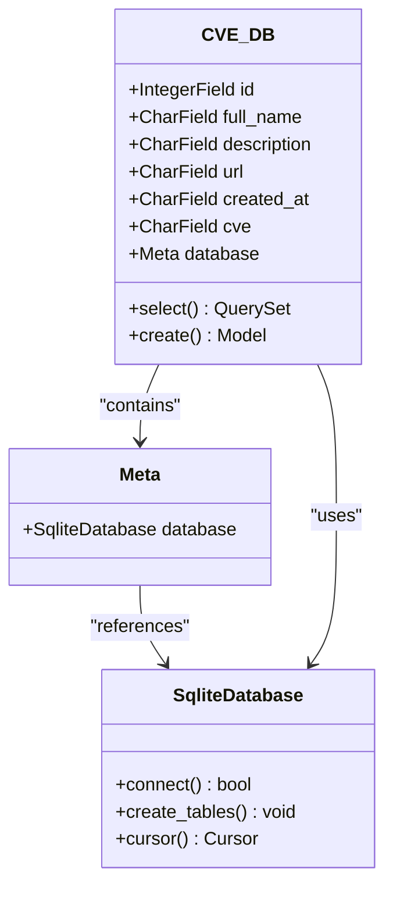
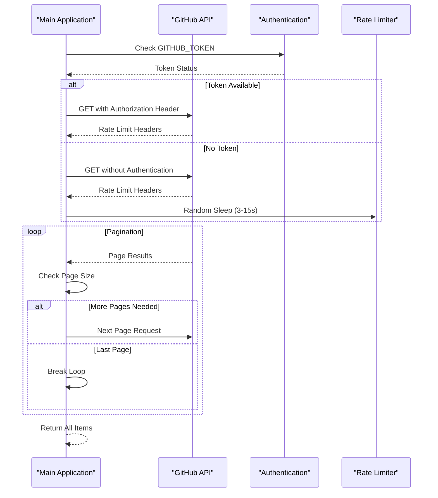
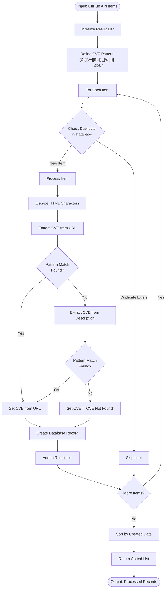
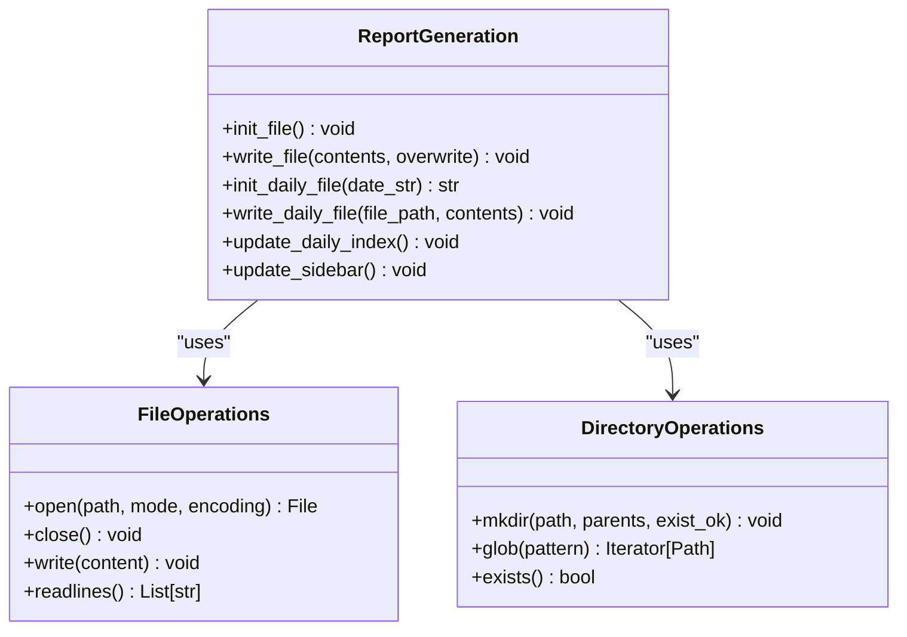

# Core Components

<cite>
**Referenced Files in This Document**
- [main.py](file://main.py)
- [README.md](file://README.md)
- [requirements.txt](file://requirements.txt)
</cite>

## Table of Contents
1. [Introduction](#introduction)
2. [Project Structure](#project-structure)
3. [Core Components Overview](#core-components-overview)
4. [CVE_DB Database Model](#cve_db-database-model)
5. [GitHub API Client (get_info)](#github-api-client-get_info)
6. [Data Processor (db_match)](#data-processor-db_match)
7. [Report Generation Functions](#report-generation-functions)
8. [Data Pipeline Architecture](#data-pipeline-architecture)
9. [Error Handling and Fallback Mechanisms](#error-handling-and-fallback-mechanisms)
10. [Performance Considerations](#performance-considerations)
11. [Integration Points](#integration-points)
12. [Conclusion](#conclusion)

## Introduction

The github_cve_monitor application is a sophisticated Python-based system designed to automatically monitor GitHub repositories for CVE (Common Vulnerabilities and Exposures) information. The application implements a comprehensive data pipeline that extracts CVE-related repositories from GitHub, processes the data, stores it in a local SQLite database, and generates both full reports and daily intelligence briefings.

The system consists of four primary functional components: the database model (CVE_DB), the GitHub API client (get_info), the data processor (db_match), and the report generation functions (init_file, write_file, etc.). These components work together to create a robust monitoring solution that handles API rate limits, data extraction, storage, and reporting.

## Project Structure

The application follows a simple yet effective modular structure centered around a single main.py file that contains all core functionality. The project utilizes a hierarchical directory structure for storing generated reports and data.



**Diagram sources**
- [main.py](file://main.py#L1-L420)

**Section sources**
- [main.py](file://main.py#L1-L420)
- [README.md](file://README.md#L1-L76)

## Core Components Overview

The github_cve_monitor application is built around four essential components that handle different aspects of the CVE monitoring workflow:

1. **CVE_DB**: A Peewee ORM database model that defines the structure for storing CVE-related repository data
2. **get_info()**: A GitHub API client that retrieves repository data using pagination and handles authentication
3. **db_match()**: A data processor that extracts CVE identifiers using regular expressions and manages database operations
4. **Report Generation Functions**: A suite of functions responsible for creating and maintaining various report formats

Each component plays a crucial role in the overall data pipeline, from initial API requests to final report generation.

## CVE_DB Database Model

The CVE_DB class serves as the central data storage mechanism for the application, utilizing the Peewee ORM framework to manage SQLite database operations.



**Diagram sources**
- [main.py](file://main.py#L24-L33)

### Database Schema Design

The CVE_DB model defines six key fields that capture essential information about each CVE-related repository:

- **id**: Unique integer identifier for each repository
- **full_name**: Repository name with owner (e.g., "organization/repository")
- **description**: Repository description with HTML escaping for safety
- **url**: Direct link to the repository on GitHub
- **created_at**: ISO-formatted creation timestamp
- **cve**: Extracted CVE identifier in standardized format

### Database Operations

The database initialization process establishes a connection to the SQLite database and creates the necessary table structure:

```python
db = SqliteDatabase("db/cve.sqlite")
db.connect()
db.create_tables([CVE_DB])
```

The database operations are primarily handled through Peewee's query interface, with the most common operation being duplicate detection:

```python
if CVE_DB.select().where(CVE_DB.id == id).count() != 0:
    continue
```

This ensures that each repository is only processed once, preventing duplicate entries in the database.

**Section sources**
- [main.py](file://main.py#L24-L33)

## GitHub API Client (get_info)

The get_info function implements a robust GitHub API client that handles authentication, pagination, and rate limiting for retrieving CVE-related repository data.



**Diagram sources**
- [main.py](file://main.py#L165-L215)

### Authentication and Rate Limiting

The get_info function implements intelligent authentication handling based on the presence of a GitHub Personal Access Token:

```python
github_token = os.environ.get('GITHUB_TOKEN')
headers = {}

if github_token:
    headers['Authorization'] = f'token {github_token}'
    per_page = 100  # Increased limit with token
else:
    per_page = 30   # Standard limit without token
```

This approach allows the application to scale from basic unauthenticated requests to high-volume authenticated operations.

### Pagination Strategy

The function implements a robust pagination strategy that continues fetching pages until no more results are available:

```python
while True:
    api = f"https://api.github.com/search/repositories?q=CVE-{year}&sort=updated&page={page}&per_page={per_page}"
    response = requests.get(api, headers=headers)
    
    if len(items) < per_page:
        break  # Last page reached
    page += 1
```

### Error Handling

The function includes comprehensive error handling for network requests:

```python
try:
    # API request logic
    return all_items
except Exception as e:
    print("An error occurred in the network request", e)
    return None
```

This ensures graceful degradation when network issues occur.

**Section sources**
- [main.py](file://main.py#L165-L215)

## Data Processor (db_match)

The db_match function serves as the core data processing engine, extracting CVE identifiers using sophisticated regular expressions and managing the transformation of raw GitHub API data into structured records.



**Diagram sources**
- [main.py](file://main.py#L218-L259)

### CVE Pattern Matching

The db_match function employs a sophisticated regular expression to identify CVE identifiers in both repository URLs and descriptions:

```python
regex = r"[Cc][Vv][Ee][-_]\d{4}[-_]\d{4,7}"
```

This pattern matches various CVE formats including:
- CVE-2023-12345
- CVE_2023_12345
- cve-2023-12345
- CVE202312345

### Data Transformation Process

The function performs several critical transformations:

1. **HTML Escaping**: Prevents XSS attacks by escaping special characters
2. **Description Normalization**: Replaces empty descriptions with 'no description'
3. **CVE Standardization**: Converts all CVE identifiers to uppercase and replaces underscores with hyphens

### Duplicate Prevention

The function implements a dual-layer duplicate prevention system:

```python
# Database check
if CVE_DB.select().where(CVE_DB.id == id).count() != 0:
    continue

# Database insertion
CVE_DB.create(
    id=id,
    full_name=full_name,
    description=description,
    url=url,
    created_at=created_at,
    cve=cve.upper().replace('_','-')
)
```

This ensures data integrity and prevents redundant database operations.

**Section sources**
- [main.py](file://main.py#L218-L259)

## Report Generation Functions

The application includes a comprehensive suite of report generation functions that create both full historical reports and daily intelligence briefings in Markdown format.

### File Initialization Functions



**Diagram sources**
- [main.py](file://main.py#L38-L163)

#### init_file() - Full Report Initialization

The init_file function creates the main README.md file with a standardized header structure:

```python
def init_file():
    newline = "# Github CVE Monitor\n\n> Automatic monitor github cve using Github Actions \n\n Last generated : {}\n\n| CVE | 相关仓库（poc/exp） | 描述 | 日期 |\n|---|---|---|---|\n".format(datetime.now())
    with open('docs/README.md','w', encoding='utf-8') as f:
        f.write(newline)
```

This function establishes the foundation for the full historical report with proper Markdown table structure.

#### write_file() - Flexible Content Writing

The write_file function provides flexible content writing capabilities with support for both append and overwrite modes:

```python
def write_file(new_contents, overwrite=False):
    mode = 'w' if overwrite else 'a'
    with open('docs/README.md', mode, encoding='utf-8') as f:
        f.write(new_contents)
```

The overwrite parameter determines whether existing content is appended or replaced, enabling both incremental updates and complete regeneration.

### Daily Report Management

#### init_daily_file() - Dynamic Directory Creation

The init_daily_file function creates a hierarchical directory structure for organizing daily reports:

```python
def init_daily_file(date_str):
    today = datetime.now()
    year = today.year
    week_number = today.strftime("%W")
    month = today.strftime("%m")
    day = today.strftime("%d")
    
    dir_path = f"docs/Data/{year}-W{week_number}-{month}-{day}"
    Path(dir_path).mkdir(parents=True, exist_ok=True)
    
    file_path = f"{dir_path}/daily_{date_str}.md"
    # Write report header...
    
    return file_path
```

This creates a structure like: `docs/Data/2024-W35-08-22/daily_20240822.md`

#### write_daily_file() - Incremental Daily Updates

The write_daily_file function appends daily records to existing reports:

```python
def write_daily_file(file_path, new_contents):
    with open(file_path, 'a', encoding='utf-8') as f:
        f.write(new_contents)
```

### Index and Navigation Management

#### update_daily_index() - Automated Index Generation

The update_daily_index function maintains an index file that tracks all available daily reports:

```python
def update_daily_index():
    data_dir = Path("docs/Data")
    if not data_dir.exists():
        return
    
    # Create index file
    index_path = data_dir / "index.md"
    # Scan directories and create links...
    
    # Update sidebar
    update_sidebar()
```

This function scans the Data directory for all date-based subdirectories and creates navigation links for easy access.

#### update_sidebar() - Dynamic Navigation Updates

The update_sidebar function maintains navigation consistency across generated reports:

```python
def update_sidebar():
    sidebar_path = Path("docs/_sidebar.md")
    if not sidebar_path.exists():
        return
    
    # Read existing sidebar
    # Check for existing daily report link
    # Add link after homepage if not present
    # Write updated sidebar
```

**Section sources**
- [main.py](file://main.py#L38-L163)

## Data Pipeline Architecture

The github_cve_monitor application implements a sophisticated data pipeline that transforms raw GitHub API data into structured reports through a series of well-defined stages.

```mermaid
flowchart LR
subgraph "Data Sources"
GitHub[GitHub API<br/>CVE Repositories]
LocalDB[(Local SQLite<br/>Database)]
end
subgraph "Processing Stages"
API[get_info()<br/>API Client]
Extract[db_match()<br/>Data Processor]
Filter[Date Filtering<br/>Today's Data]
end
subgraph "Storage Layer"
DBStore[Database Storage]
FileStore[File System<br/>Markdown Reports]
end
subgraph "Output Generation"
FullReport[Full Report<br/>docs/README.md]
DailyReport[Daily Report<br/>docs/Data/...]
Index[Report Index<br/>docs/Data/index.md]
end
GitHub --> API
API --> Extract
Extract --> Filter
Filter --> DBStore
Extract --> DBStore
DBStore --> FileStore
FileStore --> FullReport
FileStore --> DailyReport
FileStore --> Index
```

**Diagram sources**
- [main.py](file://main.py#L280-L419)

### Pipeline Execution Flow

The main function orchestrates the entire data pipeline:

1. **Initialization Phase**: Setup database connection and create base report files
2. **Data Collection**: Retrieve yearly data from GitHub API (current year first)
3. **Processing Phase**: Apply db_match to extract and normalize data
4. **Filtering**: Separate today's data from historical data
5. **Storage**: Persist processed data to SQLite database
6. **Reporting**: Generate both full and daily reports
7. **Index Maintenance**: Update navigation and indexing

### Data Flow Patterns

The pipeline implements several key data flow patterns:

- **Incremental Processing**: New data is processed alongside existing data
- **Duplicate Prevention**: Database checks prevent redundant processing
- **Fallback Mechanisms**: Historical data retrieval when current data is unavailable
- **Hierarchical Organization**: Structured directory layout for daily reports

**Section sources**
- [main.py](file://main.py#L280-L419)

## Error Handling and Fallback Mechanisms

The application implements comprehensive error handling and fallback mechanisms to ensure robust operation under various conditions.

### API-Level Error Handling

The get_info function includes robust error handling for network operations:

```python
try:
    # API request logic
    return all_items
except Exception as e:
    print("An error occurred in the network request", e)
    return None
```

This ensures that individual API failures don't crash the entire application.

### Data Processing Resilience

The db_match function handles various edge cases during data processing:

```python
description = item["description"]
if description == "" or description == None:
    description = 'no description'
else:
    description = html.escape(description.strip())
```

### Fallback Data Retrieval

The main function implements intelligent fallback mechanisms when today's data is unavailable:

```python
if len(today_list) == 0:
    print("当日无数据，尝试获取最近7天的数据...")
    # Try recent 7-day data first
    cur.execute(f"SELECT * FROM CVE_DB WHERE created_at >= '{seven_days_ago}' ORDER BY created_at DESC;")
    recent_records = cur.fetchall()
    
    if len(recent_records) == 0:
        print("最近7天无数据，获取最近10条记录...")
        cur.execute("SELECT * FROM CVE_DB ORDER BY created_at DESC LIMIT 10;")
        recent_records = cur.fetchall()
```

### Graceful Degradation

The application gracefully degrades when certain components fail:

- Missing sidebar files are handled without crashing
- Non-existent data directories are created automatically
- Empty API responses are handled appropriately

**Section sources**
- [main.py](file://main.py#L165-L215)
- [main.py](file://main.py#L218-L259)
- [main.py](file://main.py#L350-L390)

## Performance Considerations

The application incorporates several performance optimization strategies to handle large-scale data processing efficiently.

### API Request Optimization

- **Token-Based Authentication**: Uses GitHub tokens to increase rate limits from 30 to 5000 requests per hour
- **Intelligent Pagination**: Stops requesting additional pages when fewer items are returned than requested
- **Random Delays**: Implements randomized delays between requests when no token is available to avoid rate limits

### Database Performance

- **Batch Operations**: Processes multiple items before committing to the database
- **Efficient Queries**: Uses Peewee's optimized query interface for duplicate checking
- **Connection Pooling**: Maintains a single database connection throughout the application lifecycle

### Memory Management

- **Streaming Processing**: Processes items individually rather than loading all data into memory
- **Lazy Evaluation**: Uses generators and iterators where appropriate
- **Resource Cleanup**: Properly closes file handles and database connections

### Caching Strategy

The application implements implicit caching through the database:
- Duplicate detection prevents redundant API calls
- Database queries cache frequently accessed data
- File system caching benefits from operating system-level caching

## Integration Points

The github_cve_monitor application integrates with several external systems and services to provide comprehensive CVE monitoring capabilities.

### GitHub API Integration

The application integrates directly with the GitHub REST API v3, utilizing:

- **Repository Search Endpoint**: `GET /search/repositories?q=CVE-{year}`
- **Authentication Headers**: Support for both authenticated and unauthenticated requests
- **Rate Limit Monitoring**: Tracks API usage through response headers

### File System Integration

The application maintains tight integration with the local file system:

- **Directory Structure**: Creates hierarchical organization for daily reports
- **File Naming Conventions**: Uses standardized naming for easy navigation
- **Encoding Management**: Ensures UTF-8 encoding for international character support

### Environment Integration

The application seamlessly integrates with the runtime environment:

- **Environment Variables**: Reads GITHUB_TOKEN from environment
- **System Locale**: Configures Chinese locale for proper date formatting
- **Path Resolution**: Uses pathlib for cross-platform path handling

### Third-Party Tool Integration

The application is designed to integrate with various third-party tools:

- **GitHub Actions**: Can be deployed as a scheduled workflow
- **Static Site Generators**: Produces Markdown files compatible with popular SSGs
- **Documentation Systems**: Generates reports compatible with MkDocs and similar platforms

**Section sources**
- [main.py](file://main.py#L165-L215)
- [main.py](file://main.py#L50-L88)

## Conclusion

The github_cve_monitor application demonstrates a well-architected solution for automated CVE monitoring that effectively balances functionality, reliability, and maintainability. The four core components—CVE_DB database model, get_info GitHub API client, db_match data processor, and report generation functions—work together to create a robust system capable of handling large-scale data processing while maintaining data integrity and providing useful insights.

Key strengths of the system include:

- **Scalable Architecture**: Modular design allows for easy extension and maintenance
- **Robust Error Handling**: Comprehensive fallback mechanisms ensure reliable operation
- **Performance Optimization**: Intelligent API usage and database operations minimize resource consumption
- **Flexible Reporting**: Multiple report formats serve different use cases and audiences
- **Production Ready**: Real-world considerations like rate limiting and authentication are properly addressed

The application serves as an excellent example of how to build production-quality automation tools that can operate reliably in cloud environments while providing valuable security intelligence to organizations monitoring their software supply chain.

Future enhancements could include statistical analysis capabilities, notification systems for new CVE discoveries, and expanded support for additional vulnerability databases beyond GitHub repositories.