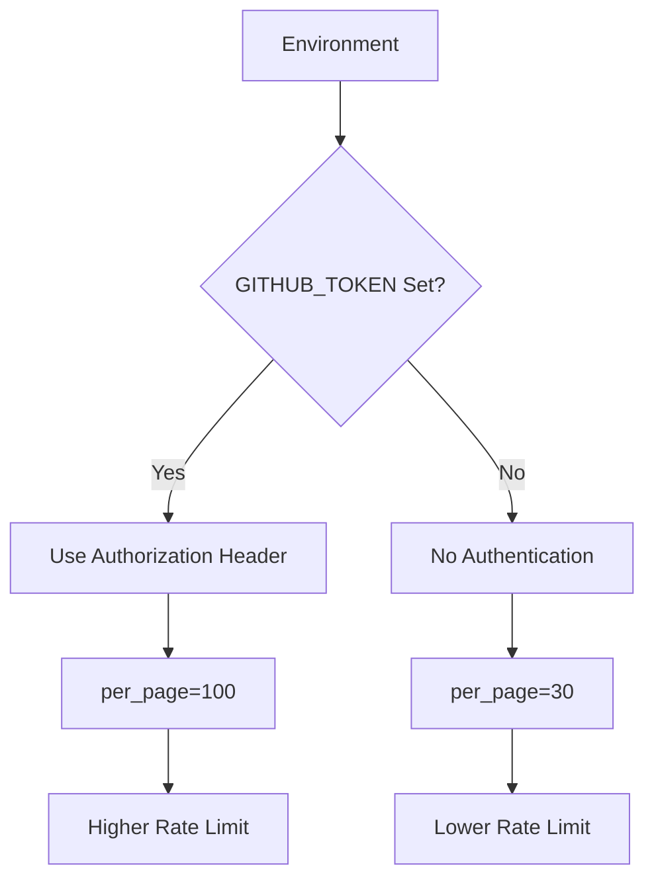

# Data Acquisition

<cite>
**Referenced Files in This Document**   
- [main.py](file://main.py)
- [requirements.txt](file://requirements.txt)
- [README.md](file://README.md)
</cite>

## Table of Contents
1. [Introduction](#introduction)
2. [GitHub API Request Construction](#github-api-request-construction)
3. [Authentication Mechanisms](#authentication-mechanisms)
4. [Pagination Handling](#pagination-handling)
5. [Rate Limit Management](#rate-limit-management)
6. [Error Handling and Retry Logic](#error-handling-and-retry-logic)
7. [Common Issues and Troubleshooting](#common-issues-and-troubleshooting)
8. [Optimization and Monitoring](#optimization-and-monitoring)

## Introduction
The data acquisition component of the GitHub CVE Monitor system centers around the `get_info()` function, which retrieves vulnerability-related repositories from GitHub's API. This document provides a comprehensive analysis of how the system constructs and executes GitHub API requests to search for CVEs by year, handles pagination, manages rate limits, and implements authentication. The system is designed to collect repositories containing proof-of-concept (PoC) or exploit code related to specific CVEs, storing them in a local database for monitoring and reporting purposes.

**Section sources**
- [main.py](file://main.py#L165-L215)
- [README.md](file://README.md#L1-L76)

## GitHub API Request Construction
The `get_info()` function constructs GitHub API requests using the search repositories endpoint with specific query parameters to find repositories related to CVEs from a given year. The API endpoint is constructed as follows:

```python
api = f"https://api.github.com/search/repositories?q=CVE-{year}&sort=updated&page={page}&per_page={per_page}"
```

The request includes several key parameters:
- **q**: Search query using "CVE-{year}" to find repositories containing CVE identifiers from the specified year
- **sort**: Results are sorted by "updated" timestamp to prioritize recently modified repositories
- **page**: Current page number for pagination
- **per_page**: Number of results per page, which varies based on authentication status

The function dynamically constructs the URL with the year parameter passed to the function, allowing for targeted searches of CVEs from specific years. This approach enables the system to systematically scan through historical CVE data by iterating through years in the `main()` function.

```mermaid
flowchart TD
Start([Start get_info()]) --> ConstructQuery["Construct API query with CVE-{year}"]
ConstructQuery --> CheckAuth["Check for GITHUB_TOKEN"]
CheckAuth --> |Token Present| SetPerPage100["Set per_page=100"]
CheckAuth --> |No Token| SetPerPage30["Set per_page=30"]
SetPerPage100 --> MakeRequest
SetPerPage30 --> MakeRequest
MakeRequest["Make API request with headers"] --> CheckResponse["Check response status"]
CheckResponse --> |Success| ProcessResults["Process items and check for more pages"]
CheckResponse --> |No Items| ReturnEmpty["Return empty list"]
ProcessResults --> |More pages| IncrementPage["page += 1"]
IncrementPage --> ApplyDelay["Apply random delay if unauthenticated"]
ApplyDelay --> MakeRequest
ProcessResults --> |No more pages| ReturnResults["Return all items"]
ReturnResults --> End([End get_info()])
```

**Diagram sources**
- [main.py](file://main.py#L165-L215)

**Section sources**
- [main.py](file://main.py#L165-L215)

## Authentication Mechanisms
The system implements authentication using the `GITHUB_TOKEN` environment variable, which significantly affects API request behavior and limitations. The authentication mechanism is implemented in the `get_info()` function:

```python
github_token = os.environ.get('GITHUB_TOKEN')
headers = {}

if github_token:
    headers['Authorization'] = f'token {github_token}'
else:
    per_page = 30
```

When the `GITHUB_TOKEN` environment variable is present, the system includes an Authorization header in API requests, which authenticates the user and provides elevated API rate limits. Authenticated requests can retrieve up to 100 results per page, while unauthenticated requests are limited to 30 results per page.

The system also supports GitHub Actions integration through the `GH_TOKEN` secret, as documented in the README. This dual-token approach allows the system to work in both local development environments and GitHub Actions workflows. The authentication status directly impacts the `per_page` parameter value, with authenticated requests using the maximum allowed value of 100, while unauthenticated requests fall back to the lower limit of 30.



**Diagram sources**
- [main.py](file://main.py#L165-L215)
- [README.md](file://README.md#L1-L76)

**Section sources**
- [main.py](file://main.py#L165-L215)
- [README.md](file://README.md#L1-L76)

## Pagination Handling
The system implements robust pagination handling to retrieve all results for a given year's CVE search. The `get_info()` function uses a while loop to iterate through pages until all results are collected:

```python
while True:
    api = f"https://api.github.com/search/repositories?q=CVE-{year}&sort=updated&page={page}&per_page={per_page}"
    response = requests.get(api, headers=headers)
    req = response.json()
    items = req.get("items")

    if not items:
        break

    all_items.extend(items)

    if len(items) < per_page:
        break
    
    page += 1
```

The pagination logic works by incrementing the page number and continuing requests until one of two conditions is met:
1. No items are returned in the response, indicating no more results exist
2. The number of items in the response is less than the `per_page` value, indicating the last page has been reached

This approach ensures that all available results are collected without making unnecessary requests. The system collects all items in a list (`all_items`) before returning them, providing a complete dataset for further processing in the `db_match()` function.

**Section sources**
- [main.py](file://main.py#L165-L215)

## Rate Limit Management
The system implements several strategies for managing GitHub API rate limits, with different behaviors for authenticated and unauthenticated requests. The rate limit management is evident in both the request parameters and the delay mechanisms:

```python
if 'X-RateLimit-Limit' in response.headers:
    print(f"API Rate Limit: {response.headers.get('X-RateLimit-Remaining')}/{response.headers.get('X-RateLimit-Limit')}")
```

The system monitors rate limit headers in API responses and logs the current usage. For authenticated requests, users benefit from a much higher rate limit (5,000 requests per hour) compared to unauthenticated requests (60 requests per hour), as documented in the README.

To avoid exceeding rate limits, the system implements a random delay mechanism for unauthenticated requests:

```python
if not github_token:
    count = random.randint(3, 15)
    time.sleep(count)
```

This random delay of 3-15 seconds between requests helps prevent the system from hitting rate limits when running without authentication. The delay is only applied to unauthenticated requests, as authenticated requests have higher limits and can make requests more frequently.

Additionally, the system uses different `per_page` values based on authentication status (100 for authenticated, 30 for unauthenticated), which affects how many requests are needed to retrieve the same amount of data.

**Section sources**
- [main.py](file://main.py#L165-L215)
- [README.md](file://README.md#L1-L76)

## Error Handling and Retry Logic
The system implements basic error handling in the `get_info()` function using a try-except block to catch network request failures:

```python
try:
    # API request code
except Exception as e:
    print("An error occurred in the network request", e)
    return None
```

While the current implementation provides basic exception handling, it lacks sophisticated retry logic for network failures. When an error occurs, the function prints the error message and returns `None`, which propagates to the calling function. This means that if a request fails, that particular year's data collection will be skipped.

The system does implement delays between requests, but these are primarily for rate limit avoidance rather than as a retry mechanism. The random delay of 3-15 seconds between unauthenticated requests serves as a preventive measure against rate limiting rather than a retry strategy after failures.

In the `main()` function, the system checks if the returned items are not `None` before processing them, providing a basic level of error handling:

```python
item = get_info(year)
if item is not None and len(item) > 0:
    # Process items
```

This check prevents the system from attempting to process data when the API request failed completely.

**Section sources**
- [main.py](file://main.py#L165-L215)
- [main.py](file://main.py#L261-L414)

## Common Issues and Troubleshooting
The system may encounter several common issues related to API access and data retrieval:

### Token Expiration
When using `GITHUB_TOKEN`, the token may expire or be revoked, causing authentication to fail. This would result in the system falling back to unauthenticated request limits (30 results per page) and lower rate limits. Users should ensure their tokens are valid and have the necessary permissions.

### IP Rate Limiting
Even with a valid token, users may encounter IP-based rate limiting, especially when running the system from networks with shared IP addresses. The system's random delay mechanism helps mitigate this, but in high-traffic environments, additional delays may be necessary.

### Incomplete Data Retrieval
Due to the lack of retry logic, transient network issues may result in incomplete data retrieval for specific years. If the `get_info()` function returns `None` due to a network error, that year's data will be completely skipped.

### Timezone and Date Issues
The system uses the `created_at` field to filter daily data, but there may be timezone-related issues as noted in the README's roadmap. The system compares dates as strings after converting from ISO format, which could lead to inconsistencies if timezone handling is not properly managed.

### GitHub API Changes
The system relies on the GitHub search API, which has limitations on the number of results returned (maximum of 1,000 results per query). For years with a large number of CVE-related repositories, the system may not retrieve all possible results.

**Section sources**
- [main.py](file://main.py#L165-L215)
- [main.py](file://main.py#L261-L414)
- [README.md](file://README.md#L1-L76)

## Optimization and Monitoring
To optimize request patterns and monitor API usage, consider the following recommendations:

### Request Pattern Optimization
1. **Use Authentication**: Always use `GITHUB_TOKEN` to benefit from higher rate limits (5,000/hour vs 60/hour) and increased results per page (100 vs 30).
2. **Adjust Delay Intervals**: For authenticated requests, reduce or eliminate the random delay between requests to improve data collection speed.
3. **Parallel Processing**: Implement parallel requests for different years to reduce total execution time, as the current implementation processes years sequentially.
4. **Caching**: Implement local caching of results to avoid re-fetching data that hasn't changed.

### API Usage Monitoring
1. **Log Rate Limit Headers**: The system already logs rate limit information, which should be monitored to ensure requests stay within limits.
2. **Implement Retry Logic**: Add exponential backoff retry logic for failed requests to improve reliability.
3. **Monitor Data Completeness**: Track the number of results per year and investigate years with unusually low counts, which might indicate retrieval issues.
4. **Set Up Alerts**: Implement notifications when API requests fail or when rate limits are approaching exhaustion.

### Performance Improvements
1. **Connection Reuse**: Use a session object from the requests library to reuse TCP connections, reducing overhead.
2. **Selective Field Retrieval**: If possible, modify requests to retrieve only necessary fields to reduce payload size.
3. **Batch Processing**: Process data in batches rather than collecting all items in memory before processing.

These optimizations would improve the system's reliability, efficiency, and data completeness while staying within GitHub API guidelines.

**Section sources**
- [main.py](file://main.py#L165-L215)
- [README.md](file://README.md#L1-L76)