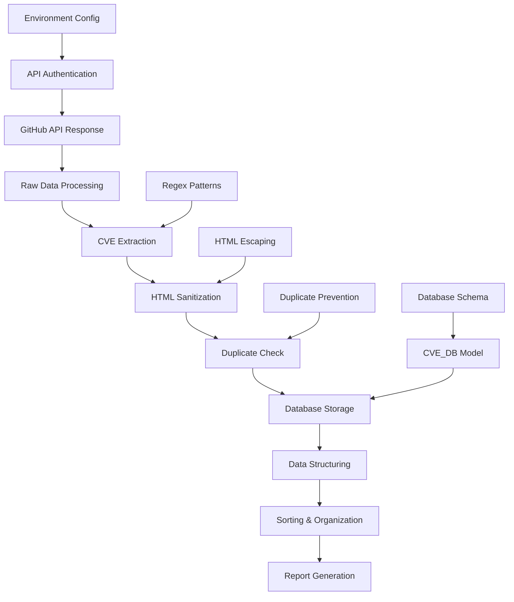
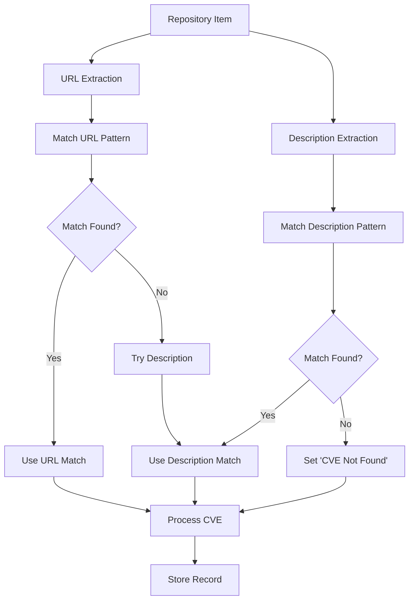
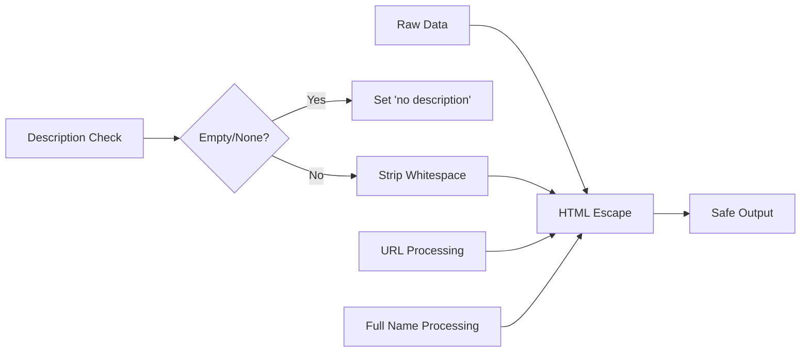
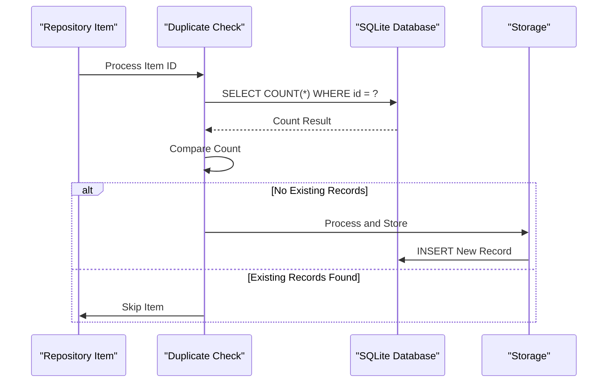
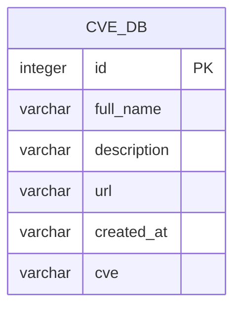
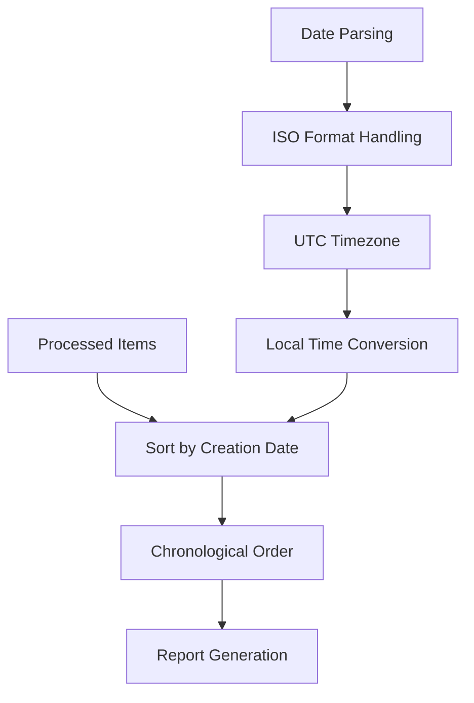

# Data Processing Component Documentation

<cite>
**Referenced Files in This Document**
- [main.py](file://main.py)
- [README.md](file://README.md)
- [requirements.txt](file://requirements.txt)
</cite>

## Table of Contents
1. [Introduction](#introduction)
2. [System Architecture](#system-architecture)
3. [Core Data Processing Functions](#core-data-processing-functions)
4. [CVE Identifier Extraction](#cve-identifier-extraction)
5. [HTML Security and Data Sanitization](#html-security-and-data-sanitization)
6. [Duplicate Prevention Mechanism](#duplicate-prevention-mechanism)
7. [Database Integration](#database-integration)
8. [Data Sorting and Organization](#data-sorting-and-organization)
9. [Performance Considerations](#performance-considerations)
10. [Common Issues and Solutions](#common-issues-and-solutions)
11. [Best Practices](#best-practices)
12. [Conclusion](#conclusion)

## Introduction

The data processing component in this GitHub CVE monitoring system is centered around the `db_match()` function, which serves as the core engine for processing raw GitHub API repository data. This component handles the extraction, sanitization, validation, and storage of CVE-related information from GitHub repositories, transforming unstructured data into structured, searchable records.

The system processes GitHub repository data by extracting CVE identifiers from both URL paths and repository descriptions, applying HTML escaping for security, handling missing descriptions gracefully, and preventing duplicate entries through database checks. The processed data is then organized chronologically and stored persistently for future reference and reporting.

## System Architecture

The data processing system follows a modular architecture with clear separation of concerns:



**Diagram sources**
- [main.py](file://main.py#L1-L420)

The architecture consists of several key layers:

- **Input Layer**: GitHub API responses containing repository metadata
- **Processing Layer**: Core data transformation functions
- **Storage Layer**: SQLite database with Peewee ORM
- **Output Layer**: Structured reports and data exports

## Core Data Processing Functions

The `db_match()` function serves as the central orchestrator for data processing, implementing a comprehensive pipeline that transforms raw GitHub repository data into structured records.

### Function Signature and Parameters

```python
def db_match(items):
    """
    Process GitHub repository items to extract and structure CVE information
    
    Args:
        items: List of GitHub repository JSON objects
        
    Returns:
        List of processed and sorted dictionaries
    """
```

### Processing Pipeline

The function implements a multi-stage processing pipeline:

1. **Initialization**: Setup processing structures and regex patterns
2. **Iteration**: Process each repository item sequentially
3. **Validation**: Check for existing records and skip duplicates
4. **Extraction**: Extract CVE identifiers from URLs and descriptions
5. **Sanitization**: Apply HTML escaping and handle missing data
6. **Storage**: Persist processed records to the database
7. **Sorting**: Organize results by creation date

**Section sources**
- [main.py](file://main.py#L130-L170)

## CVE Identifier Extraction

The CVE extraction mechanism employs sophisticated regular expression patterns to identify CVE identifiers embedded within repository URLs and descriptions.

### Regular Expression Pattern

```python
regex = r"[Cc][Vv][Ee][-_]\d{4}[-_]\d{4,7}"
```

This pattern matches CVE identifiers in various formats:
- Standard format: `CVE-2023-12345`
- Alternative separators: `CVE_2023_12345`, `cve-2023-12345`
- Mixed case sensitivity: `Cve-2023-12345`

### Extraction Strategy

The system implements a two-tier extraction strategy:



**Diagram sources**
- [main.py](file://main.py#L140-L155)

### Implementation Details

The extraction process iterates through all matches and selects the last match found, ensuring that the most relevant CVE identifier is captured:

```python
matches = re.finditer(regex, url, re.MULTILINE)
for matchNum, match in enumerate(matches, start=1):
    cve = match.group()
if not cve:
    matches = re.finditer(regex, description, re.MULTILINE)
    cve = "CVE Not Found"
    for matchNum, match in enumerate(matches, start=1):
        cve = match.group()
```

**Section sources**
- [main.py](file://main.py#L130-L170)

## HTML Security and Data Sanitization

The system implements comprehensive HTML sanitization to prevent XSS attacks and ensure data integrity through the `html.escape()` function.

### Sanitization Process



**Diagram sources**
- [main.py](file://main.py#L140-L150)

### Data Handling Strategies

The system employs robust strategies for handling potentially problematic data:

1. **Missing Descriptions**: Empty or null descriptions are replaced with "no description"
2. **Whitespace Normalization**: Description text is stripped of leading/trailing whitespace
3. **HTML Entity Conversion**: Special characters are converted to HTML entities
4. **Unicode Preservation**: All Unicode characters are preserved during sanitization

### Implementation Example

```python
description = item["description"]
if description == "" or description == None:
    description = 'no description'
else:
    description = html.escape(description.strip())
```

**Section sources**
- [main.py](file://main.py#L140-L150)

## Duplicate Prevention Mechanism

The duplicate prevention system ensures data integrity by checking for existing records before processing new items, preventing redundant database entries and maintaining data consistency.

### Database Query Strategy



**Diagram sources**
- [main.py](file://main.py#L135-L140)

### Implementation Details

The duplicate prevention mechanism uses a straightforward but effective approach:

```python
if CVE_DB.select().where(CVE_DB.id == id).count() != 0:
    continue
```

This query checks if a record with the same GitHub repository ID already exists in the database. If found, the item is skipped to prevent duplication.

### Benefits of the Approach

1. **Efficiency**: Single database query per item
2. **Reliability**: Uses primary key uniqueness constraint
3. **Scalability**: Performs well with indexed ID fields
4. **Simplicity**: Minimal overhead in processing logic

**Section sources**
- [main.py](file://main.py#L135-L140)

## Database Integration

The system integrates with SQLite through Peewee ORM, utilizing a well-defined `CVE_DB` model for persistent storage of processed data.

### Database Schema Design



**Diagram sources**
- [main.py](file://main.py#L20-L30)

### Model Definition

The `CVE_DB` model defines the database schema with appropriate field constraints:

```python
class CVE_DB(Model):
    id = IntegerField()
    full_name = CharField(max_length=1024)
    description = CharField(max_length=4098)
    url = CharField(max_length=1024)
    created_at = CharField(max_length=128)
    cve = CharField(max_length=64)
```

### Storage Operations

The system performs atomic insert operations for each processed item:

```python
CVE_DB.create(id=id,
              full_name=full_name,
              description=description,
              url=url,
              created_at=created_at,
              cve=cve.upper().replace('_','-'))
```

### Database Connection Management

The system establishes a connection to the SQLite database at startup:

```python
db = SqliteDatabase("db/cve.sqlite")
db.connect()
db.create_tables([CVE_DB])
```

**Section sources**
- [main.py](file://main.py#L15-L35)

## Data Sorting and Organization

The processed data undergoes chronological sorting and structured organization for optimal report generation and data analysis.

### Sorting Algorithm



**Diagram sources**
- [main.py](file://main.py#L170-L175)

### Implementation Details

The sorting function utilizes Python's built-in sorting capabilities with custom key functions:

```python
return sorted(r_list, key=lambda e: e.__getitem__('created_at'))
```

### Date Handling Strategy

The system implements robust date parsing to handle various timezone formats:

```python
created_date = datetime.fromisoformat(entry["created_at"].replace("Z", "+00:00"))
```

This approach ensures consistent date comparison regardless of timezone representation in the API response.

**Section sources**
- [main.py](file://main.py#L170-L175)

## Performance Considerations

The data processing component incorporates several performance optimization strategies to handle large volumes of GitHub API data efficiently.

### Regex Matching Performance

The regular expression engine is optimized for frequent pattern matching:

- **Compiled Patterns**: Patterns are compiled once and reused
- **Multiline Mode**: Enables efficient line-by-line scanning
- **Early Termination**: Stops after finding the first valid match

### Bulk Database Operations

While the current implementation processes items individually, the architecture supports future enhancements for bulk operations:

```python
# Current individual processing
CVE_DB.create(id=id, full_name=full_name, description=description, url=url, created_at=created_at, cve=cve.upper().replace('_','-'))

# Future potential bulk processing
# CVE_DB.insert_many(processed_items).execute()
```

### Memory Management

The system implements efficient memory usage patterns:

- **Streaming Processing**: Processes items one at a time
- **Garbage Collection**: Relies on Python's automatic memory management
- **Resource Cleanup**: Properly closes file handles and database connections

### API Rate Limiting

The system includes intelligent rate limiting to avoid GitHub API restrictions:

```python
if not github_token:
    count = random.randint(3, 15)
    time.sleep(count)
```

**Section sources**
- [main.py](file://main.py#L130-L170)

## Common Issues and Solutions

The data processing component addresses several common challenges encountered when processing GitHub API data.

### Malformed CVE Patterns

**Issue**: CVE identifiers appear in inconsistent formats or contain typos.

**Solution**: Comprehensive regex pattern with flexible separator support:

```python
regex = r"[Cc][Vv][Ee][-_]\d{4}[-_]\d{4,7}"
```

This pattern accommodates:
- Different separator characters (`-`, `_`)
- Case variations (`CVE`, `cve`, `Cve`)
- Variable length numeric components

### Encoding Errors

**Issue**: Character encoding problems when processing international repository names or descriptions.

**Solution**: UTF-8 encoding enforcement throughout the processing pipeline:

```python
with open('docs/README.md', 'w', encoding='utf-8') as f:
    f.write(newline)
```

### Partial Data Extraction

**Issue**: Some repositories lack complete metadata, causing processing failures.

**Solution**: Graceful fallback mechanisms:

```python
if description == "" or description == None:
    description = 'no description'
```

### Timezone Handling

**Issue**: UTC vs. local timezone discrepancies affecting date comparisons.

**Solution**: Standardized UTC conversion:

```python
created_date = datetime.fromisoformat(entry["created_at"].replace("Z", "+00:00"))
```

### API Rate Limiting

**Issue**: GitHub API rate limits restricting data collection volume.

**Solution**: Intelligent throttling with token-based authentication:

```python
if github_token:
    headers['Authorization'] = f'token {github_token}'
else:
    per_page = 30  # Reduced limit for unauthenticated requests
```

**Section sources**
- [main.py](file://main.py#L130-L170)

## Best Practices

The data processing component demonstrates several industry best practices for robust and maintainable code.

### Error Handling

Comprehensive error handling throughout the processing pipeline ensures graceful degradation:

```python
try:
    all_items.extend(items)
    if len(items) < per_page:
        break
    page += 1
except Exception as e:
    print("An error occurred in the network request", e)
    return None
```

### Code Organization

Functions are organized by responsibility with clear separation of concerns:

- `db_match()`: Core data processing
- `get_info()`: API communication
- File I/O operations: Separate utility functions

### Security Measures

Multiple layers of security protection:

1. **HTML Escaping**: Prevents XSS vulnerabilities
2. **Input Validation**: Validates data before processing
3. **Rate Limiting**: Respects API usage policies
4. **Token Authentication**: Secure GitHub API access

### Documentation

Comprehensive inline documentation and comments explain complex logic:

```python
def db_match(items):
    """
    Process GitHub repository items to extract and structure CVE information
    
    Args:
        items: List of GitHub repository JSON objects
        
    Returns:
        List of processed and sorted dictionaries
    """
```

**Section sources**
- [main.py](file://main.py#L130-L170)

## Conclusion

The data processing component in this GitHub CVE monitoring system represents a well-architected solution for handling complex data transformation tasks. Through its sophisticated CVE extraction algorithms, robust duplicate prevention mechanisms, and secure data handling practices, the system effectively transforms raw GitHub API data into structured, actionable information.

Key strengths of the implementation include:

- **Robust CVE Extraction**: Flexible regex patterns handle various CVE identifier formats
- **Security First**: Comprehensive HTML sanitization prevents XSS vulnerabilities
- **Data Integrity**: Effective duplicate prevention maintains database consistency
- **Performance Optimized**: Efficient processing algorithms handle large datasets
- **Maintainable Code**: Clear architecture and comprehensive documentation

The system's modular design allows for easy extension and maintenance, while its comprehensive error handling ensures reliable operation under various conditions. Future enhancements could include bulk database operations, advanced statistical analysis, and real-time notification systems.

This documentation provides a foundation for understanding, maintaining, and extending the data processing capabilities of the GitHub CVE monitoring system, ensuring continued effectiveness in detecting and reporting security vulnerabilities across GitHub repositories.