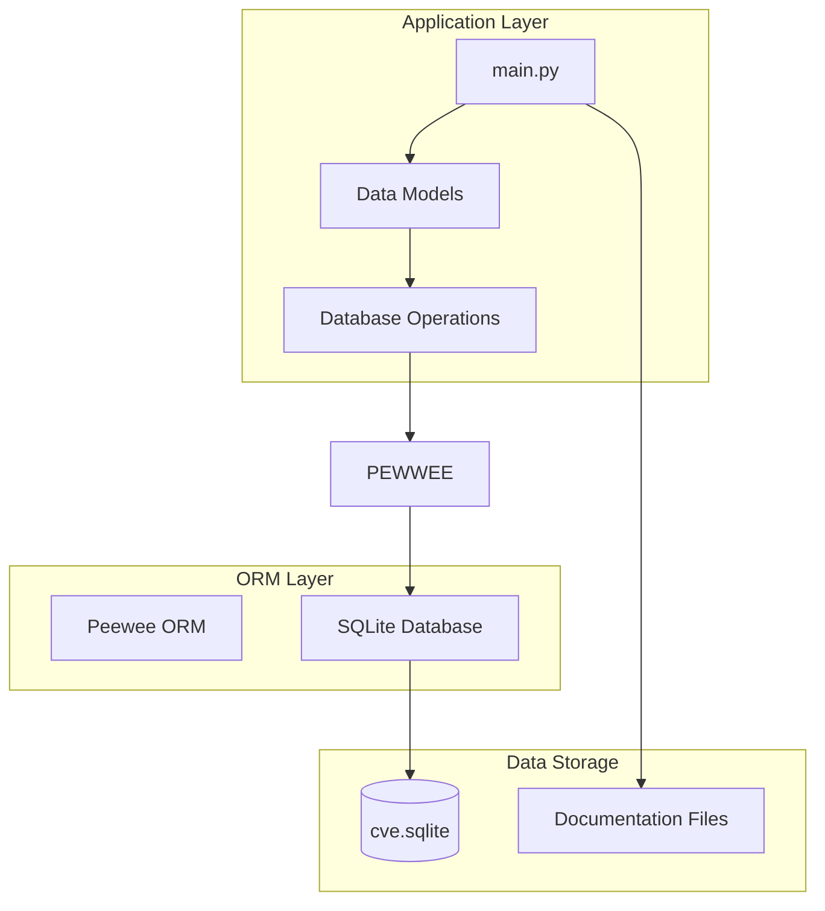
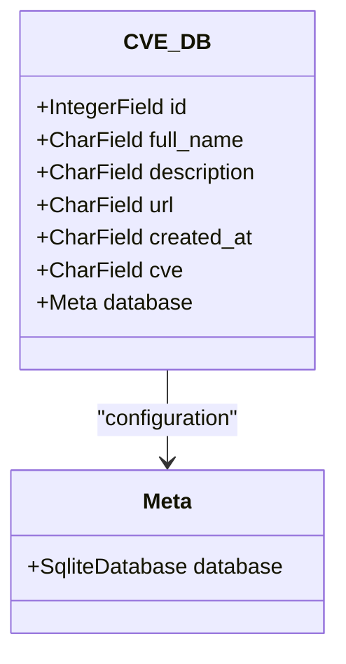
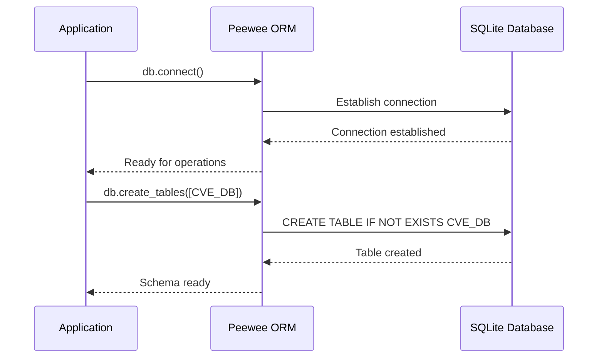
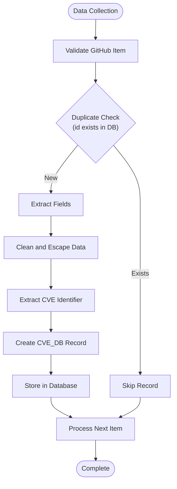

# Database Model Documentation

<cite>
**Referenced Files in This Document**
- [main.py](file://main.py)
- [requirements.txt](file://requirements.txt)
</cite>

## Table of Contents
1. [Introduction](#introduction)
2. [Project Structure](#project-structure)
3. [CVE_DB Model Definition](#cvedb-model-definition)
4. [Peewee ORM Integration](#peewee-orm-integration)
5. [Database Initialization](#database-initialization)
6. [Data Operations](#data-operations)
7. [Duplicate Prevention](#duplicate-prevention)
8. [Common Issues and Solutions](#common-issues-and-solutions)
9. [Performance Considerations](#performance-considerations)
10. [Troubleshooting Guide](#troubleshooting-guide)
11. [Conclusion](#conclusion)

## Introduction

The github_cve_monitor application utilizes a SQLite database with Peewee ORM to manage CVE (Common Vulnerabilities and Exposures) data collected from GitHub repositories. The primary data model, `CVE_DB`, serves as the central repository for storing vulnerability information, including repository metadata, descriptions, URLs, and CVE identifiers extracted from various sources.

This documentation provides comprehensive coverage of the database model architecture, including entity structure, field definitions, ORM integration patterns, and operational procedures for maintaining data integrity and preventing duplicates.

## Project Structure

The application follows a minimalist architecture with a single Python script serving as the main application entry point. The database structure is tightly integrated with the application logic.



**Diagram sources**
- [main.py](file://main.py#L22-L36)

**Section sources**
- [main.py](file://main.py#L1-L420)
- [requirements.txt](file://requirements.txt#L1-L3)

## CVE_DB Model Definition

The `CVE_DB` model is the cornerstone of the application's data persistence layer. It defines a structured schema for storing CVE-related information with specific constraints and validation rules.

### Entity Structure



**Diagram sources**
- [main.py](file://main.py#L18-L27)

### Field Definitions

Each field in the `CVE_DB` model serves a specific purpose in capturing comprehensive vulnerability information:

#### Primary Identifier (`id`)
- **Type**: `IntegerField`
- **Purpose**: Stores the unique GitHub repository ID
- **Constraints**: No explicit constraints defined
- **Usage**: Primary key for duplicate detection and record identification

#### Repository Name (`full_name`)
- **Type**: `CharField(max_length=1024)`
- **Purpose**: Stores the complete repository name (owner/repo)
- **Constraints**: Maximum length of 1024 characters
- **Usage**: Provides human-readable repository identification

#### Description (`description`)
- **Type**: `CharField(max_length=4098)`
- **Purpose**: Stores the repository description text
- **Constraints**: Maximum length of 4098 characters
- **Usage**: Captures vulnerability-related project descriptions

#### URL (`url`)
- **Type**: `CharField(max_length=1024)`
- **Purpose**: Stores the GitHub repository URL
- **Constraints**: Maximum length of 1024 characters
- **Usage**: Provides direct access links to vulnerability repositories

#### Creation Date (`created_at`)
- **Type**: `CharField(max_length=128)`
- **Purpose**: Stores the ISO-formatted creation timestamp
- **Constraints**: Maximum length of 128 characters
- **Usage**: Enables temporal analysis and sorting of records

#### CVE Identifier (`cve`)
- **Type**: `CharField(max_length=64)`
- **Purpose**: Stores extracted CVE identifier
- **Constraints**: Maximum length of 64 characters
- **Usage**: Links to official CVE records and enables filtering

**Section sources**
- [main.py](file://main.py#L18-L27)

## Peewee ORM Integration

The application leverages Peewee ORM for database abstraction and manipulation. The integration follows standard Peewee patterns with SQLite backend configuration.

### ORM Configuration

```python
# Database connection setup
db = SqliteDatabase("db/cve.sqlite")

# Model definition with database association
class CVE_DB(Model):
    id = IntegerField()
    full_name = CharField(max_length=1024)
    description = CharField(max_length=4098)
    url = CharField(max_length=1024)
    created_at = CharField(max_length=128)
    cve = CharField(max_length=64)

    class Meta:
        database = db
```

### Database Connection Management

The application establishes database connectivity through a straightforward connection pattern:



**Diagram sources**
- [main.py](file://main.py#L35-L36)

**Section sources**
- [main.py](file://main.py#L22-L36)

## Database Initialization

The database initialization process occurs automatically during application startup, ensuring the schema is properly configured before data operations begin.

### Initialization Steps

1. **Database File Creation**: Creates the SQLite database file at `db/cve.sqlite`
2. **Schema Generation**: Defines the `CVE_DB` table structure
3. **Connection Establishment**: Opens a persistent connection to the database
4. **Table Verification**: Ensures the target table exists and is accessible

### Directory Structure

The application expects a `db/` directory to exist for database file storage:

```
github_cve_monitor/
├── db/
│   └── cve.sqlite
├── docs/
├── main.py
└── requirements.txt
```

**Section sources**
- [main.py](file://main.py#L35-L36)

## Data Operations

The application performs CRUD operations through the `db_match()` function, which handles data extraction, validation, and persistence.

### Insertion Process



**Diagram sources**
- [main.py](file://main.py#L138-L175)

### Query Operations

The application uses both Peewee ORM queries and raw SQL for different purposes:

#### ORM Queries
```python
# Duplicate checking
if CVE_DB.select().where(CVE_DB.id == id).count() != 0:
    continue

# Retrieving all records
cur.execute("SELECT * FROM CVE_DB ORDER BY cve DESC;")
result = cur.fetchall()
```

#### Raw SQL Queries
```python
# Historical data retrieval
cur.execute(f"SELECT * FROM CVE_DB WHERE created_at >= '{seven_days_ago}' ORDER BY created_at DESC;")
recent_records = cur.fetchall()
```

**Section sources**
- [main.py](file://main.py#L138-L175)
- [main.py](file://main.py#L290-L295)

## Duplicate Prevention

The application implements a robust duplicate prevention mechanism using the GitHub repository ID as the primary uniqueness constraint.

### Duplicate Detection Logic

```python
def db_match(items):
    r_list = []
    for item in items:
        id = item["id"]
        # Check for existing record with same ID
        if CVE_DB.select().where(CVE_DB.id == id).count() != 0:
            continue  # Skip if record exists
        
        # Process and insert new record
        # ...
```

### Data Integrity Measures

1. **Primary Key Constraint**: Uses GitHub ID as natural primary key
2. **Pre-insertion Validation**: Checks for existence before insertion
3. **Atomic Operations**: Inserts processed records in bulk
4. **Error Handling**: Gracefully handles duplicate entries

**Section sources**
- [main.py](file://main.py#L138-L175)

## Common Issues and Solutions

### Database File Permissions

**Issue**: Permission denied errors when accessing the SQLite database file.

**Solution**: Ensure the application has write permissions to the `db/` directory:
```bash
# Linux/macOS
chmod 755 db/
chmod 644 db/cve.sqlite

# Windows
icacls db\ /grant Users:F
```

### Schema Evolution

**Issue**: Need to modify the database schema without losing existing data.

**Solution**: Implement migration scripts or recreate the database:
```python
# Remove existing table and recreate
db.drop_tables([CVE_DB])
db.create_tables([CVE_DB])
```

### Recovery from Corruption

**Issue**: SQLite database corruption or file corruption.

**Solution**: Implement backup and recovery procedures:
```python
# Backup current database
import shutil
shutil.copy2("db/cve.sqlite", "db/cve_backup.sqlite")

# Recreate database if corrupted
if not db.is_closed():
    db.close()
os.remove("db/cve.sqlite")
db.connect()
db.create_tables([CVE_DB])
```

### Memory Management

**Issue**: Large datasets causing memory exhaustion.

**Solution**: Implement pagination for large queries:
```python
# Process records in batches
batch_size = 1000
offset = 0
while True:
    batch = CVE_DB.select().order_by(CVE_DB.id).limit(batch_size).offset(offset)
    if not batch:
        break
    # Process batch
    offset += batch_size
```

## Performance Considerations

### Indexing Strategies

While the current implementation uses the ID field as the primary key, additional indexing could improve query performance:

```python
# Add indexes for frequently queried fields
class CVE_DB(Model):
    # ... existing fields ...
    
    class Meta:
        database = db
        indexes = (
            (('cve',), False),  # Non-unique index for CVE searches
            (('created_at',), False),  # Non-unique index for date range queries
        )
```

### Query Optimization

1. **Batch Operations**: Process records in batches to reduce memory usage
2. **Selective Queries**: Use WHERE clauses to limit result sets
3. **Index Utilization**: Leverage indexes for frequent search patterns
4. **Connection Pooling**: Reuse database connections for multiple operations

### Memory Management

```python
# Efficient data processing
def process_large_dataset():
    with db.atomic():
        batch = []
        for item in large_dataset:
            batch.append(process_item(item))
            if len(batch) >= 1000:
                CVE_DB.insert_many(batch).execute()
                batch.clear()
        # Insert remaining items
        if batch:
            CVE_DB.insert_many(batch).execute()
```

## Troubleshooting Guide

### Database Connection Issues

**Problem**: `OperationalError: unable to open database file`

**Diagnosis**:
```python
try:
    db.connect()
    print("Database connected successfully")
except OperationalError as e:
    print(f"Connection failed: {e}")
    # Check directory permissions and file existence
```

**Solution**: Verify directory structure and permissions:
```bash
ls -la db/
mkdir -p db/
chmod 755 db/
```

### Data Extraction Problems

**Problem**: CVE identifiers not being extracted correctly

**Diagnosis**: Check regex patterns and data quality:
```python
import re
regex = r"[Cc][Vv][Ee][-_]\d{4}[-_]\d{4,7}"
test_string = "CVE-2023-12345"
matches = re.finditer(regex, test_string, re.MULTILINE)
print(list(matches))  # Should show match object
```

**Solution**: Enhance regex patterns and fallback mechanisms:
```python
def extract_cve(text):
    patterns = [
        r"CVE[-_]\d{4}[-_]\d{4,7}",
        r"cve[-_]\d{4}[-_]\d{4,7}",
        r"\bCVE\d{4}\d{4,7}\b"
    ]
    for pattern in patterns:
        matches = re.search(pattern, text, re.IGNORECASE)
        if matches:
            return matches.group().replace('_', '-')
    return "CVE Not Found"
```

### Performance Issues

**Problem**: Slow query performance with large datasets

**Diagnosis**: Profile query execution:
```python
import time
start_time = time.time()
results = CVE_DB.select().where(CVE_DB.cve.contains("CVE")).execute()
print(f"Query took {time.time() - start_time:.2f} seconds")
```

**Solution**: Implement pagination and indexing:
```python
# Paginated query
def get_paginated_results(page=1, page_size=100):
    offset = (page - 1) * page_size
    return CVE_DB.select().order_by(CVE_DB.created_at.desc()).limit(page_size).offset(offset)
```

**Section sources**
- [main.py](file://main.py#L138-L175)

## Conclusion

The CVE_DB model in the github_cve_monitor application demonstrates a well-structured approach to database modeling using Peewee ORM with SQLite. The implementation successfully balances simplicity with functionality, providing essential features for CVE data management including duplicate prevention, data integrity maintenance, and efficient querying capabilities.

Key strengths of the implementation include:

- **Robust Duplicate Prevention**: Using GitHub repository IDs as primary keys ensures no duplicate records
- **Flexible Data Storage**: CharField types with appropriate length constraints accommodate diverse data
- **Efficient ORM Integration**: Standard Peewee patterns enable clean database operations
- **Automatic Schema Management**: Initialization process ensures database readiness
- **Scalable Architecture**: Foundation supports future enhancements and scaling

The documentation provides comprehensive guidance for understanding, maintaining, and extending the database model. Future enhancements could include advanced indexing strategies, migration support, and enhanced error handling for production deployments.