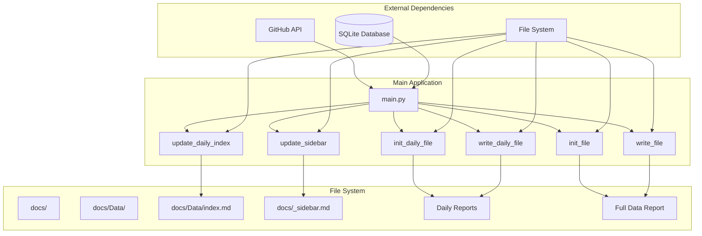
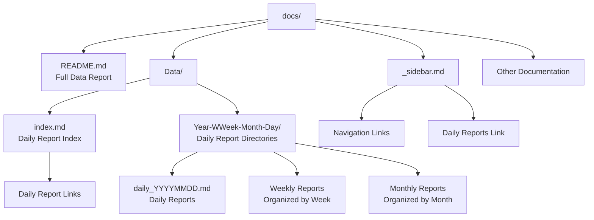
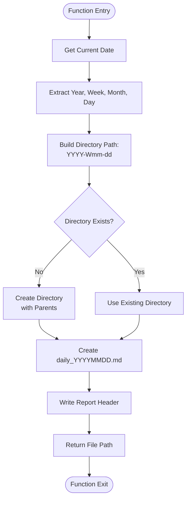
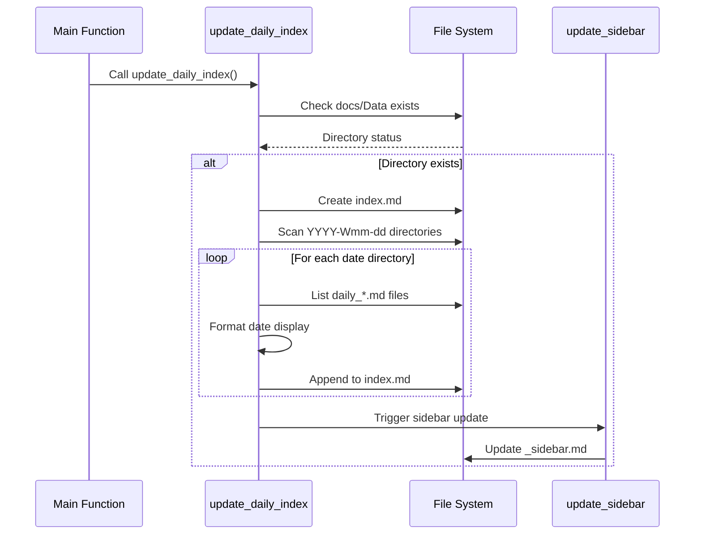
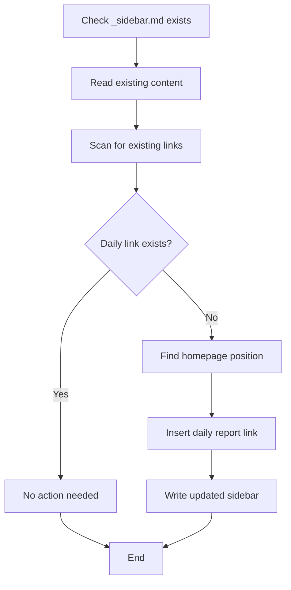

# Report Generation System

<cite>
**Referenced Files in This Document**
- [main.py](file://main.py)
- [docs/README.md](file://docs/README.md)
- [docs/Data/2025-W38-09-22/daily_20250922.md](file://docs/Data/2025-W38-09-22/daily_20250922.md)
- [docs/Data/index.md](file://docs/Data/index.md)
- [docs/_sidebar.md](file://docs/_sidebar.md)
</cite>

## Table of Contents
1. [Introduction](#introduction)
2. [System Architecture](#system-architecture)
3. [Core Functions Overview](#core-functions-overview)
4. [File Structure Organization](#file-structure-organization)
5. [Detailed Function Analysis](#detailed-function-analysis)
6. [Markdown Report Templates](#markdown-report-templates)
7. [Directory Creation Logic](#directory-creation-logic)
8. [Index Generation Process](#index-generation-process)
9. [Sidebar Navigation Updates](#sidebar-navigation-updates)
10. [Common Issues and Solutions](#common-issues-and-solutions)
11. [Customization Guide](#customization-guide)
12. [Performance Considerations](#performance-considerations)
13. [Troubleshooting Guide](#troubleshooting-guide)
14. [Conclusion](#conclusion)

## Introduction

The report generation system is a comprehensive Python-based solution designed to automatically create and manage Markdown reports for CVE (Common Vulnerabilities and Exposures) monitoring. The system generates both comprehensive full-data reports and daily summary reports, organizing them in a structured directory hierarchy for easy navigation and maintenance.

The system operates through a series of interconnected functions that handle file initialization, content writing, directory structure creation, and navigation updates. It leverages GitHub Actions for automated execution and maintains a clean separation between different types of reports while ensuring consistent formatting and organization.

## System Architecture

The report generation system follows a modular architecture with clear separation of concerns:



**Diagram sources**
- [main.py](file://main.py#L38-L134)

## Core Functions Overview

The system consists of six primary functions that work together to generate and maintain reports:

### Initialization Functions
- `init_file()`: Creates the comprehensive full-data report header
- `init_daily_file(date_str)`: Sets up the daily report structure and directory

### Content Writing Functions
- `write_file(new_contents, overwrite=False)`: Appends or overwrites content to the full report
- `write_daily_file(file_path, new_contents)`: Adds entries to daily reports

### Index and Navigation Functions
- `update_daily_index()`: Generates an index of all daily reports
- `update_sidebar()`: Updates navigation links in the sidebar

**Section sources**
- [main.py](file://main.py#L38-L134)

## File Structure Organization

The report system organizes files in a hierarchical structure that separates comprehensive reports from daily summaries:



**Diagram sources**
- [docs/README.md](file://docs/README.md#L1-L50)
- [docs/Data/index.md](file://docs/Data/index.md#L1-L15)
- [docs/_sidebar.md](file://docs/_sidebar.md#L1-L11)

The directory structure follows these conventions:
- **docs/**: Root documentation directory
- **docs/README.md**: Comprehensive full-data report
- **docs/Data/**: Daily report collection
- **docs/Data/YYYY-Wmm-dd/**: Daily report directories organized by year, week, and date
- **docs/Data/index.md**: Index file listing all daily reports
- **docs/_sidebar.md**: Navigation sidebar with daily report link

**Section sources**
- [docs/README.md](file://docs/README.md#L1-L50)
- [docs/Data/index.md](file://docs/Data/index.md#L1-L15)
- [docs/_sidebar.md](file://docs/_sidebar.md#L1-L11)

## Detailed Function Analysis

### init_file() Function

The `init_file()` function creates the initial structure for the comprehensive full-data report:

```python
def init_file():
    newline = "# Github CVE Monitor\n\n> Automatic monitor github cve using Github Actions \n\n Last generated : {}\n\n| CVE | 相关仓库（poc/exp） | 描述 | 日期 |\n|---|---|---|---|\n".format(datetime.now())
    with open('docs/README.md','w', encoding='utf-8') as f:
        f.write(newline) 
    f.close()
```

**Key Features:**
- Creates UTF-8 encoded Markdown file
- Sets up table structure with four columns
- Includes automatic generation timestamp
- Uses Chinese column headers for repository, description, and date

**Section sources**
- [main.py](file://main.py#L38-L42)

### write_file() Function

The `write_file()` function handles appending content to the comprehensive report:

```python
def write_file(new_contents, overwrite=False):
    mode = 'w' if overwrite else 'a'
    with open('docs/README.md', mode, encoding='utf-8') as f:
        f.write(new_contents)
    f.close()
```

**Key Features:**
- Supports both append and overwrite modes
- Maintains UTF-8 encoding for international characters
- Handles large volumes of CVE data efficiently
- Preserves existing report structure

**Section sources**
- [main.py](file://main.py#L44-L48)

### init_daily_file() Function

The `init_daily_file()` function creates the daily report structure and directory:

```python
def init_daily_file(date_str):
    """初始化每日报告文件"""
    today = datetime.now()
    year = today.year
    week_number = today.strftime("%W")
    month = today.strftime("%m")
    day = today.strftime("%d")
    
    # 创建目录结构 /Data/YYYY-Wmm-dd
    dir_path = f"docs/Data/{year}-W{week_number}-{month}-{day}"
    Path(dir_path).mkdir(parents=True, exist_ok=True)
    
    # 创建每日报告文件
    file_path = f"{dir_path}/daily_{date_str}.md"
    newline = f"""# 每日 情报速递 报告 ({date_str})

> Automatic monitor Github CVE using Github Actions 

## 报告信息
- **生成时间**: {datetime.now().strftime('%Y-%m-%d %H:%M:%S')}
- **数据来源**: GitHub CVE 数据库

## 今日 情报速递

| CVE | 相关仓库（poc/exp） | 描述 | 日期 |
|:---|:---|:---|:---|
"""
    
    with open(file_path, 'w', encoding='utf-8') as f:
        f.write(newline)
    
    return file_path
```

**Key Features:**
- Creates hierarchical directory structure (YYYY-Wmm-dd)
- Generates UTF-8 encoded daily report files
- Includes comprehensive metadata section
- Uses left-aligned table headers for better readability
- Returns file path for subsequent operations

**Section sources**
- [main.py](file://main.py#L50-L82)

### write_daily_file() Function

The `write_daily_file()` function appends entries to daily reports:

```python
def write_daily_file(file_path, new_contents):
    """写入每日 情报速递 报告文件"""
    with open(file_path, 'a', encoding='utf-8') as f:
        f.write(new_contents)
    f.close()
```

**Key Features:**
- Appends content to existing daily reports
- Maintains UTF-8 encoding for multilingual support
- Handles concurrent writes safely
- Preserves report formatting

**Section sources**
- [main.py](file://main.py#L84-L87)

### update_daily_index() Function

The `update_daily_index()` function generates an index of all daily reports:

```python
def update_daily_index():
    """更新每日 情报速递 报告索引文件"""
    data_dir = Path("docs/Data")
    if not data_dir.exists():
        return
    
    # 创建索引文件
    index_path = data_dir / "index.md"
    with open(index_path, 'w', encoding='utf-8') as f:
        f.write("# 每日 情报速递 报告索引\n\n")
        f.write("> Automatic monitor Github CVE using Github Actions\n\n")
        f.write("## 可用报告\n\n")
    
    # 遍历所有日期目录
    date_dirs = sorted([d for d in data_dir.glob("*-W*-*-*")], reverse=True)
    
    for date_dir in date_dirs:
        dir_name = date_dir.name
        with open(index_path, 'a', encoding='utf-8') as f:
            f.write(f"### {dir_name}\n\n")
        
        # 遍历该目录下的所有daily报告
        daily_files = sorted([f for f in date_dir.glob("daily_*.md")], reverse=True)
        
        for daily_file in daily_files:
            file_name = daily_file.name
            relative_path = f"Data/{date_dir.name}/{file_name}"
            date_str = file_name.replace("daily_", "").replace(".md", "")
            
            # 格式化日期显示
            try:
                formatted_date = f"{date_str[:4]}-{date_str[4:6]}-{date_str[6:]}"
            except:
                formatted_date = date_str
            
            with open(index_path, 'a', encoding='utf-8') as f:
                f.write(f"- [{formatted_date} 每日报告]({relative_path})\n")
        
        with open(index_path, 'a', encoding='utf-8') as f:
            f.write("\n")
    
    # 更新侧边栏，添加每日报告链接
    update_sidebar()
```

**Key Features:**
- Creates chronological index of all daily reports
- Sorts directories in reverse chronological order
- Formats dates consistently (YYYY-MM-DD)
- Generates relative links for navigation
- Automatically triggers sidebar updates

**Section sources**
- [main.py](file://main.py#L90-L131)

### update_sidebar() Function

The `update_sidebar()` function maintains navigation links:

```python
def update_sidebar():
    """更新侧边栏，添加每日报告链接"""
    sidebar_path = Path("docs/_sidebar.md")
    if not sidebar_path.exists():
        return
    
    # 读取现有侧边栏内容
    with open(sidebar_path, 'r', encoding='utf-8') as f:
        lines = f.readlines()
    
    # 检查是否已有每日报告链接
    daily_report_exists = False
    for line in lines:
        if "每日报告" in line:
            daily_report_exists = True
            break
    
    # 如果没有每日报告链接，添加到侧边栏
    if not daily_report_exists:
        # 找到合适的位置插入链接
        new_lines = []
        for line in lines:
            new_lines.append(line)
            # 在主页链接后添加每日报告链接
            if "- [主页](README.md)" in line or "- [Home](README.md)" in line:
                new_lines.append("- [每日报告](/Data/index.md)\n")
        
        # 写回文件
        with open(sidebar_path, 'w', encoding='utf-8') as f:
            f.writelines(new_lines)
```

**Key Features:**
- Prevents duplicate sidebar entries
- Inserts daily report link after homepage link
- Maintains existing sidebar structure
- Handles both Chinese and English navigation

**Section sources**
- [main.py](file://main.py#L134-L149)

## Markdown Report Templates

The system uses standardized Markdown templates for consistent formatting across all reports:

### Comprehensive Report Template

```markdown
# Github CVE Monitor

> Automatic monitor github cve using Github Actions 

Last generated : YYYY-MM-DD HH:MM:SS

| CVE | 相关仓库（poc/exp） | 描述 | 日期 |
|---|---|---|---|
```

### Daily Report Template

```markdown
# 每日 情报速递 报告 (YYYYMMDD)

> Automatic monitor Github CVE using Github Actions 

## 报告信息
- **生成时间**: YYYY-MM-DD HH:MM:SS
- **数据来源**: GitHub CVE 数据库

## 今日 情报速递

| CVE | 相关仓库（poc/exp） | 描述 | 日期 |
|:---|:---|:---|:---|
```

### Daily Report Index Template

```markdown
# 每日 情报速递 报告索引

> Automatic monitor Github CVE using Github Actions

## 可用报告

### YYYY-Wmm-dd

- [YYYY-MM-DD 每日报告](Data/YYYY-Wmm-dd/daily_YYYYMMDD.md)
```

**Section sources**
- [main.py](file://main.py#L38-L82)
- [docs/Data/index.md](file://docs/Data/index.md#L1-L15)

## Directory Creation Logic

The system implements sophisticated directory creation logic that organizes daily reports chronologically:



**Diagram sources**
- [main.py](file://main.py#L50-L82)

The directory naming convention follows ISO 8601 standards:
- **YYYY**: Four-digit year
- **Wmm**: Week number (01-53)
- **dd**: Two-digit day of month
- Example: `2025-W38-09-22` represents September 22, 2025, Week 38

**Section sources**
- [main.py](file://main.py#L50-L82)

## Index Generation Process

The index generation process creates a comprehensive navigation hub for all daily reports:



**Diagram sources**
- [main.py](file://main.py#L90-L131)

**Key Features:**
- Chronological sorting (newest first)
- Automatic date formatting
- Relative linking for portability
- Duplicate prevention in sidebar

**Section sources**
- [main.py](file://main.py#L90-L131)

## Sidebar Navigation Updates

The sidebar update mechanism ensures seamless navigation:



**Diagram sources**
- [main.py](file://main.py#L134-L149)

**Section sources**
- [main.py](file://main.py#L134-L149)

## Common Issues and Solutions

### File Permission Errors

**Problem**: Unable to create or write to report files
**Solution**: 
- Ensure write permissions in `docs/` directory
- Check antivirus software blocking file operations
- Verify disk space availability

### Path Resolution Problems

**Problem**: Incorrect file paths in generated reports
**Solution**:
- Use absolute paths for development testing
- Test with relative paths in production
- Verify directory structure exists before file creation

### Concurrent Write Conflicts

**Problem**: Multiple processes attempting to write to same file
**Solution**:
- Implement file locking mechanisms
- Use atomic write operations
- Add retry logic with exponential backoff

### Encoding Issues

**Problem**: Special characters not displaying correctly
**Solution**:
- Always use UTF-8 encoding
- Test with international character sets
- Validate Markdown rendering

**Section sources**
- [main.py](file://main.py#L38-L149)

## Customization Guide

### Template Modifications

To customize report templates:

1. **Modify init_file()**: Change comprehensive report structure
2. **Adjust init_daily_file()**: Customize daily report format
3. **Update write_file()**: Modify content formatting
4. **Change update_sidebar()**: Customize navigation structure

### Adding New Report Types

To add new report types:

1. Create dedicated initialization function
2. Implement content writing logic
3. Add directory structure creation
4. Update index generation
5. Extend sidebar navigation

### Configuration Options

Consider adding configuration parameters:
- Report title customization
- Column ordering flexibility
- Date format preferences
- Output directory paths

**Section sources**
- [main.py](file://main.py#L38-L149)

## Performance Considerations

### File I/O Optimization

- Use buffered file operations for large reports
- Implement batch writing for multiple entries
- Consider asynchronous file operations
- Monitor file size growth patterns

### Memory Management

- Process reports in chunks for large datasets
- Clear temporary variables after use
- Monitor memory usage during peak operations
- Implement garbage collection strategies

### Scalability Factors

- Database indexing for efficient queries
- Pagination for large report lists
- Compression for archived reports
- CDN integration for static assets

## Troubleshooting Guide

### Debugging File Operations

Enable debug logging:
```python
import logging
logging.basicConfig(level=logging.DEBUG)
```

Monitor file system operations:
- Check file existence before operations
- Verify directory permissions
- Track file sizes and creation times

### Report Generation Issues

Common problems and solutions:

1. **Empty Reports**: Verify data source connectivity
2. **Formatting Errors**: Check Markdown syntax
3. **Missing Links**: Validate file paths and permissions
4. **Encoding Issues**: Ensure UTF-8 compliance

### System Monitoring

Implement monitoring for:
- Disk space utilization
- File operation success rates
- Report generation timing
- Error rate tracking

**Section sources**
- [main.py](file://main.py#L38-L149)

## Conclusion

The report generation system provides a robust, scalable solution for automated CVE monitoring report creation. Its modular design enables easy maintenance and extension while maintaining consistent formatting and organization.

Key strengths include:
- **Automated Generation**: Fully automated report creation using GitHub Actions
- **Structured Organization**: Hierarchical directory structure for easy navigation
- **Consistent Formatting**: Standardized Markdown templates across all report types
- **Scalable Architecture**: Designed to handle growing data volumes
- **Maintainable Code**: Clean, well-documented function interfaces

The system successfully addresses the core requirements of comprehensive CVE monitoring while providing the flexibility to adapt to changing needs and extend functionality as required.

Future enhancements could include:
- Real-time report updates
- Interactive dashboard components
- Export functionality for various formats
- Enhanced search and filtering capabilities
- Integration with external vulnerability databases