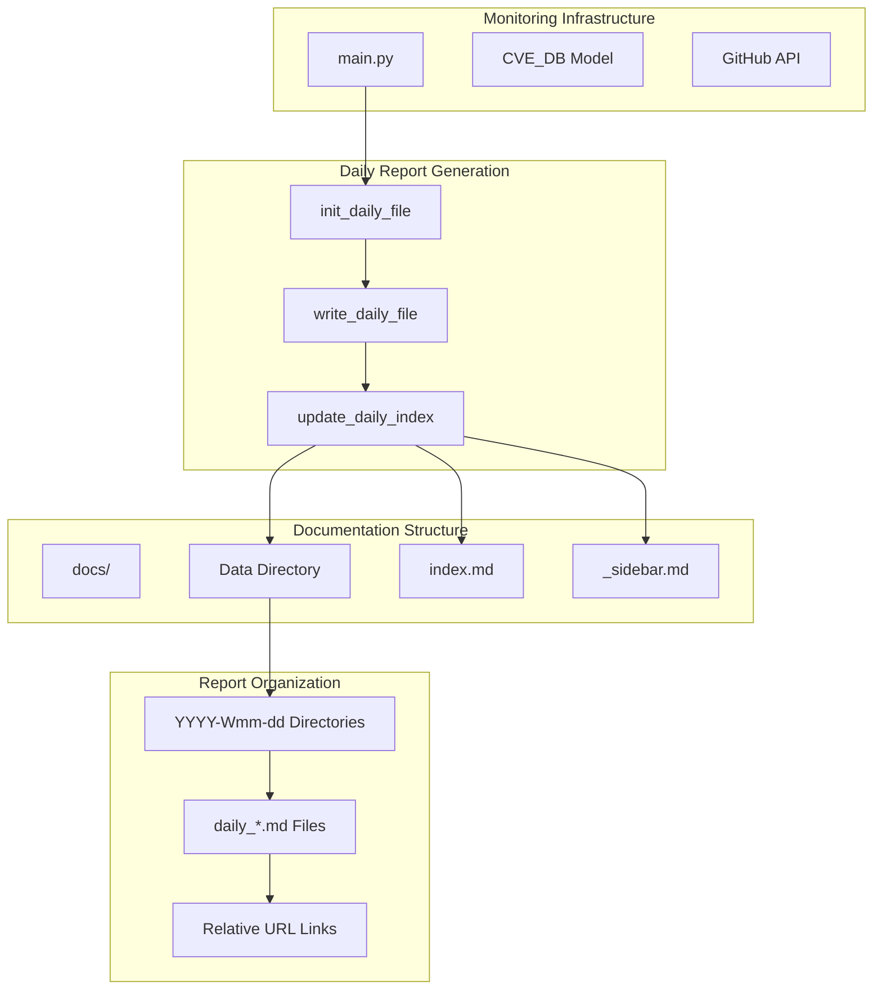
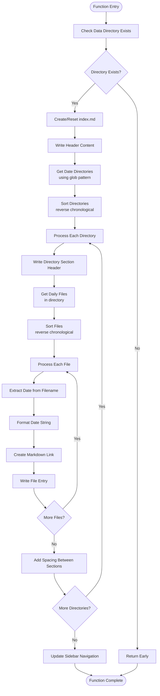
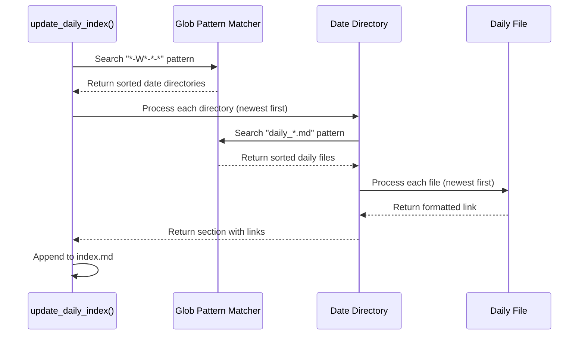
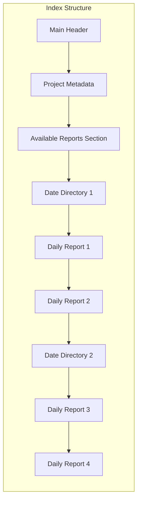

# Report Indexing System Documentation

<cite>
**Referenced Files in This Document**
- [main.py](file://main.py)
- [README.md](file://README.md)
- [requirements.txt](file://requirements.txt)
- [docs/Data/index.md](file://docs/Data/index.md)
- [docs/_sidebar.md](file://docs/_sidebar.md)
</cite>

## Table of Contents
1. [Introduction](#introduction)
2. [System Architecture](#system-architecture)
3. [Index Management Overview](#index-management-overview)
4. [update_daily_index() Function Analysis](#update_daily-index-function-analysis)
5. [Directory Structure Traversal](#directory-structure-traversal)
6. [Date Extraction and Formatting](#date-extraction-and-formatting)
7. [Index File Construction](#index-file-construction)
8. [Sidecar Navigation Updates](#sidecar-navigation-updates)
9. [Error Handling and Edge Cases](#error-handling-and-edge-cases)
10. [Performance Considerations](#performance-considerations)
11. [Customization Guidelines](#customization-guidelines)
12. [Troubleshooting Guide](#troubleshooting-guide)
13. [Conclusion](#conclusion)

## Introduction

The Report Indexing System is a sophisticated component of the Github CVE Monitor project that manages the centralized index of all daily reports. This system automatically discovers daily report directories, organizes them chronologically, and maintains a comprehensive navigation structure for easy access to historical data.

The system operates through the `update_daily_index()` function, which serves as the central orchestrator for maintaining the index.md file that acts as the primary navigation hub for all daily intelligence reports. This function implements a robust directory traversal mechanism using glob patterns, intelligent date extraction, and automatic sorting to ensure optimal user experience.

## System Architecture

The indexing system integrates seamlessly with the broader monitoring infrastructure, forming a hierarchical data management structure:



**Diagram sources**
- [main.py](file://main.py#L80-L120)
- [main.py](file://main.py#L24-L30)

## Index Management Overview

The index management system follows a systematic approach to maintain organized access to daily intelligence reports. The core functionality revolves around three main components:

1. **Directory Discovery**: Uses glob patterns to identify all date-based directories
2. **Chronological Ordering**: Sorts reports from newest to oldest
3. **Navigation Maintenance**: Updates sidebar links for seamless navigation

The system ensures that all daily reports are systematically cataloged and easily accessible through a well-structured index file that mirrors the underlying directory structure.

**Section sources**
- [main.py](file://main.py#L80-L120)

## update_daily_index() Function Analysis

The `update_daily_index()` function serves as the central coordinator for maintaining the daily report index. This function implements a comprehensive workflow that encompasses directory discovery, file processing, and navigation updates.



**Diagram sources**
- [main.py](file://main.py#L90-L120)

### Function Implementation Details

The function begins by establishing the base data directory path and performing existence validation. It then creates or resets the index file with standardized header content that includes project metadata and navigation guidance.

The core processing logic employs a two-tier traversal approach:
1. **Directory Level**: Processes all date-based directories identified by the glob pattern "*-W*-*-*"
2. **File Level**: Processes individual daily report files within each directory using the pattern "daily_*.md"

Each directory is processed in reverse chronological order, ensuring that the most recent reports appear at the top of the index. Within each directory, files are also sorted in reverse chronological order to maintain consistency.

**Section sources**
- [main.py](file://main.py#L90-L120)

## Directory Structure Traversal

The directory traversal mechanism utilizes Python's `glob` pattern matching to efficiently discover all relevant report directories. The system employs a sophisticated pattern recognition strategy that aligns with the established directory naming convention.

### Glob Pattern Implementation

```python
# Directory discovery pattern
date_dirs = sorted([d for d in data_dir.glob("*-W*-*-*")], reverse=True)

# File discovery pattern within each directory
daily_files = sorted([f for f in date_dir.glob("daily_*.md")], reverse=True)
```

The glob pattern "*-W*-*-*" specifically targets directories that follow the naming convention `YYYY-Www-mm-dd`, where:
- `YYYY`: Four-digit year
- `Www`: Week number in ISO format
- `mm`: Two-digit month
- `dd`: Two-digit day

This pattern ensures that only properly formatted date directories are included in the index, preventing accidental inclusion of unrelated directories.

### Recursive Directory Processing

The system processes directories in a depth-first manner, with each directory containing multiple daily report files. The processing order is carefully controlled to maintain chronological consistency:



**Diagram sources**
- [main.py](file://main.py#L98-L110)

**Section sources**
- [main.py](file://main.py#L98-L110)

## Date Extraction and Formatting

The date extraction and formatting process represents a critical component of the indexing system, responsible for converting filename-based date information into human-readable formats suitable for navigation links.

### Filename Pattern Analysis

Daily report filenames follow the pattern `daily_YYYYMMDD.md`, where:
- `YYYY`: Four-digit year
- `MM`: Two-digit month
- `DD`: Two-digit day

The system extracts the date portion by removing the "daily_" prefix and ".md" suffix, leaving only the numeric date representation.

### Intelligent Date Parsing

The date parsing mechanism implements robust error handling to accommodate various edge cases:

```python
# Extract date from filename
date_str = file_name.replace("daily_", "").replace(".md", "")

# Attempt to format as YYYY-MM-DD
try:
    formatted_date = f"{date_str[:4]}-{date_str[4:6]}-{date_str[6:]}"
except:
    formatted_date = date_str
```

This approach ensures graceful degradation when encountering malformed dates or unexpected filename patterns. The try-except block prevents runtime errors while maintaining system stability.

### Relative URL Construction

The system constructs relative URLs using a structured path format that preserves the hierarchical relationship between directories:

```python
# Construct relative path
relative_path = f"Data/{date_dir.name}/{file_name}"

# Create markdown link
link_text = f"- [{formatted_date} 每日报告]({relative_path})\n"
```

This URL construction method ensures compatibility across different deployment environments and maintains consistent navigation behavior regardless of the hosting platform.

**Section sources**
- [main.py](file://main.py#L102-L110)

## Index File Construction

The index file construction process generates a comprehensive markdown document that serves as the primary navigation interface for daily reports. The system employs a structured approach to organize content with clear section headers and nested lists.

### File Creation Workflow

The index file creation follows a systematic initialization process:

```python
# Initialize index file
index_path = data_dir / "index.md"
with open(index_path, 'w', encoding='utf-8') as f:
    f.write("# 每日 情报速递 报告索引\n\n")
    f.write("> Automatic monitor Github CVE using Github Actions\n\n")
    f.write("## 可用报告\n\n")
```

The initialization includes:
- **Main Heading**: Clear identification of the index purpose
- **Project Metadata**: Attribution and automation information
- **Section Header**: Specific designation for available reports

### Hierarchical Organization

The index maintains a two-level hierarchy that mirrors the directory structure:

1. **Directory Level**: Major sections representing individual date directories
2. **File Level**: Individual report entries within each date section

Each directory section begins with a markdown header (`###`) followed by a list of daily report links. The system inserts blank lines between sections to improve readability and visual separation.

### Content Generation Patterns

The content generation follows consistent patterns for uniform presentation:



**Diagram sources**
- [main.py](file://main.py#L95-L120)

**Section sources**
- [main.py](file://main.py#L95-L120)

## Sidecar Navigation Updates

The sidecar navigation system provides seamless integration between the index file and the overall documentation structure. The `update_sidebar()` function maintains the sidebar navigation by dynamically adding links to the daily report index.

### Navigation Link Management

The sidebar update process implements intelligent link insertion to avoid duplication while maintaining logical ordering:

```python
# Check for existing daily report link
daily_report_exists = False
for line in lines:
    if "每日报告" in line:
        daily_report_exists = True
        break
```

The system performs a comprehensive scan of existing sidebar content to prevent duplicate entries, ensuring clean navigation structure maintenance.

### Strategic Link Placement

When inserting new navigation links, the system identifies appropriate insertion points based on existing content patterns:

```python
# Find suitable insertion position
for line in lines:
    new_lines.append(line)
    if "- [主页](README.md)" in line or "- [Home](README.md)" in line:
        new_lines.append("- [每日报告](/Data/index.md)\n")
```

The insertion logic prioritizes placement after the homepage link, maintaining intuitive navigation flow for users familiar with standard documentation structures.

### Dynamic Content Preservation

The sidebar update process preserves all existing content while selectively adding new navigation elements. This approach ensures that manual customizations and additional links remain intact while extending functionality.

**Section sources**
- [main.py](file://main.py#L122-L150)

## Error Handling and Edge Cases

The indexing system implements comprehensive error handling mechanisms to ensure robust operation across diverse deployment scenarios and handle various edge cases gracefully.

### Directory Existence Validation

The system performs early validation to prevent unnecessary processing when the target directory does not exist:

```python
data_dir = Path("docs/Data")
if not data_dir.exists():
    return
```

This defensive programming approach prevents file system errors and ensures the function completes successfully even when no reports are available.

### Date Parsing Resilience

The date extraction and formatting process includes built-in error handling to accommodate various filename patterns and potential parsing failures:

```python
try:
    formatted_date = f"{date_str[:4]}-{date_str[4:6]}-{date_str[6:]}"
except:
    formatted_date = date_str
```

This error handling strategy ensures that malformed date strings do not disrupt the indexing process, maintaining system stability and providing fallback mechanisms.

### File Corruption Prevention

The system implements careful file handling practices to prevent corruption during index updates:

1. **Atomic Operations**: Each write operation appends content rather than rewriting entire files
2. **Encoding Consistency**: Uses UTF-8 encoding throughout to prevent character corruption
3. **Resource Management**: Properly closes file handles after each operation

### Operating System Compatibility

The indexing system accounts for cross-platform compatibility issues:

- **Path Separators**: Uses `Path` objects for platform-independent path manipulation
- **Line Endings**: Relies on Python's file handling for appropriate line ending conversion
- **Character Encoding**: Standardizes on UTF-8 to support international characters

**Section sources**
- [main.py](file://main.py#L90-L120)

## Performance Considerations

The indexing system is designed with performance optimization in mind, implementing efficient algorithms and resource management strategies to minimize processing overhead and ensure responsive operation.

### Efficient Directory Traversal

The system employs optimized glob pattern matching to minimize file system overhead:

```python
# Efficient directory discovery
date_dirs = sorted([d for d in data_dir.glob("*-W*-*-*")], reverse=True)

# Efficient file discovery within each directory
daily_files = sorted([f for f in date_dir.glob("daily_*.md")], reverse=True)
```

These approaches leverage Python's built-in optimization for glob pattern matching and sorting operations, reducing computational overhead during directory enumeration.

### Memory-Efficient Processing

The indexing process implements memory-efficient strategies:

- **Streaming Writes**: Appends content incrementally rather than accumulating in memory
- **Single-Pass Processing**: Processes directories and files in a single traversal
- **Minimal State Storage**: Maintains only essential state information during processing

### Scalability Considerations

The system is designed to handle growing datasets efficiently:

- **Linear Scaling**: Processing time scales linearly with the number of reports
- **Memory Bounds**: Memory usage remains constant regardless of dataset size
- **Disk Space Efficiency**: Generates compact markdown files with minimal redundancy

### Caching Strategies

While the current implementation focuses on real-time processing, the architecture supports future caching enhancements:

- **Incremental Updates**: Future versions could implement change detection
- **Metadata Caching**: Store directory timestamps to avoid redundant scans
- **Partial Rebuilds**: Update only changed sections of the index

## Customization Guidelines

The indexing system provides several customization options to adapt to different organizational needs and reporting preferences.

### Index Layout Modification

The index structure can be customized by modifying the header content and section organization:

```python
# Current header structure
f.write("# 每日 情报速递 报告索引\n\n")
f.write("> Automatic monitor Github CVE using Github Actions\n\n")
f.write("## 可用报告\n\n")
```

Organizations can modify these headers to reflect specific branding, project names, or additional metadata requirements.

### Filtering Capabilities

The system can be extended with filtering capabilities by modifying the glob patterns:

```python
# Current filtering pattern
daily_files = sorted([f for f in date_dir.glob("daily_*.md")], reverse=True)

# Enhanced filtering could include:
# - Date range filtering
# - Content-based filtering
# - Status-based filtering
```

### Custom Date Formats

The date formatting logic can be adapted for different regional preferences:

```python
# Current format
formatted_date = f"{date_str[:4]}-{date_str[4:6]}-{date_str[6:]}"

# Alternative formats:
# - European format: dd/mm/yyyy
# - ISO format: yyyy-mm-dd (current)
# - Custom format: mm/dd/yyyy
```

### Navigation Enhancement

The sidebar update process can be extended with additional navigation features:

```python
# Current sidebar enhancement
new_lines.append("- [每日报告](/Data/index.md)\n")

# Potential enhancements:
# - Conditional visibility based on permissions
# - Dynamic menu generation
# - Multi-level navigation support
```

## Troubleshooting Guide

This section addresses common issues encountered during index management and provides systematic solutions for problem resolution.

### Path Resolution Issues

**Problem**: Index fails to locate daily report directories
**Symptoms**: Empty index file or missing report entries
**Causes**: Incorrect directory structure or glob pattern mismatches
**Solutions**:
1. Verify directory structure matches expected pattern `YYYY-Www-mm-dd`
2. Check glob pattern consistency: `*-W*-*-*`
3. Validate directory permissions and accessibility
4. Confirm working directory context

### Sorting Inconsistencies

**Problem**: Reports appear in incorrect chronological order
**Symptoms**: Newer reports appearing below older ones
**Causes**: Malformed date strings or inconsistent filename patterns
**Solutions**:
1. Review filename patterns for consistency
2. Validate date string format in filenames
3. Check sorting logic implementation
4. Verify glob pattern specificity

### File Corruption During Updates

**Problem**: Index file becomes corrupted or incomplete
**Symptoms**: Missing sections or malformed markdown
**Causes**: Concurrent file access or interrupted write operations
**Solutions**:
1. Implement file locking mechanisms
2. Use atomic write operations
3. Add backup and recovery procedures
4. Monitor file system health

### Unicode Character Issues

**Problem**: Special characters cause display problems
**Symptoms**: Garbled text or rendering errors
**Causes**: Encoding mismatches or unsupported character sets
**Solutions**:
1. Standardize on UTF-8 encoding
2. Escape special markdown characters
3. Validate character set compatibility
4. Test across different browsers and platforms

### Performance Degradation

**Problem**: Index updates become slow with large datasets
**Symptoms**: Extended processing times and resource consumption
**Causes**: Inefficient directory traversal or excessive file operations
**Solutions**:
1. Implement incremental updates
2. Add caching mechanisms
3. Optimize glob pattern specificity
4. Consider parallel processing for large datasets

**Section sources**
- [main.py](file://main.py#L90-L120)

## Conclusion

The Report Indexing System represents a robust and scalable solution for managing daily intelligence reports within the Github CVE Monitor ecosystem. Through its sophisticated directory traversal mechanisms, intelligent date extraction algorithms, and comprehensive error handling, the system ensures reliable operation across diverse deployment scenarios.

The `update_daily_index()` function serves as the cornerstone of this system, implementing a well-structured workflow that maintains chronological organization while providing flexible customization options. The system's design emphasizes performance, reliability, and ease of maintenance, making it suitable for both small-scale deployments and enterprise-level monitoring operations.

Key strengths of the system include:

- **Automated Discovery**: Intelligent glob pattern matching ensures comprehensive coverage
- **Chronological Organization**: Reverse chronological sorting maintains logical presentation
- **Cross-Platform Compatibility**: Robust path handling and encoding management
- **Error Resilience**: Comprehensive error handling prevents system failures
- **Extensibility**: Modular design supports future enhancements and customizations

Future enhancements could include incremental updates, advanced filtering capabilities, and enhanced caching mechanisms to further optimize performance and expand functionality. The current implementation provides a solid foundation for these improvements while maintaining backward compatibility and operational stability.