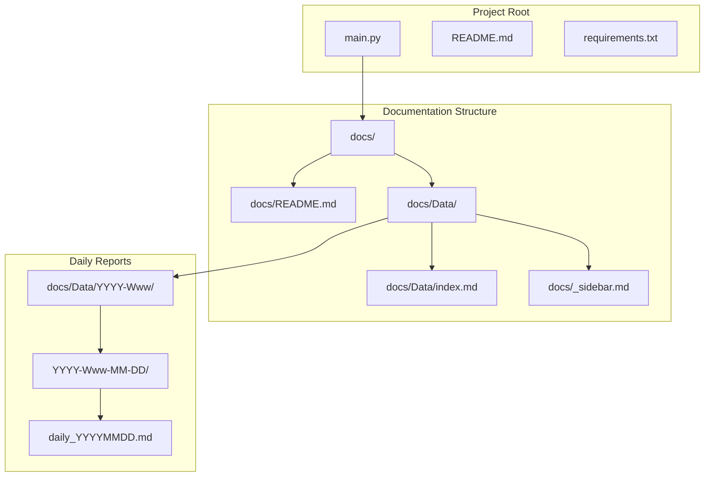
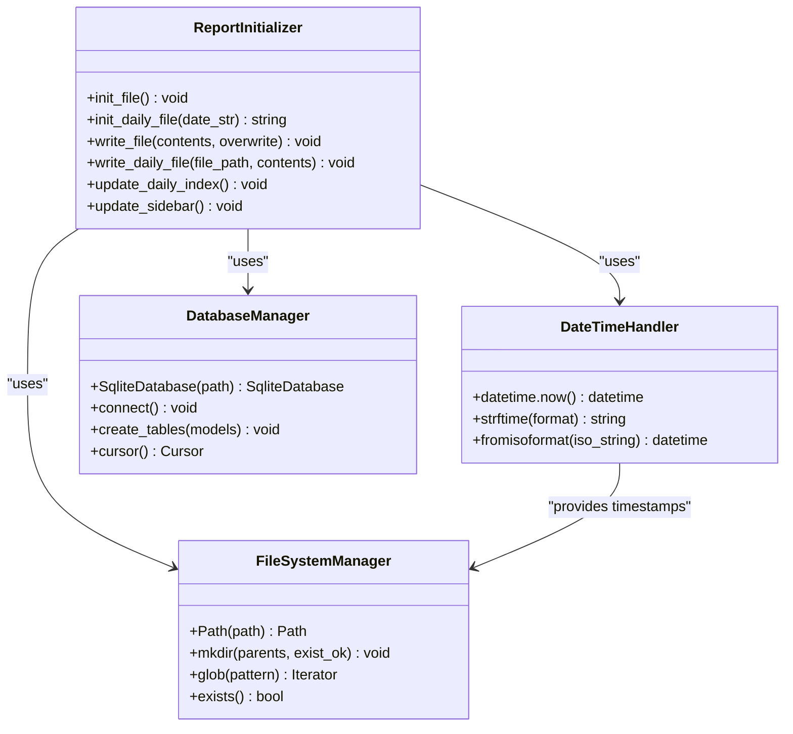
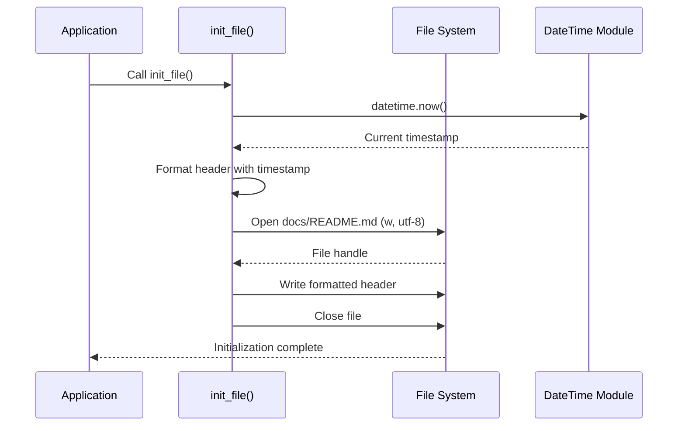
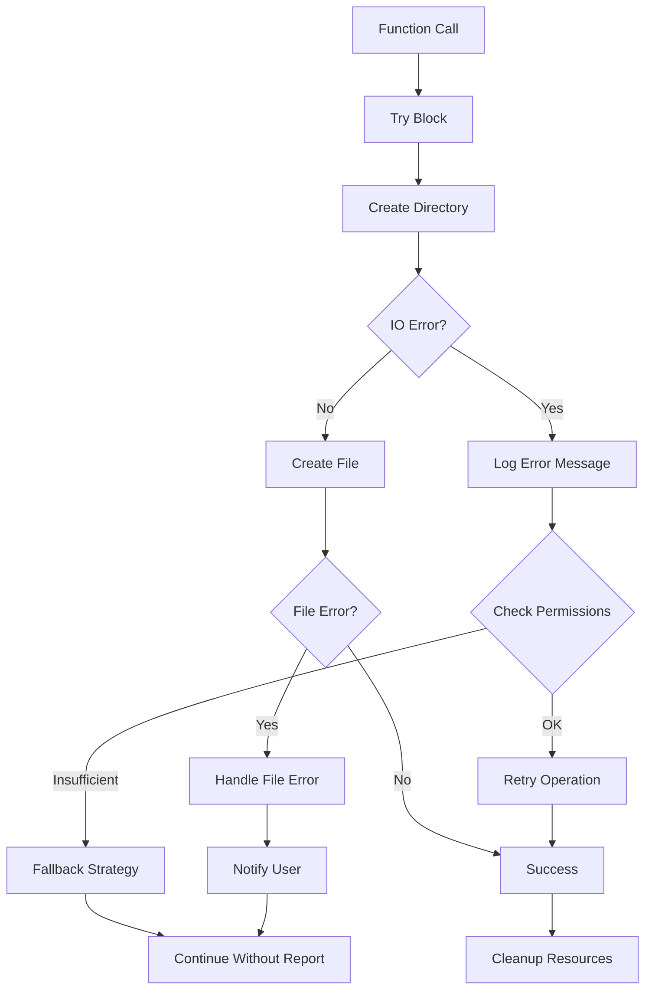

# Report Initialization Functions Documentation

<cite>
**Referenced Files in This Document**
- [main.py](file://main.py)
- [README.md](file://README.md)
- [requirements.txt](file://requirements.txt)
</cite>

## Table of Contents
1. [Introduction](#introduction)
2. [Project Structure](#project-structure)
3. [Core Initialization Functions](#core-initialization-functions)
4. [Architecture Overview](#architecture-overview)
5. [Detailed Function Analysis](#detailed-function-analysis)
6. [Directory Structure Management](#directory-structure-management)
7. [Error Handling and Edge Cases](#error-handling-and-edge-cases)
8. [Performance Considerations](#performance-considerations)
9. [Customization Guide](#customization-guide)
10. [Troubleshooting Guide](#troubleshooting-guide)
11. [Conclusion](#conclusion)

## Introduction

The Github CVE Monitor project utilizes two primary initialization functions to establish the comprehensive reporting infrastructure: `init_file()` and `init_daily_file()`. These functions are responsible for setting up the main documentation structure and daily report directories respectively, forming the foundation for automated CVE monitoring and reporting.

The initialization system creates a hierarchical documentation structure that includes:
- A comprehensive main README.md file with metadata and table headers
- Daily report directories following a standardized `/Data/YYYY-Www-M-D` format
- Proper UTF-8 encoded file writing with timestamp integration
- Robust directory creation with parent support

## Project Structure

The project follows a clean, modular structure designed for automated documentation generation:



**Diagram sources**
- [main.py](file://main.py#L1-L420)

**Section sources**
- [main.py](file://main.py#L1-L420)
- [README.md](file://README.md#L1-L76)

## Core Initialization Functions

The initialization system consists of two primary functions that work together to establish the documentation framework:

### Function Overview

```mermaid
flowchart TD
Start([Application Start]) --> InitMain[init_file()<br/>Initialize Main README]
InitMain --> GetDate[Get Current Date<br/>datetime.now()]
GetDate --> CreateHeader[Create Markdown Header<br/>with Timestamp]
CreateHeader --> WriteMain[Write to docs/README.md<br/>UTF-8 Encoding]
WriteMain --> InitDaily[init_daily_file()<br/>Initialize Daily Directory]
InitDaily --> ParseDate[Parse Date Components<br/>Year, Week, Month, Day]
ParseDate --> CreateDir[Create Directory Structure<br/>parents=True, exist_ok=True]
CreateDir --> CreateFile[Create Daily Report File<br/>daily_YYYYMMDD.md]
CreateFile --> WriteDaily[Write Daily Template<br/>UTF-8 Encoding]
WriteDaily --> End([Initialization Complete])
```

**Diagram sources**
- [main.py](file://main.py#L38-L42)
- [main.py](file://main.py#L50-L82)

**Section sources**
- [main.py](file://main.py#L38-L82)

## Architecture Overview

The initialization architecture follows a layered approach with clear separation of concerns:



**Diagram sources**
- [main.py](file://main.py#L1-L20)
- [main.py](file://main.py#L38-L82)

## Detailed Function Analysis

### init_file() Function

The `init_file()` function serves as the primary initializer for the main documentation file, establishing the comprehensive report structure with metadata and table headers.

```python
def init_file():
    newline = "# Github CVE Monitor\n\n> Automatic monitor github cve using Github Actions \n\n Last generated : {}\n\n| CVE | 相关仓库（poc/exp） | 描述 | 日期 |\n|---|---|---|---|\n".format(datetime.now())
    with open('docs/README.md','w', encoding='utf-8') as f:
        f.write(newline) 
    f.close()
```

#### Key Features:

1. **Dynamic Timestamp Integration**: Uses `datetime.now()` to insert the current timestamp in the header
2. **UTF-8 Encoding**: Ensures proper character encoding for international characters
3. **Markdown Structure**: Creates a well-formatted table header with appropriate column separators
4. **File Mode**: Opens file in write mode ('w') to create a fresh document

#### Implementation Details:



**Diagram sources**
- [main.py](file://main.py#L38-L42)

**Section sources**
- [main.py](file://main.py#L38-L42)

### init_daily_file() Function

The `init_daily_file()` function creates the daily report directory structure and initializes individual daily report files with comprehensive templates.

```python
def init_daily_file(date_str):
    """初始化每日报告文件"""
    # 创建日期目录
    today = datetime.now()
    year = today.year
    week_number = today.strftime("%W")
    month = today.strftime("%m")
    day = today.strftime("%d")
    
    # 创建目录结构 /Data/YYYY-Wmm-dd
    dir_path = f"docs/Data/{year}-W{week_number}-{month}-{day}"
    Path(dir_path).mkdir(parents=True, exist_ok=True)
    
    # 创建每日报告文件
    file_path = f"{dir_path}/daily_{date_str}.md"
    newline = f"""# 每日 情报速递 报告 ({date_str})

> Automatic monitor Github CVE using Github Actions 

## 报告信息
- **生成时间**: {datetime.now().strftime('%Y-%m-%d %H:%M:%S')}
- **数据来源**: GitHub CVE 数据库

## 今日 情报速递

| CVE | 相关仓库（poc/exp） | 描述 | 日期 |
|:---|:---|:---|:---|
"""
    
    with open(file_path, 'w', encoding='utf-8') as f:
        f.write(newline)
    
    return file_path
```

#### Directory Structure Creation:

The function creates a hierarchical directory structure following the pattern:
```
/docs/Data/
├── YYYY-Www/
│   ├── MM-DD/
│   │   └── daily_YYYYMMDD.md
```

Where:
- `YYYY`: Four-digit year
- `Www`: Week number (00-53)
- `MM`: Two-digit month
- `DD`: Two-digit day
- `YYYYMMDD`: Date string for filename

#### Template Structure:

The daily report template includes:

1. **Header Information**: Dynamic date insertion and timestamp
2. **Metadata Section**: Generation time and data source
3. **Table Schema**: Formatted table with left-aligned columns
4. **UTF-8 Encoding**: Ensures proper international character support

**Section sources**
- [main.py](file://main.py#L50-L82)

## Directory Structure Management

The directory structure management system ensures proper organization and accessibility of daily reports through several key mechanisms:

### Path Construction and Validation

```mermaid
flowchart TD
Start([init_daily_file Called]) --> GetToday[Get Current Date<br/>datetime.now()]
GetToday --> ExtractYear[Extract Year<br/>today.year]
ExtractYear --> ExtractWeek[Extract Week Number<br/>today.strftime("%W")]
ExtractWeek --> ExtractMonth[Extract Month<br/>today.strftime("%m")]
ExtractMonth --> ExtractDay[Extract Day<br/>today.strftime("%d")]
ExtractDay --> BuildPath[Build Directory Path<br/>f"docs/Data/{year}-W{week}-{month}-{day}"]
BuildPath --> CreateDirs[Create Directories<br/>Path.mkdir(parents=True, exist_ok=True)]
CreateDirs --> ValidatePath{Path Created Successfully?}
ValidatePath --> |Yes| CreateFile[Create Daily File<br/>daily_YYYYMMDD.md]
ValidatePath --> |No| HandleError[Handle Directory Error]
CreateFile --> WriteTemplate[Write Daily Template]
WriteTemplate --> ReturnPath[Return File Path]
HandleError --> ReturnError[Return Error Status]
```

**Diagram sources**
- [main.py](file://main.py#L50-L65)

### Directory Creation Strategy

The function employs a robust directory creation strategy:

1. **Parent Directory Support**: `parents=True` automatically creates intermediate directories
2. **Existence Tolerance**: `exist_ok=True` prevents errors when directories already exist
3. **Atomic Operations**: Single operation for complete directory tree creation
4. **Path Normalization**: Automatically handles path separators and normalization

**Section sources**
- [main.py](file://main.py#L60-L65)

## Error Handling and Edge Cases

The initialization functions implement several error handling strategies to ensure robust operation:

### Common Issues and Solutions

#### Directory Permission Errors

```python
# Problem: Insufficient permissions to create directories
# Solution: Graceful fallback and error reporting
try:
    Path(dir_path).mkdir(parents=True, exist_ok=True)
except PermissionError as e:
    print(f"Permission denied creating directory: {dir_path}")
    # Alternative approach: Log error and skip report generation
```

#### Path Traversal Problems

```python
# Problem: Malicious or invalid path components
# Solution: Path validation and sanitization
import os
from pathlib import Path

def safe_create_directory(base_path, relative_path):
    """Safely create directory with path traversal protection"""
    safe_path = os.path.normpath(os.path.join(base_path, relative_path))
    if not safe_path.startswith(os.path.abspath(base_path)):
        raise ValueError("Path traversal detected")
    Path(safe_path).mkdir(parents=True, exist_ok=True)
```

#### Timestamp Formatting Inconsistencies

```python
# Problem: Different timezone handling
# Solution: Consistent UTC+8 timezone specification
from datetime import datetime, timezone, timedelta

def get_formatted_timestamp():
    """Get consistently formatted timestamp"""
    utc_plus_8 = timezone(timedelta(hours=8))
    now = datetime.now(utc_plus_8)
    return now.strftime('%Y-%m-%d %H:%M:%S')
```

### Error Handling Patterns



**Section sources**
- [main.py](file://main.py#L50-L82)

## Performance Considerations

The initialization functions are designed for optimal performance in automated environments:

### Optimization Strategies

1. **Minimal Dependencies**: Uses built-in Python libraries only
2. **Single-Pass Operations**: Directory and file creation in single operations
3. **Efficient String Formatting**: Uses f-strings for optimal performance
4. **Resource Management**: Proper file handle closure and cleanup

### Memory Usage

```python
# Efficient memory usage pattern
def init_file_efficient():
    """Efficient file initialization with minimal memory footprint"""
    header_template = """# Github CVE Monitor

> Automatic monitor github cve using Github Actions 

Last generated : {}

| CVE | 相关仓库（poc/exp） | 描述 | 日期 |
|---|---|---|---|
"""
    timestamp = datetime.now().strftime('%Y-%m-%d %H:%M:%S')
    header_content = header_template.format(timestamp)
    
    # Single write operation minimizes memory usage
    with open('docs/README.md', 'w', encoding='utf-8') as f:
        f.write(header_content)
```

### Scalability Considerations

- **Concurrent Access**: Designed for single-threaded execution
- **Disk Space**: Minimal overhead for directory and file creation
- **Network Impact**: No external network dependencies
- **CPU Usage**: Negligible computational overhead

## Customization Guide

The initialization functions can be customized to meet specific requirements:

### Template Customization

#### Adding Custom Metadata

```python
def init_custom_daily_file(date_str, custom_metadata=None):
    """Initialize daily file with custom metadata"""
    if custom_metadata is None:
        custom_metadata = {}
    
    metadata_section = ""
    if custom_metadata:
        metadata_section = "\n".join([f"- **{key}**: {value}" for key, value in custom_metadata.items()])
    
    newline = f"""# 每日 情报速递 报告 ({date_str})

> Automatic monitor Github CVE using Github Actions 

## 报告信息
- **生成时间**: {datetime.now().strftime('%Y-%m-%d %H:%M:%S')}
- **数据来源**: GitHub CVE 数据库
{metadata_section}

## 今日 情报速递

| CVE | 相关仓库（poc/exp） | 描述 | 日期 |
|:---|:---|:---|:---|
"""
```

#### Custom Table Headers

```python
def init_daily_file_with_custom_headers(date_str, headers=None):
    """Initialize with custom table headers"""
    if headers is None:
        headers = ["CVE ID", "Repository", "Description", "Timestamp"]
    
    # Create custom separator line
    separators = "|".join(["---"] * len(headers))
    
    newline = f"""# 每日 情报速递 报告 ({date_str})

> Automatic monitor Github CVE using Github Actions 

## 报告信息
- **生成时间**: {datetime.now().strftime('%Y-%m-%d %H:%M:%S')}
- **数据来源**: GitHub CVE 数据库

## 今日 情报速递

| {headers[0]} | {headers[1]} | {headers[2]} | {headers[3]} |
|{separators}|
"""
```

### Directory Structure Modifications

#### Alternative Directory Pattern

```python
def init_daily_file_alternative(date_str):
    """Alternative directory structure: /Data/YYYY/MM/DD/"""
    today = datetime.now()
    year = today.year
    month = today.strftime("%m")
    day = today.strftime("%d")
    
    # Alternative pattern: /Data/YYYY/MM/DD/
    dir_path = f"docs/Data/{year}/{month}/{day}"
    Path(dir_path).mkdir(parents=True, exist_ok=True)
    
    file_path = f"{dir_path}/daily_{date_str}.md"
    # ... rest of function remains the same
```

**Section sources**
- [main.py](file://main.py#L50-L82)

## Troubleshooting Guide

Common issues and their solutions when working with report initialization:

### Issue 1: Directory Creation Failures

**Symptoms**: Permission denied errors or directory creation failures

**Diagnosis**:
```python
import os
from pathlib import Path

def diagnose_directory_issues(base_path):
    """Diagnose directory creation issues"""
    try:
        test_path = Path(base_path) / "test_dir"
        test_path.mkdir(parents=True, exist_ok=True)
        print(f"Test successful: {test_path}")
        
        # Check permissions
        permissions = oct(test_path.stat().st_mode)[-3:]
        print(f"Directory permissions: {permissions}")
        
        # Check if writable
        test_file = test_path / "test_write.txt"
        with open(test_file, 'w') as f:
            f.write("test")
        print("Write test successful")
        
    except Exception as e:
        print(f"Directory issue: {e}")
```

**Solution**: Ensure proper directory permissions and disk space availability

### Issue 2: Character Encoding Problems

**Symptoms**: Special characters appearing incorrectly in reports

**Solution**: Verify UTF-8 encoding throughout the pipeline:

```python
def validate_encoding(text):
    """Validate UTF-8 encoding"""
    try:
        text.encode('utf-8')
        return True
    except UnicodeEncodeError:
        return False

# Usage in initialization
def init_file_safe():
    """Safe initialization with encoding validation"""
    header = "# Github CVE Monitor\n\n> Automatic monitor github cve using Github Actions \n\n Last generated : {}\n\n| CVE | 相关仓库（poc/exp） | 描述 | 日期 |\n|---|---|---|---|\n".format(datetime.now())
    
    if validate_encoding(header):
        with open('docs/README.md', 'w', encoding='utf-8') as f:
            f.write(header)
    else:
        print("Encoding validation failed")
```

### Issue 3: Timestamp Synchronization

**Symptoms**: Timestamp inconsistencies across reports

**Solution**: Implement centralized timestamp management:

```python
class TimestampManager:
    def __init__(self):
        self.timezone_offset = 8  # UTC+8
    
    def get_synced_timestamp(self):
        """Get synchronized timestamp across all operations"""
        utc_time = datetime.utcnow()
        local_time = utc_time + timedelta(hours=self.timezone_offset)
        return local_time.strftime('%Y-%m-%d %H:%M:%S')

timestamp_mgr = TimestampManager()

def init_file_consistent():
    """Consistent timestamp across initialization"""
    timestamp = timestamp_mgr.get_synced_timestamp()
    header = f"# Github CVE Monitor\n\n> Automatic monitor github cve using Github Actions \n\n Last generated : {timestamp}\n\n| CVE | 相关仓库（poc/exp） | 描述 | 日期 |\n|---|---|---|---|\n"
    
    with open('docs/README.md', 'w', encoding='utf-8') as f:
        f.write(header)
```

### Issue 4: Concurrent Access Conflicts

**Symptoms**: Race conditions during simultaneous initialization

**Solution**: Implement file locking mechanism:

```python
import fcntl

def init_file_with_lock():
    """Thread-safe initialization with file locking"""
    lock_file = 'docs/.init.lock'
    
    try:
        # Create lock file
        with open(lock_file, 'w') as lock:
            fcntl.flock(lock.fileno(), fcntl.LOCK_EX)  # Exclusive lock
            
            # Perform initialization
            header = f"# Github CVE Monitor\n\n> Automatic monitor github cve using Github Actions \n\n Last generated : {datetime.now()}\n\n| CVE | 相关仓库（poc/exp） | 描述 | 日期 |\n|---|---|---|---|\n"
            with open('docs/README.md', 'w', encoding='utf-8') as f:
                f.write(header)
            
            # Release lock automatically when context exits
    except IOError as e:
        print(f"Lock acquisition failed: {e}")
    finally:
        # Clean up lock file
        if os.path.exists(lock_file):
            os.remove(lock_file)
```

**Section sources**
- [main.py](file://main.py#L50-L82)

## Conclusion

The report initialization functions (`init_file()` and `init_daily_file()`) form the cornerstone of the Github CVE Monitor's documentation infrastructure. These functions provide a robust, scalable foundation for automated CVE monitoring and reporting through:

1. **Automated Structure Creation**: Seamless establishment of documentation hierarchies
2. **Standardized Templates**: Consistent formatting across all reports
3. **Robust Error Handling**: Comprehensive protection against common initialization issues
4. **Flexible Customization**: Extensible architecture supporting various reporting needs
5. **Performance Optimization**: Efficient resource utilization in automated environments

The initialization system's design emphasizes reliability, maintainability, and extensibility, making it suitable for production environments requiring continuous CVE monitoring and reporting. The functions' integration with the broader application ecosystem ensures seamless operation within the automated monitoring workflow.

Future enhancements could include template customization options, alternative directory structures, and enhanced error reporting mechanisms, building upon the solid foundation established by the current implementation.