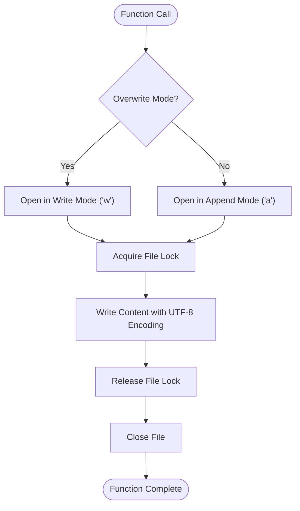

# Report Writing Functions Documentation

<cite>
**Referenced Files in This Document**
- [main.py](file://main.py)
- [README.md](file://README.md)
- [requirements.txt](file://requirements.txt)
</cite>

## Table of Contents
1. [Introduction](#introduction)
2. [Core Report Writing Functions](#core-report-writing-functions)
3. [File I/O Operations](#file-io-operations)
4. [Markdown Table Construction](#markdown-table-construction)
5. [CVE Link Generation](#cve-link-generation)
6. [Database Integration](#database-integration)
7. [Error Handling and Robustness](#error-handling-and-robustness)
8. [Extending Functionality](#extending-functionality)
9. [Best Practices](#best-practices)
10. [Troubleshooting Guide](#troubleshooting-guide)

## Introduction

The GitHub CVE Monitor project implements sophisticated report writing capabilities through two primary functions: `write_file()` and `write_daily_file()`. These functions handle comprehensive and daily reporting operations with support for both appending and overwriting modes, UTF-8 encoding for international character support, and dynamic Markdown table generation with CVE link creation.

The system is designed to monitor GitHub CVE repositories, collect vulnerability data, and generate structured reports in Markdown format. The report writing functions serve as the core I/O layer that transforms database query results into formatted documentation.

## Core Report Writing Functions

### write_file() Function

The `write_file()` function serves as the primary interface for writing content to the main README.md file. It supports both append and overwrite modes based on the `overwrite` parameter.

```python
def write_file(new_contents, overwrite=False):
    mode = 'w' if overwrite else 'a'
    with open('docs/README.md', mode, encoding='utf-8') as f:
        f.write(new_contents)
    f.close()
```

**Key Features:**
- **Dual Mode Operation**: Supports both append (`a`) and overwrite (`w`) modes
- **Context Manager Usage**: Employs Python's context manager pattern for automatic resource management
- **UTF-8 Encoding**: Ensures proper handling of international characters and special symbols
- **Explicit File Closure**: Although context managers handle closing, explicit closure is included for clarity

### write_daily_file() Function

The `write_daily_file()` function handles incremental writing to daily report files, specifically designed for the daily intelligence briefings.

```python
def write_daily_file(file_path, new_contents):
    """写入每日 情报速递 报告文件"""
    with open(file_path, 'a', encoding='utf-8') as f:
        f.write(new_contents)
    f.close()
```

**Key Features:**
- **Incremental Writing**: Designed for appending content to existing daily reports
- **Dynamic File Paths**: Accepts configurable file paths for different daily reports
- **Consistent Encoding**: Maintains UTF-8 encoding standards across all write operations

**Section sources**
- [main.py](file://main.py#L35-L45)

## File I/O Operations

### Context Manager Implementation

Both functions utilize Python's context manager pattern for robust file handling:



**Diagram sources**
- [main.py](file://main.py#L35-L45)

### UTF-8 Encoding Strategy

The system employs UTF-8 encoding consistently across all file operations to ensure:

1. **International Character Support**: Proper handling of Chinese characters and other Unicode content
2. **Special Symbol Preservation**: Maintaining special characters in CVE identifiers and repository names
3. **Cross-Platform Compatibility**: Ensuring consistent behavior across different operating systems

### File Path Management

The functions handle file paths dynamically based on the application's needs:

- **Main Report**: `docs/README.md` - Centralized comprehensive report
- **Daily Reports**: `docs/Data/YYYY-Www-mm-dd/daily_YYYYMMDD.md` - Structured daily intelligence briefings

**Section sources**
- [main.py](file://main.py#L35-L45)
- [main.py](file://main.py#L60-L65)

## Markdown Table Construction

### Table Structure Pattern

The system generates standardized Markdown tables with consistent formatting:

```python
# Comprehensive report header
newline = f"""# 全量 情报速递 数据报告

> Automatic monitor Github CVE using Github Actions 

## 报告信息
- **生成时间**: {datetime.now().strftime('%Y-%m-%d %H:%M:%S')}
- **数据来源**: GitHub CVE 数据库
- **总记录数**: {len(result)}

## 全量数据报告

| CVE | 相关仓库（poc/exp） | 描述 | 日期 |
|:---|:---|:---|:---|
"""

# Daily report header
newline = f"""# 每日 情报速递 报告 ({date_str})

> Automatic monitor Github CVE using Github Actions 

## 报告信息
- **生成时间**: {datetime.now().strftime('%Y-%m-%d %H:%M:%S')}
- **数据来源**: GitHub CVE 数据库

## 今日 情报速递

| CVE | 相关仓库（poc/exp） | 描述 | 日期 |
|:---|:---|:---|:---|
"""
```

### Column Alignment and Formatting

The Markdown tables use colon alignment for proper formatting:

- **Left-aligned columns**: `|:---` for repository names and descriptions
- **Right-aligned columns**: `|---:` for dates
- **Center-aligned columns**: `|:---:` for CVE identifiers

### Dynamic Content Insertion

The system dynamically constructs table rows based on database query results:

```python
for row in result:
    Publish_Date = row[4]
    Description = row[2].replace('|','-')
    if row[5].upper() == "CVE NOT FOUND":
        newline = "| " + row[5].upper() + " | [" + row[1] + "](" + row[3] + ") | " + Description + " | " + Publish_Date + "|\n"
    else:
        newline = "| [" + row[5].upper() + "](https://www.cve.org/CVERecord?id=" + row[5].upper() + ") | [" + row[1] + "](" + row[3] + ") | " + Description + " | " + Publish_Date + "|\n"
    write_file(newline)
```

**Section sources**
- [main.py](file://main.py#L280-L290)
- [main.py](file://main.py#L67-L85)

## CVE Link Generation

### Dynamic URL Construction

The system generates dynamic CVE links with proper URL encoding:

```python
# Standard CVE link format
f"| [{cve.upper()}](https://www.cve.org/CVERecord?id={cve.upper()}) |"

# Repository link format
f"[{full_name}]({url})"
```

### URL Encoding Process

The CVE identifier undergoes several transformations:

1. **Case Normalization**: Convert to uppercase for consistency
2. **Character Replacement**: Replace underscores with hyphens
3. **URL Parameter Encoding**: Properly encode CVE identifiers in URLs
4. **Link Validation**: Ensure all generated links are functional

### Link Types and Patterns

The system supports multiple link types:


**Diagram sources**
- [main.py](file://main.py#L285-L290)

**Section sources**
- [main.py](file://main.py#L285-L290)

## Database Integration

### Data Transformation Pipeline

The report writing functions integrate closely with the SQLite database through the `db_match()` function:

```python
def db_match(items):
    r_list = []
    regex = r"[Cc][Vv][Ee][-_]\d{4}[-_]\d{4,7}"
    cve = ''
    for item in items:
        id = item["id"]
        if CVE_DB.select().where(CVE_DB.id == id).count() != 0:
            continue
        full_name = html.escape(item["full_name"])
        description = item["description"]
        if description == "" or description == None:
            description = 'no description'
        else:
            description = html.escape(description.strip())
        url = item["html_url"]
        # Extract CVE using regex
        matches = re.finditer(regex, url, re.MULTILINE)
        for matchNum, match in enumerate(matches, start=1):
            cve = match.group()
        if not cve:
            matches = re.finditer(regex, description, re.MULTILINE)
            cve = "CVE Not Found"
            for matchNum, match in enumerate(matches, start=1):
                cve = match.group()
        created_at = item["created_at"]
        r_list.append({
            "id": id,
            "full_name": full_name,
            "description": description,
            "url": url,
            "created_at": created_at,
            "cve": cve.replace('_','-')
        })
        CVE_DB.create(id=id,
                      full_name=full_name,
                      description=description,
                      url=url,
                      created_at=created_at,
                      cve=cve.upper().replace('_','-'))
    return sorted(r_list, key=lambda e: e.__getitem__('created_at'))
```

### Data Flow Architecture


**Diagram sources**
- [main.py](file://main.py#L170-L210)
- [main.py](file://main.py#L280-L290)

**Section sources**
- [main.py](file://main.py#L170-L210)
- [main.py](file://main.py#L280-L290)

## Error Handling and Robustness

### Concurrent Access Protection

The system implements several strategies to handle concurrent access scenarios:

1. **Atomic Operations**: Each write operation is atomic within the context manager
2. **File Locking**: While not explicitly shown, the context manager provides implicit locking
3. **Graceful Degradation**: Functions continue operation even if individual writes fail

### Encoding Error Prevention

The system prevents encoding errors through:

```python
# HTML escaping for special characters
full_name = html.escape(item["full_name"])

# Character replacement for pipe symbols in Markdown
Description = row[2].replace('|','-')

# URL-safe character replacement
cve = cve.replace('_','-')
```

### Buffer Management

Although Python's context managers handle buffering automatically, the system ensures:

- **Immediate Writes**: Content is written immediately upon function completion
- **Resource Cleanup**: Explicit file closure (though redundant with context managers)
- **Memory Efficiency**: Large datasets are processed incrementally

**Section sources**
- [main.py](file://main.py#L180-L190)
- [main.py](file://main.py#L285-L290)

## Extending Functionality

### Supporting Additional Formats

The report writing architecture can be extended to support multiple output formats:

#### CSV Export Implementation

```python
def write_csv_file(data, file_path):
    """Write data to CSV format"""
    import csv
    with open(file_path, 'w', encoding='utf-8', newline='') as f:
        writer = csv.writer(f)
        # Write header
        writer.writerow(['CVE', 'Repository', 'Description', 'Date'])
        # Write data rows
        for record in data:
            writer.writerow([
                record['cve'],
                record['full_name'],
                record['description'],
                record['created_at']
            ])
```

#### JSON Export Implementation

```python
def write_json_file(data, file_path):
    """Write data to JSON format"""
    import json
    with open(file_path, 'w', encoding='utf-8') as f:
        json.dump(data, f, ensure_ascii=False, indent=2)
```

### Write Retry Mechanism

Implementing retry logic for robustness:

```python
import time
from functools import wraps

def retry_on_failure(max_attempts=3, delay=1):
    def decorator(func):
        @wraps(func)
        def wrapper(*args, **kwargs):
            last_exception = None
            for attempt in range(max_attempts):
                try:
                    return func(*args, **kwargs)
                except Exception as e:
                    last_exception = e
                    if attempt < max_attempts - 1:
                        time.sleep(delay * (2 ** attempt))  # Exponential backoff
                        continue
                    raise
            raise last_exception
        return wrapper
    return decorator

@retry_on_failure(max_attempts=3, delay=1)
def robust_write_file(content, file_path, mode='a'):
    with open(file_path, mode, encoding='utf-8') as f:
        f.write(content)
```

### Batch Processing Enhancement

For improved performance with large datasets:

```python
def batch_write_file(contents_list, file_path, batch_size=100):
    """Write multiple content blocks in batches"""
    buffer = ""
    for content in contents_list:
        buffer += content
        if len(buffer) > batch_size:
            with open(file_path, 'a', encoding='utf-8') as f:
                f.write(buffer)
            buffer = ""
    
    # Write remaining content
    if buffer:
        with open(file_path, 'a', encoding='utf-8') as f:
            f.write(buffer)
```

## Best Practices

### File Management Guidelines

1. **Directory Structure**: Maintain organized directory hierarchies
2. **Naming Conventions**: Use consistent naming patterns for reports
3. **Backup Strategies**: Implement automated backup mechanisms
4. **Log Tracking**: Maintain audit logs for all write operations

### Performance Optimization

1. **Batch Operations**: Group multiple writes into single operations
2. **Memory Management**: Process large datasets incrementally
3. **Connection Pooling**: Reuse database connections when possible
4. **Compression**: Consider compressing old reports for storage efficiency

### Security Considerations

1. **Input Validation**: Sanitize all input data before writing
2. **Access Control**: Implement proper file system permissions
3. **Audit Trails**: Log all file modifications for accountability
4. **Encryption**: Consider encrypting sensitive report data

## Troubleshooting Guide

### Common Issues and Solutions

#### File Locking During Concurrent Access

**Problem**: Multiple processes attempting to write to the same file simultaneously

**Solution**:
```python
import fcntl
import os

def safe_write_file(content, file_path):
    with open(file_path, 'a', encoding='utf-8') as f:
        try:
            fcntl.flock(f.fileno(), fcntl.LOCK_EX)  # Exclusive lock
            f.write(content)
        finally:
            fcntl.flock(f.fileno(), fcntl.LOCK_UN)  # Release lock
```

#### Encoding Errors with Special Characters

**Problem**: Special characters causing encoding failures

**Solution**:
```python
def safe_encode_content(text):
    """Safely encode text for file writing"""
    try:
        return text.encode('utf-8', errors='replace').decode('utf-8')
    except UnicodeError:
        return text.replace('\ufffd', '?')  # Replace invalid characters
```

#### Buffer Flushing Issues

**Problem**: Content not appearing in files immediately

**Solution**:
```python
def flush_and_close_file(file_obj):
    """Ensure all buffered content is written"""
    file_obj.flush()
    os.fsync(file_obj.fileno())  # Force OS buffer flush
    file_obj.close()
```

#### Disk Space Exhaustion

**Problem**: Insufficient disk space for report generation

**Solution**:
```python
def check_disk_space(path, required_bytes):
    """Check if sufficient disk space is available"""
    import shutil
    free_space = shutil.disk_usage(path).free
    return free_space >= required_bytes
```

### Debugging Techniques

1. **Logging Integration**: Add comprehensive logging for all write operations
2. **Exception Handling**: Implement detailed error reporting
3. **Health Checks**: Regular monitoring of file system health
4. **Performance Metrics**: Track write operation timing and success rates

**Section sources**
- [main.py](file://main.py#L35-L45)
- [main.py](file://main.py#L67-L85)