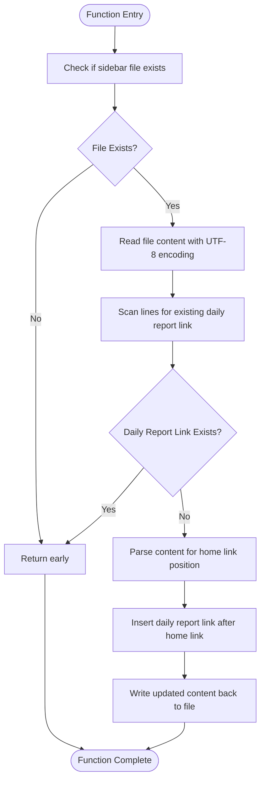
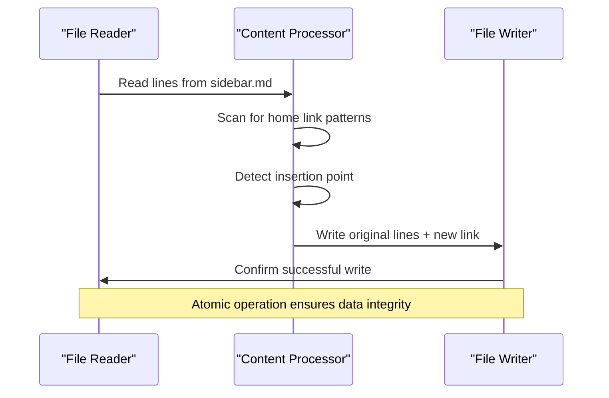

# Sidebar Management

<cite>
**Referenced Files in This Document**
- [main.py](file://main.py)
- [docs/_sidebar.md](file://docs/_sidebar.md)
- [README.md](file://README.md)
</cite>

## Table of Contents
1. [Introduction](#introduction)
2. [Function Overview](#function-overview)
3. [Core Implementation Details](#core-implementation-details)
4. [File Handling Strategy](#file-handling-strategy)
5. [String Matching Logic](#string-matching-logic)
6. [Error Handling and Edge Cases](#error-handling-and-edge-cases)
7. [Extension Guidelines](#extension-guidelines)
8. [Best Practices](#best-practices)
9. [Troubleshooting Guide](#troubleshooting-guide)
10. [Conclusion](#conclusion)

## Introduction

The sidebar management system in the CVE monitoring project provides automated navigation maintenance for the documentation website. The `update_sidebar()` function serves as the core component responsible for maintaining the navigation structure by adding the daily report link to the sidebar while preserving existing content and ensuring proper positioning.

This system demonstrates robust file handling, intelligent content parsing, and safe injection mechanisms that prevent corruption of existing documentation structures. The implementation focuses on maintaining backward compatibility while enhancing the navigation experience for users accessing the documentation site.

## Function Overview

The `update_sidebar()` function operates as a maintenance utility that ensures the daily report link appears consistently in the documentation sidebar. It performs several key operations:

- **File Existence Validation**: Checks if the sidebar file exists before attempting modifications
- **Content Parsing**: Reads the existing sidebar content line by line for intelligent processing
- **Duplicate Prevention**: Scans for existing daily report links to avoid duplication
- **Positional Insertion**: Adds new links immediately after the home page link
- **Safe File Writing**: Maintains original file structure while injecting new navigation elements



**Diagram sources**
- [main.py](file://main.py#L134-L164)

**Section sources**
- [main.py](file://main.py#L134-L164)

## Core Implementation Details

### Function Declaration and Path Resolution

The function begins by establishing the sidebar file path using Python's `Path` object from the `pathlib` module:

```python
sidebar_path = Path("docs/_sidebar.md")
```

This approach provides cross-platform compatibility and ensures proper path resolution regardless of the operating system. The function immediately validates file existence:

```python
if not sidebar_path.exists():
    return
```

This early return mechanism prevents unnecessary file operations when the sidebar doesn't exist, improving performance and avoiding errors.

### Content Reading Strategy

The function employs a line-by-line reading strategy that preserves the original file structure:

```python
with open(sidebar_path, 'r', encoding='utf-8') as f:
    lines = f.readlines()
```

Using UTF-8 encoding ensures compatibility with international characters commonly found in documentation content, preventing encoding-related corruption during file operations.

### Duplicate Detection Mechanism

The function implements a simple yet effective duplicate detection system:

```python
daily_report_exists = False
for line in lines:
    if "每日报告" in line:
        daily_report_exists = True
        break
```

This approach scans for the Chinese character sequence "每日报告" (daily report) to determine if the link already exists, preventing duplicate entries while maintaining flexibility for potential localization changes.

**Section sources**
- [main.py](file://main.py#L134-L150)

## File Handling Strategy

### Safe File Reading

The implementation prioritizes data preservation by reading the entire file content into memory before processing. This approach offers several advantages:

- **Atomic Operations**: Prevents partial updates that could corrupt the file
- **Memory Efficiency**: Handles typical sidebar files efficiently without loading excessive data
- **Encoding Safety**: Ensures consistent UTF-8 handling throughout the operation

### Intelligent Line Processing

The function processes each line individually while maintaining the original structure:

```python
new_lines = []
for line in lines:
    new_lines.append(line)
    if "- [主页](README.md)" in line or "- [Home](README.md)" in line:
        new_lines.append("- [每日报告](/Data/index.md)\n")
```

This strategy ensures that:
- Original formatting is preserved
- New links are inserted at the correct position
- Line endings remain intact
- Comments and metadata are maintained

### Atomic File Writing

The function writes the complete processed content back to the file in a single operation:

```python
with open(sidebar_path, 'w', encoding='utf-8') as f:
    f.writelines(new_lines)
```

This atomic write operation minimizes the risk of file corruption and ensures that either the complete updated content is written or no changes occur.

**Section sources**
- [main.py](file://main.py#L150-L164)

## String Matching Logic

### Home Link Detection

The function implements dual-language support by detecting both Chinese and English home link formats:

```python
"- [主页](README.md)" in line or "- [Home](README.md)" in line
```

This approach accommodates international users while maintaining consistent functionality across different language preferences.

### Positional Insertion Strategy

The insertion logic follows a specific pattern that ensures proper navigation hierarchy:

1. **Line Preservation**: Each original line is copied to the new content array
2. **Conditional Detection**: The function identifies the appropriate insertion point
3. **Immediate Injection**: The daily report link is added immediately after the home link
4. **Structure Maintenance**: The original file structure remains intact



**Diagram sources**
- [main.py](file://main.py#L150-L160)

**Section sources**
- [main.py](file://main.py#L150-L160)

## Error Handling and Edge Cases

### File Existence Validation

The function implements robust error handling through early validation:

```python
if not sidebar_path.exists():
    return
```

This approach gracefully handles scenarios where:
- The documentation directory doesn't exist
- The sidebar file was accidentally deleted
- Permission issues prevent file access

### Encoding Compatibility

UTF-8 encoding is consistently used throughout the file operations to handle:
- International characters in navigation titles
- Special symbols and punctuation
- Multilingual content support

### Duplicate Prevention

The duplicate detection mechanism prevents:
- Multiple daily report links in the sidebar
- Confusion for users navigating the documentation
- Potential layout issues caused by redundant entries

### Graceful Degradation

The function exhibits graceful degradation by:
- Returning early when the sidebar doesn't exist
- Preserving existing content even if processing fails
- Maintaining backward compatibility with older sidebar formats

**Section sources**
- [main.py](file://main.py#L137-L150)

## Extension Guidelines

### Adding Additional Navigation Items

To extend the sidebar with additional navigation items, modify the insertion logic:

```python
if "- [主页](README.md)" in line or "- [Home](README.md)" in line:
    new_lines.append("- [每日报告](/Data/index.md)\n")
    new_lines.append("- [新项目](/projects/new.md)\n")
    new_lines.append("- [帮助中心](/help/index.md)\n")
```

### Supporting Multiple Language Versions

For multilingual support, enhance the detection logic:

```python
home_patterns = [
    "- [主页](README.md)",
    "- [Home](README.md)",
    "- [Accueil](README.md)",  # French
    "- [Inicio](README.md)"   # Spanish
]

for pattern in home_patterns:
    if pattern in line:
        # Insert new links
        break
```

### Dynamic Link Generation

Implement dynamic link generation based on file availability:

```python
import os

def get_available_links():
    links = []
    if os.path.exists("docs/projects"):
        links.append("- [项目](/projects/index.md)")
    if os.path.exists("docs/tutorials"):
        links.append("- [教程](/tutorials/index.md)")
    return links

# In the main loop
for link in get_available_links():
    if link.split('](')[1].split(')')[0] in ''.join(lines):
        continue  # Skip if already exists
    new_lines.append(link + '\n')
```

**Section sources**
- [main.py](file://main.py#L150-L160)

## Best Practices

### File Path Management

Always use `Path` objects for cross-platform compatibility:

```python
from pathlib import Path
sidebar_path = Path("docs/_sidebar.md")
```

### Encoding Consistency

Maintain consistent UTF-8 encoding throughout file operations:

```python
with open(path, 'r', encoding='utf-8') as f:
    content = f.read()
```

### Defensive Programming

Implement comprehensive validation:

```python
def update_sidebar():
    sidebar_path = Path("docs/_sidebar.md")
    if not sidebar_path.exists():
        print(f"Sidebar file not found: {sidebar_path}")
        return
    
    try:
        # Process file operations
        pass
    except Exception as e:
        print(f"Error updating sidebar: {e}")
        return
```

### Logging and Debugging

Add logging for troubleshooting:

```python
import logging

logging.basicConfig(level=logging.INFO)
logger = logging.getLogger(__name__)

def update_sidebar():
    logger.info("Starting sidebar update process")
    # Implementation...
    logger.info("Sidebar update completed successfully")
```

## Troubleshooting Guide

### Common Issues and Solutions

#### Issue: Sidebar File Not Found
**Symptoms**: Function returns early without modification
**Cause**: `docs/_sidebar.md` doesn't exist
**Solution**: Ensure the documentation directory structure is complete

#### Issue: Encoding Mismatch
**Symptoms**: Characters appear corrupted in the sidebar
**Cause**: File encoded in non-UTF-8 format
**Solution**: Convert file to UTF-8 encoding or modify function to detect encoding

#### Issue: Incorrect Link Positioning
**Symptoms**: Daily report link appears in wrong location
**Cause**: Home link pattern doesn't match expected format
**Solution**: Verify home link format matches detection patterns

#### Issue: Sidebar Corruption
**Symptoms**: File becomes unreadable or loses content
**Cause**: File writing operation interrupted
**Solution**: Implement backup mechanism before file operations

### Diagnostic Steps

1. **Verify File Existence**:
   ```python
   sidebar_path = Path("docs/_sidebar.md")
   print(f"File exists: {sidebar_path.exists()}")
   print(f"File size: {sidebar_path.stat().st_size} bytes")
   ```

2. **Check File Encoding**:
   ```python
   import chardet
   
   with open("docs/_sidebar.md", 'rb') as f:
       raw_data = f.read()
       result = chardet.detect(raw_data)
       print(f"Detected encoding: {result['encoding']}")
   ```

3. **Validate Content Structure**:
   ```python
   with open("docs/_sidebar.md", 'r', encoding='utf-8') as f:
       content = f.read()
       print(f"Contains home link: {'[主页]' in content or '[Home]' in content}")
       print(f"Contains daily report: {'每日报告' in content}")
   ```

### Recovery Procedures

#### Backup Restoration
```python
import shutil

def restore_sidebar_backup():
    backup_path = "docs/_sidebar.md.bak"
    if Path(backup_path).exists():
        shutil.copy(backup_path, "docs/_sidebar.md")
        print("Sidebar restored from backup")
```

#### Manual Fix Procedure
1. Create manual backup: `cp docs/_sidebar.md docs/_sidebar.md.manual`
2. Edit file manually to correct issues
3. Run function again to verify automatic fixes

**Section sources**
- [main.py](file://main.py#L137-L150)

## Conclusion

The sidebar management system demonstrates sophisticated file handling and content manipulation capabilities. The `update_sidebar()` function provides a robust solution for maintaining navigation consistency while preserving existing documentation structure.

Key strengths of this implementation include:

- **Reliability**: Early validation prevents errors and ensures graceful operation
- **Flexibility**: Supports multiple languages and future extensions
- **Safety**: Atomic operations minimize risk of file corruption
- **Maintainability**: Clear, readable code facilitates future enhancements

The system serves as an excellent example of how to safely manipulate documentation files while maintaining data integrity and user experience. Future enhancements could include dynamic content generation, multilingual support expansion, and automated testing procedures.