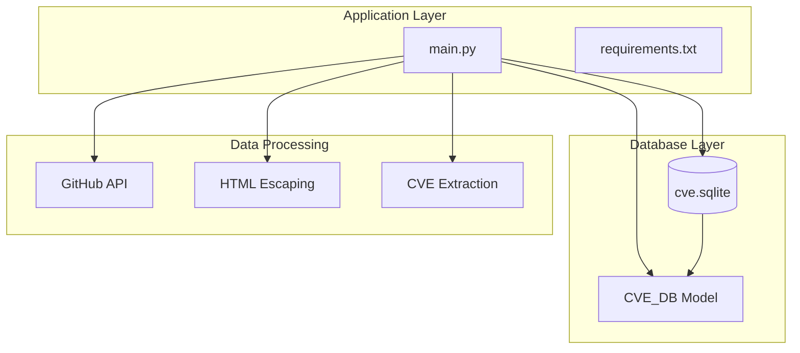
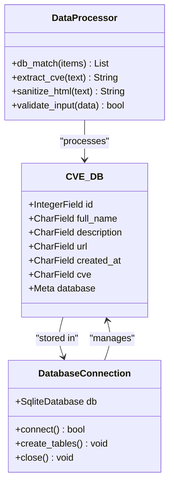
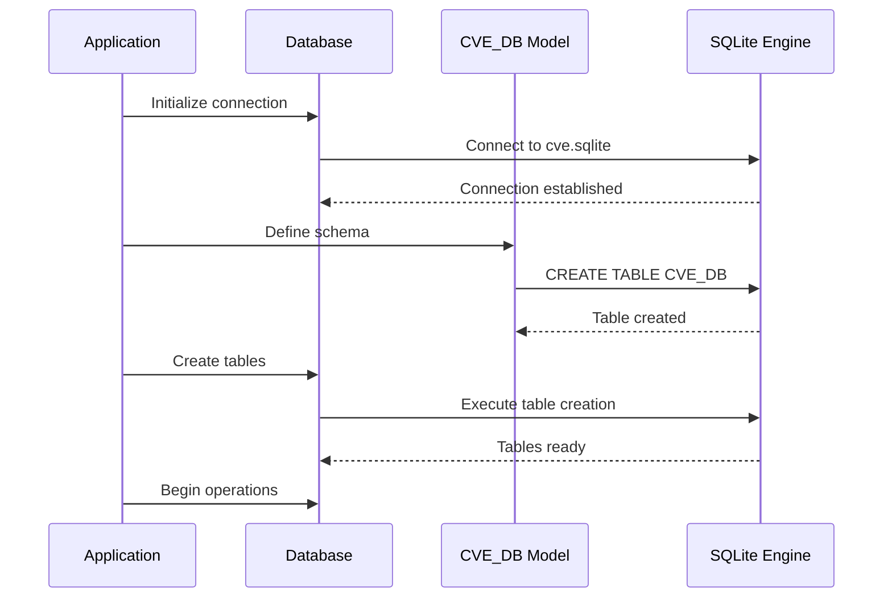
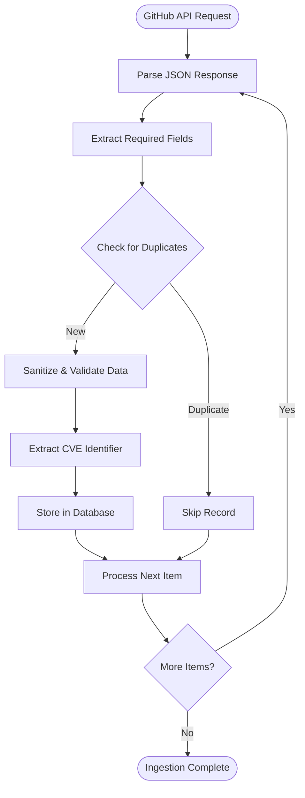

# Database Schema Design

<cite>
**Referenced Files in This Document**
- [main.py](file://main.py)
- [requirements.txt](file://requirements.txt)
</cite>

## Table of Contents
1. [Introduction](#introduction)
2. [Project Structure](#project-structure)
3. [Core Database Model](#core-database-model)
4. [Schema Architecture](#schema-architecture)
5. [Field Specifications](#field-specifications)
6. [ORM Implementation](#orm-implementation)
7. [Data Validation and Sanitization](#data-validation-and-sanitization)
8. [Query Patterns and Indexing](#query-patterns-and-indexing)
9. [Data Lifecycle Management](#data-lifecycle-management)
10. [Performance Considerations](#performance-considerations)
11. [Troubleshooting Guide](#troubleshooting-guide)
12. [Conclusion](#conclusion)

## Introduction

The CVE_DB model represents a comprehensive database schema designed for storing and managing GitHub CVE (Common Vulnerabilities and Exposures) data. This documentation provides detailed insights into the database structure, implementation patterns, and operational characteristics of the system.

The database utilizes SQLite as the underlying storage engine with Peewee ORM for database abstraction and management. The schema is specifically designed to handle vulnerability data extraction, processing, and reporting with emphasis on data integrity, performance, and scalability.

## Project Structure

The project follows a minimalist architecture focused on database operations and data processing:



**Diagram sources**
- [main.py](file://main.py#L1-L420)
- [requirements.txt](file://requirements.txt#L1-L3)

**Section sources**
- [main.py](file://main.py#L1-L420)
- [requirements.txt](file://requirements.txt#L1-L3)

## Core Database Model

The CVE_DB model serves as the central data structure for storing vulnerability information extracted from GitHub repositories. The model is implemented using Peewee ORM and defines a comprehensive schema for vulnerability data management.



**Diagram sources**
- [main.py](file://main.py#L17-L26)
- [main.py](file://main.py#L135-L180)

**Section sources**
- [main.py](file://main.py#L17-L26)
- [main.py](file://main.py#L135-L180)

## Schema Architecture

The database schema is designed with a flat structure optimized for vulnerability data storage and retrieval. The architecture emphasizes simplicity while maintaining comprehensive data coverage.

### Table Creation Process

The database initialization follows a straightforward process:

1. **Database Connection**: Establishes connection to SQLite database file
2. **Model Definition**: Defines the CVE_DB model with field specifications
3. **Table Creation**: Creates the CVE_DB table with appropriate schema
4. **Index Setup**: Implements indexing for optimal query performance



**Diagram sources**
- [main.py](file://main.py#L28-L30)
- [main.py](file://main.py#L135-L140)

**Section sources**
- [main.py](file://main.py#L28-L30)
- [main.py](file://main.py#L135-L140)

## Field Specifications

The CVE_DB model defines six essential fields, each serving a specific purpose in vulnerability data management:

### Primary Identifier Field

```python
id = IntegerField(primary_key=True)
```

- **Type**: IntegerField
- **Purpose**: Unique identifier for each vulnerability record
- **Constraints**: Primary key, auto-incremented
- **Usage**: Prevents duplicate entries and enables efficient lookups

### Repository Information Fields

```python
full_name = CharField(max_length=1024)
description = CharField(max_length=4098)
url = CharField(max_length=1024)
```

- **full_name**: Complete repository name with owner
- **description**: Detailed vulnerability description
- **url**: GitHub repository URL
- **Max Lengths**: Optimized for GitHub API response sizes

### Timestamp Field

```python
created_at = CharField(max_length=128)
```

- **Format**: ISO 8601 timestamp string
- **Max Length**: 128 characters to accommodate various timestamp formats
- **Purpose**: Tracks vulnerability discovery and publication dates

### CVE Identifier Field

```python
cve = CharField(max_length=64)
```

- **Format**: Standard CVE identifier (e.g., CVE-2024-12345)
- **Max Length**: 64 characters to support future CVE formats
- **Normalization**: Converted to uppercase and standardized hyphen format

**Section sources**
- [main.py](file://main.py#L17-L26)
- [main.py](file://main.py#L135-L180)

## ORM Implementation

The Peewee ORM provides a robust abstraction layer for database operations, offering several advantages:

### Model Definition Pattern

```python
class CVE_DB(Model):
    id = IntegerField()
    full_name = CharField(max_length=1024)
    description = CharField(max_length=4098)
    url = CharField(max_length=1024)
    created_at = CharField(max_length=128)
    cve = CharField(max_length=64)

    class Meta:
        database = db
```

### Database Connection Management

```python
db = SqliteDatabase("db/cve.sqlite")
db.connect()
db.create_tables([CVE_DB])
```

### Query Operations

The system implements several key query patterns:

1. **Duplicate Prevention**: Checks existing records before insertion
2. **Sorting**: Orders results by CVE identifier in descending order
3. **Date Filtering**: Supports temporal queries for daily reports

**Section sources**
- [main.py](file://main.py#L17-L30)
- [main.py](file://main.py#L135-L180)

## Data Validation and Sanitization

The system implements comprehensive data validation and sanitization mechanisms to ensure data integrity and prevent security vulnerabilities:

### HTML Escaping

```python
full_name = html.escape(item["full_name"])
description = html.escape(description.strip())
```

- **Purpose**: Prevents HTML injection attacks and ensures safe display
- **Implementation**: Uses Python's built-in html module
- **Scope**: Applied to repository names and descriptions

### CVE Extraction and Normalization

```python
regex = r"[Cc][Vv][Ee][-_]\d{4}[-_]\d{4,7}"
cve = match.group().upper().replace('_','-')
```

- **Pattern Matching**: Extracts CVE identifiers from URLs and descriptions
- **Normalization**: Converts to uppercase and standardizes hyphen format
- **Fallback**: Handles cases where CVE is not found in URL

### Input Validation

```python
if description == "" or description == None:
    description = 'no description'
```

- **Null Handling**: Provides default values for missing data
- **Consistency**: Ensures all fields have meaningful content
- **Display Compatibility**: Prevents rendering issues in reports

**Section sources**
- [main.py](file://main.py#L135-L180)

## Query Patterns and Indexing

The database employs specific query patterns optimized for the application's data access requirements:

### Primary Query Pattern

```sql
SELECT * FROM CVE_DB ORDER BY cve DESC;
```

- **Purpose**: Retrieve all records sorted by CVE identifier
- **Performance**: Efficient for browsing and reporting
- **Indexing**: Implicitly benefits from primary key ordering

### Duplicate Detection

```python
if CVE_DB.select().where(CVE_DB.id == id).count() != 0:
    continue
```

- **Efficiency**: Uses primary key for fast existence checks
- **Prevention**: Eliminates duplicate entries during ingestion
- **Scalability**: O(log n) lookup performance

### Temporal Queries

```python
cur.execute(f"SELECT * FROM CVE_DB WHERE created_at >= '{seven_days_ago}' ORDER BY created_at DESC;")
```

- **Range Filtering**: Supports date-based data retrieval
- **Recent Data**: Enables daily report generation
- **Performance**: Leverages SQLite's native date handling

**Section sources**
- [main.py](file://main.py#L135-L180)
- [main.py](file://main.py#L350-L370)

## Data Lifecycle Management

The data lifecycle encompasses the complete journey from GitHub API ingestion to final reporting:

### Data Ingestion Phase



**Diagram sources**
- [main.py](file://main.py#L135-L180)

### Data Processing Pipeline

1. **API Integration**: Fetches data from GitHub's search API
2. **Field Extraction**: Parses repository metadata
3. **Duplicate Prevention**: Validates against existing records
4. **Data Sanitization**: Applies HTML escaping and normalization
5. **Storage**: Persists validated data to SQLite
6. **Indexing**: Maintains database indexes for optimal performance

### Reporting Generation

The system generates two types of reports:

1. **Full Report**: Comprehensive inventory of all CVE data
2. **Daily Report**: Focused on recent discoveries for timely alerts

**Section sources**
- [main.py](file://main.py#L135-L180)
- [main.py](file://main.py#L350-L420)

## Performance Considerations

The database design incorporates several performance optimization strategies:

### Storage Optimization

- **Field Lengths**: Carefully sized character fields to minimize storage overhead
- **Data Types**: Appropriate selection of integer vs. character fields
- **Index Strategy**: Primary key indexing for efficient lookups

### Query Performance

- **Sorted Retrieval**: Pre-sorted data reduces client-side processing
- **Efficient Filtering**: Primary key-based duplicate detection
- **Batch Operations**: Minimizes database round trips during ingestion

### Scalability Factors

- **SQLite Limitations**: Single-file database with concurrent access constraints
- **Memory Usage**: Character field sizing affects memory allocation
- **Index Maintenance**: Regular vacuum operations for optimal performance

## Troubleshooting Guide

Common issues and their solutions:

### Database Connection Issues

**Problem**: Cannot connect to SQLite database
**Solution**: Verify database file permissions and path accessibility

### Duplicate Record Prevention

**Problem**: Unexpected duplicate entries
**Solution**: Check primary key generation and duplicate detection logic

### Memory Constraints

**Problem**: Out of memory errors during large imports
**Solution**: Implement batch processing with controlled memory usage

### Data Integrity Issues

**Problem**: Corrupted or malformed data
**Solution**: Review HTML escaping and input validation logic

**Section sources**
- [main.py](file://main.py#L28-L30)
- [main.py](file://main.py#L135-L180)

## Conclusion

The CVE_DB schema represents a well-designed database solution for vulnerability data management. Its architecture balances simplicity with functionality, providing efficient storage and retrieval capabilities while maintaining data integrity and security.

Key strengths of the design include:

- **Robust Data Validation**: Comprehensive sanitization and normalization
- **Efficient Query Patterns**: Optimized for the application's access requirements
- **Scalable Architecture**: Modular design supporting future enhancements
- **Security Focus**: Built-in protection against common vulnerabilities

The implementation demonstrates effective use of Peewee ORM with SQLite, providing a solid foundation for vulnerability monitoring and reporting applications.