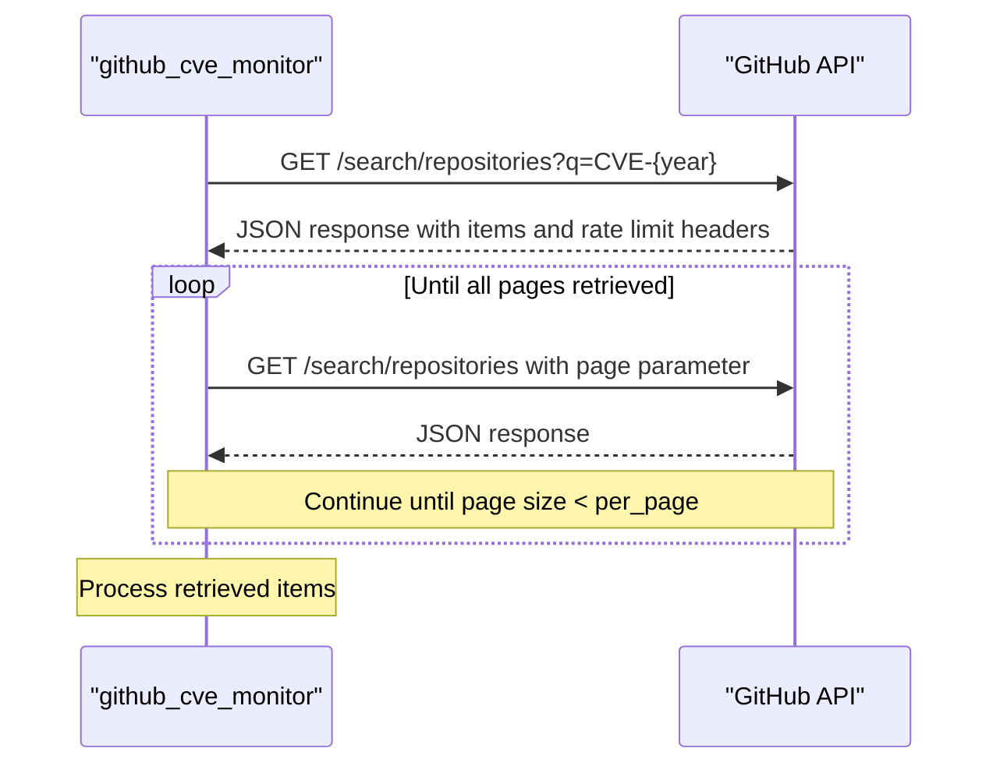
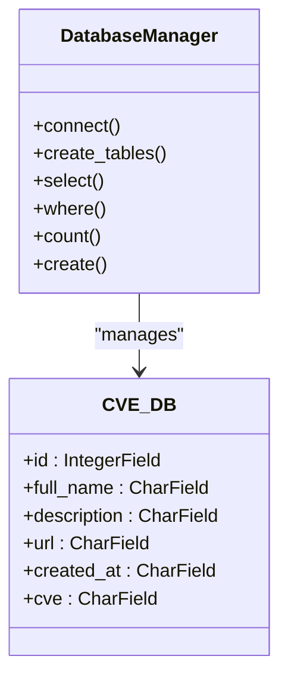
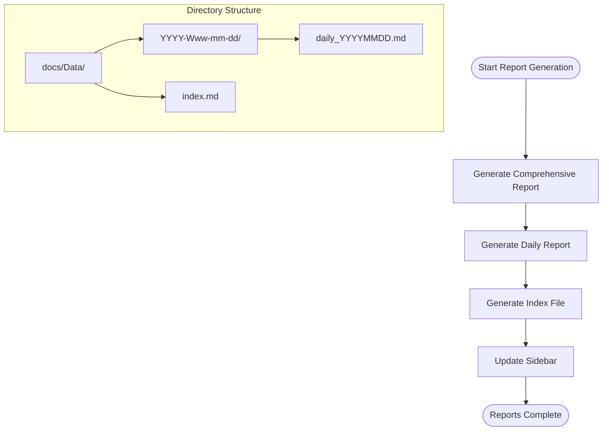
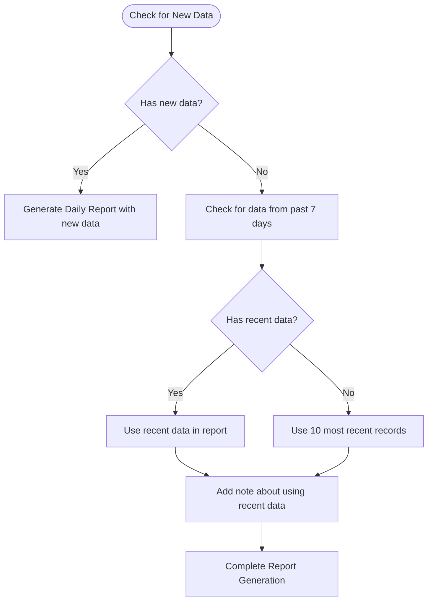
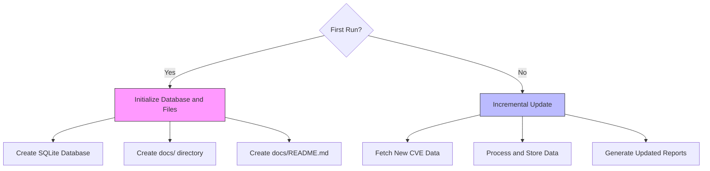
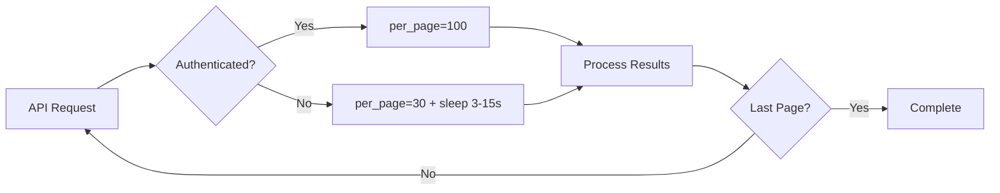

# Functionality and Features

<cite>
**Referenced Files in This Document**   
- [main.py](file://main.py)
- [README.md](file://README.md)
- [docs/README.md](file://docs/README.md)
- [docs/Data/index.md](file://docs/Data/index.md)
- [docs/Data/2025-W38-09-22/daily_20250922.md](file://docs/Data/2025-W38-09-22/daily_20250922.md)
- [docs/_sidebar.md](file://docs/_sidebar.md)
</cite>

## Table of Contents
1. [GitHub Integration](#github-integration)
2. [Database Operations](#database-operations)
3. [Report Generation System](#report-generation-system)
4. [Error Handling and Fallback Strategies](#error-handling-and-fallback-strategies)
5. [Usage Patterns](#usage-patterns)
6. [Performance Considerations](#performance-considerations)

## GitHub Integration

The github_cve_monitor tool integrates with the GitHub API to search for repositories containing CVE references in their URLs or descriptions. The integration is implemented through the `get_info(year)` function in main.py, which performs search queries against the GitHub API to retrieve repositories related to specific CVE years.

The tool uses the GitHub Search API with a query pattern of `CVE-{year}` to find relevant repositories. The search results are retrieved with pagination support, where each request fetches a page of results and the tool continues to the next page until no more results are returned. The pagination logic is implemented by incrementing the page number in the API URL until the response contains fewer items than the requested per_page value, indicating the last page has been reached.

To handle GitHub API rate limits, the tool implements rate limit handling through authentication with a GitHub token. When the `GITHUB_TOKEN` environment variable is set, the tool uses token-based authentication which increases the API rate limit from 60 requests per hour (unauthenticated) to 5,000 requests per hour (authenticated). The tool checks for the presence of the `GITHUB_TOKEN` environment variable and includes it in the request headers when available. The rate limit status is monitored through the `X-RateLimit-Limit` and `X-RateLimit-Remaining` headers in the API response, allowing the tool to be aware of its current rate limit status.

**Diagram sources**
- [main.py](file://main.py#L170-L215)

**Section sources**
- [main.py](file://main.py#L170-L215)
- [README.md](file://README.md#L38-L41)

## Database Operations

The github_cve_monitor tool implements a SQLite database to store and manage CVE-related repository data. The database operations are handled through the Peewee ORM, with a `CVE_DB` model class that defines the database schema with fields for id, full_name, description, url, created_at, and cve.

Table creation is handled automatically through the `db.create_tables([CVE_DB])` call, which creates the database table if it doesn't already exist. The database file is stored in the `db/cve.sqlite` path, and the tool establishes a connection to the database at startup.

Duplicate prevention is implemented through a check in the `db_match(items)` function, which queries the database to see if a repository with the same id already exists before creating a new record. This prevents duplicate entries from being added to the database during subsequent runs of the tool.

Data querying is performed using Peewee's query interface, with the tool executing SQL queries to retrieve data for report generation. The main query used for the comprehensive report is `SELECT * FROM CVE_DB ORDER BY cve DESC`, which retrieves all records sorted by CVE identifier in descending order. For daily reports, the tool queries for records created on the current date, with fallback logic to retrieve recent data if no new records are found.

**Diagram sources**
- [main.py](file://main.py#L13-L25)
- [main.py](file://main.py#L100-L110)

**Section sources**
- [main.py](file://main.py#L13-L25)
- [main.py](file://main.py#L100-L110)

## Report Generation System

The github_cve_monitor tool implements a comprehensive report generation system that produces multiple types of reports in Markdown format. The system generates three main types of reports: comprehensive reports, daily reports, and index files.

Comprehensive reports are generated in the `docs/README.md` file and contain all CVE records stored in the database, sorted by CVE identifier in descending order. The report includes metadata such as generation time and total record count, followed by a table of all CVE entries with links to the CVE details on cve.org and to the corresponding GitHub repositories.

Daily reports are generated in a structured directory hierarchy under `docs/Data/` with a format of `YYYY-Www-mm-dd` (year-week-month-day). Each day's report is stored in a directory named with this format, containing a `daily_YYYYMMDD.md` file. The daily report includes only the CVEs discovered on that day, with metadata about the generation time and data source.

The index generation system creates an `index.md` file in the `docs/Data/` directory that serves as a catalog of all available daily reports. The index is organized by date directories in reverse chronological order, with each date section listing the available daily reports for that date. This allows users to easily navigate through historical reports.

The sidebar is updated automatically through the `update_sidebar()` function, which checks for the existence of a `_sidebar.md` file and adds a link to the daily reports index if it doesn't already exist. This ensures that the navigation sidebar always includes a link to the daily reports, making them easily accessible from the main documentation.

**Diagram sources**
- [main.py](file://main.py#L50-L90)
- [main.py](file://main.py#L230-L280)
- [main.py](file://main.py#L282-L315)

**Section sources**
- [main.py](file://main.py#L50-L90)
- [main.py](file://main.py#L230-L280)
- [main.py](file://main.py#L282-L315)
- [docs/Data/2025-W38-09-22/daily_20250922.md](file://docs/Data/2025-W38-09-22/daily_20250922.md)
- [docs/Data/index.md](file://docs/Data/index.md)

## Error Handling and Fallback Strategies

The github_cve_monitor tool implements several error handling mechanisms and fallback strategies to ensure robust operation even when encountering issues with data availability or external services.

When no new CVE data is available for the current day, the tool implements a fallback strategy to provide meaningful content in the daily report. If the `today_list` of newly created repositories is empty, the tool first attempts to retrieve data from the past 7 days by querying the database for records with `created_at` dates within the last week. If no records are found in the 7-day window, the tool falls back to retrieving the 10 most recent records from the database regardless of date.

The tool handles potential errors in date parsing through try-catch blocks in the main function. When processing the `created_at` timestamp from GitHub API responses, the tool wraps the date parsing logic in a try-except block to prevent the entire process from failing due to malformed date strings in the API response.

Network request errors are handled through a try-except block in the `get_info(year)` function, which catches exceptions that may occur during the HTTP request to the GitHub API. If an error occurs, the function returns None, allowing the calling code to handle the absence of data appropriately.

The tool also includes error handling for environment variable access, gracefully handling cases where the `GITHUB_TOKEN` environment variable is not set by falling back to unauthenticated requests with a lower rate limit.

**Diagram sources**
- [main.py](file://main.py#L320-L360)

**Section sources**
- [main.py](file://main.py#L320-L360)

## Usage Patterns

The github_cve_monitor tool supports different usage patterns for first-time setup and incremental updates. When running for the first time, the tool initializes the file structure by creating the `docs/README.md` file with the header content and establishing the database structure. The `init_file()` function creates the main report file with the initial markdown header, while the database initialization creates the SQLite database and table structure.

For incremental updates, the tool follows a pattern of collecting new data, updating the database, and regenerating reports. The main execution flow in the `main()` function first retrieves data for the current year, processes it to extract CVE information, and stores new records in the database. It then iterates through previous years to ensure comprehensive coverage of historical CVE data.

The tool uses environment variables for authentication configuration, specifically the `GITHUB_TOKEN` environment variable which provides authentication credentials for the GitHub API. This allows users to set their personal access token as an environment variable, enabling higher API rate limits without hardcoding credentials in the source code.

For organized reporting, the tool creates a hierarchical directory structure for daily reports using the `Path(dir_path).mkdir(parents=True, exist_ok=True)` method. This creates directories in the format `docs/Data/YYYY-Www-mm-dd` where YYYY is the year, ww is the week number, mm is the month, and dd is the day. This structure organizes daily reports chronologically and makes them easy to navigate.

**Diagram sources**
- [main.py](file://main.py#L40-L50)
- [main.py](file://main.py#L317-L320)
- [main.py](file://main.py#L50-L60)

**Section sources**
- [main.py](file://main.py#L40-L50)
- [main.py](file://main.py#L317-L320)
- [main.py](file://main.py#L50-L60)
- [README.md](file://README.md#L38-L41)

## Performance Considerations

The github_cve_monitor tool incorporates several performance considerations to balance data collection efficiency with API usage constraints. The tool implements sleep intervals between API calls when operating without authentication to avoid exceeding GitHub's rate limits. When the `GITHUB_TOKEN` environment variable is not set, the tool introduces a random delay of 3-15 seconds between requests using `time.sleep(count)` to prevent aggressive polling that could lead to IP blocking.

Data sorting is handled efficiently by leveraging the database's indexing capabilities. The comprehensive report sorts records by CVE identifier in descending order using the SQL query `ORDER BY cve DESC`, which is more efficient than sorting in memory, especially as the database grows larger. The tool also sorts data in memory when necessary, using Python's built-in sorting with a lambda function: `sorted(r_list, key=lambda e: e.__getitem__('created_at'))`.

The tool optimizes API usage by adjusting the `per_page` parameter based on authentication status. When authenticated with a GitHub token, the tool requests 100 items per page (the GitHub API maximum), reducing the number of requests needed to retrieve large result sets. When unauthenticated, it reduces this to 30 items per page, which is the limit for unauthenticated requests.

The pagination implementation is designed to minimize unnecessary API calls by detecting when the last page has been reached. When a response contains fewer items than the requested `per_page` value, the tool assumes this is the final page and stops paginating, avoiding additional requests that would return empty results.

**Diagram sources**
- [main.py](file://main.py#L170-L215)
- [main.py](file://main.py#L100-L110)

**Section sources**
- [main.py](file://main.py#L170-L215)
- [main.py](file://main.py#L100-L110)