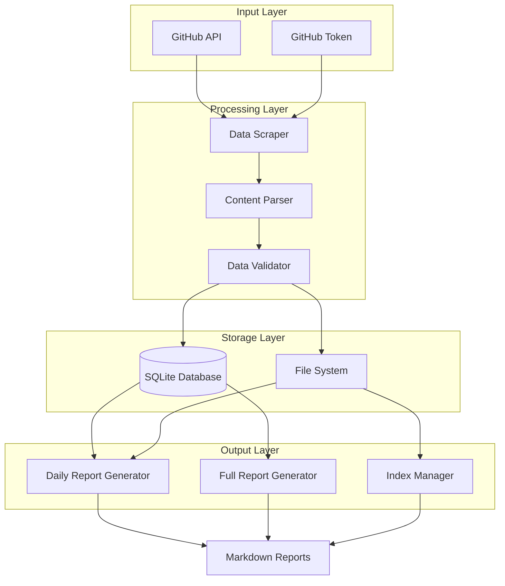
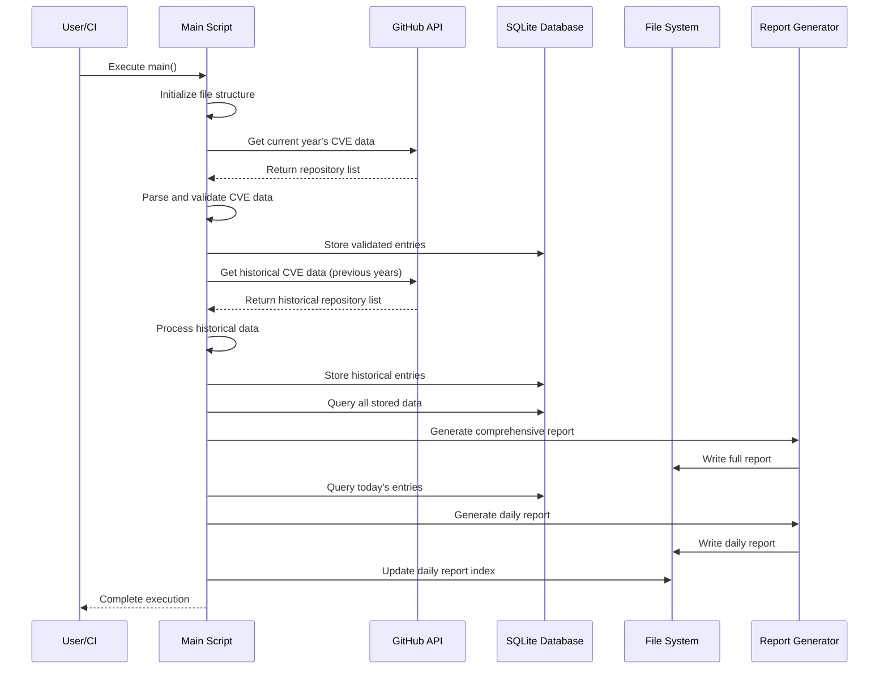
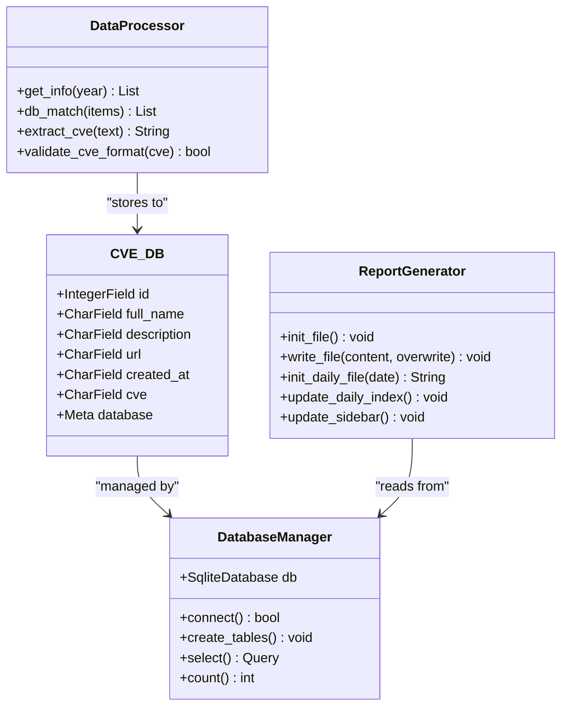
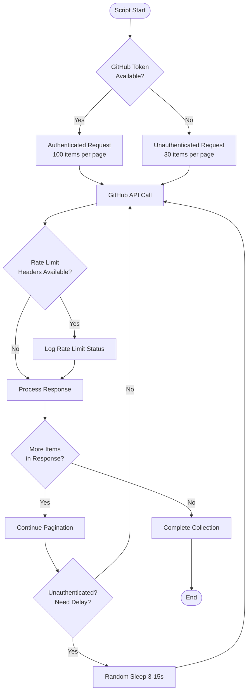
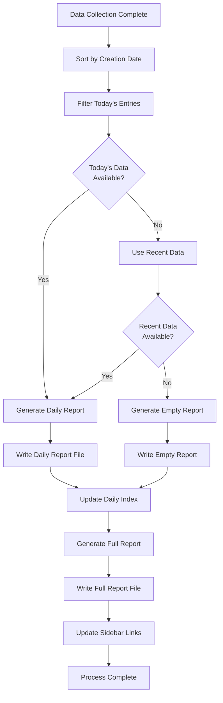
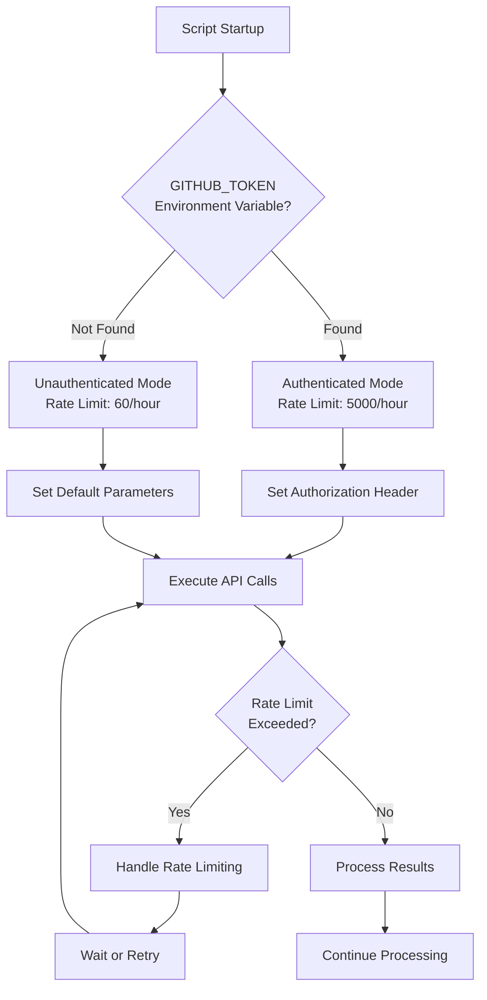

# GitHub CVE Monitor Project Overview

<cite>
**Referenced Files in This Document**
- [README.md](file://README.md)
- [main.py](file://main.py)
- [requirements.txt](file://requirements.txt)
</cite>

## Table of Contents
1. [Introduction](#introduction)
2. [Project Purpose and Target Audience](#project-purpose-and-target-audience)
3. [Core Features and Capabilities](#core-features-and-capabilities)
4. [System Architecture](#system-architecture)
5. [High-Level Workflow](#high-level-workflow)
6. [Key Components Analysis](#key-components-analysis)
7. [Data Processing Pipeline](#data-processing-pipeline)
8. [Deployment Scenarios](#deployment-scenarios)
9. [Integration with Environment Variables](#integration-with-environment-variables)
10. [Common Use Cases](#common-use-cases)
11. [Performance Considerations](#performance-considerations)
12. [Troubleshooting Guide](#troubleshooting-guide)
13. [Conclusion](#conclusion)

## Introduction

The GitHub CVE Monitor is a sophisticated Command Line Interface (CLI) tool designed to automatically monitor GitHub repositories related to Common Vulnerabilities and Exposures (CVEs). This project serves as a comprehensive solution for security researchers, vulnerability analysts, and cybersecurity professionals who need to stay informed about newly discovered vulnerabilities and their associated proof-of-concept (PoC) repositories.

The tool leverages the GitHub API to collect vulnerability data, stores it in a local SQLite database for persistence, and generates structured Markdown reports that provide organized insights into the latest security discoveries. It operates both as a standalone Python script and integrates seamlessly with GitHub Actions for automated, scheduled execution.

## Project Purpose and Target Audience

### Primary Purpose

The GitHub CVE Monitor was developed to address the critical need for continuous monitoring of vulnerability-related activity on GitHub. The platform serves as an automated intelligence gathering system that tracks:

- **Real-time CVE Discovery**: Monitors GitHub for repositories tagged with CVE identifiers
- **PoC Repository Tracking**: Identifies and catalogs Proof of Concept (PoC) implementations
- **Vulnerability Intelligence**: Provides structured data for security research and analysis
- **Historical Trend Analysis**: Maintains comprehensive historical records of vulnerability discoveries

### Target Audience

The tool is specifically designed for:

1. **Security Researchers**: Professionals conducting vulnerability research and threat intelligence
2. **Vulnerability Analysts**: Teams responsible for assessing and prioritizing security risks
3. **Bug Bounty Hunters**: Individuals participating in bug bounty programs seeking new targets
4. **Cybersecurity Teams**: Organizations maintaining situational awareness of emerging threats
5. **Academic Researchers**: Students and educators studying cybersecurity trends and methodologies

## Core Features and Capabilities

### Daily and Comprehensive Reporting

The system provides two distinct reporting modes:

- **Daily Intelligence Briefings**: Generates real-time reports highlighting newly discovered vulnerabilities
- **Comprehensive Historical Reports**: Maintains complete archives of all collected CVE data

### Database Persistence

- **SQLite Storage**: Utilizes a local SQLite database (`db/cve.sqlite`) for reliable data persistence
- **Structured Schema**: Implements a well-defined data model with fields for CVE identification, repository metadata, and timestamps
- **Incremental Updates**: Supports efficient data synchronization by tracking processed entries

### Token-Based Authentication

- **GitHub API Rate Limiting**: Handles API rate limits through configurable authentication tokens
- **Enhanced Limits**: Unauthenticated requests receive 30 items per page, while authenticated requests receive 100 items per page
- **Token Management**: Supports environment variable configuration for secure credential handling

### Automated Execution

- **Scheduled Operations**: Can be executed manually or integrated with GitHub Actions for automated scheduling
- **Multi-year Coverage**: Searches across multiple years of CVE data to provide comprehensive coverage
- **Intelligent Filtering**: Extracts and validates CVE identifiers from both repository URLs and descriptions

## System Architecture

The GitHub CVE Monitor follows a modular architecture with clear separation of concerns:



**Diagram sources**
- [main.py](file://main.py#L1-L50)
- [main.py](file://main.py#L100-L200)

## High-Level Workflow

The system operates through a well-defined workflow that ensures comprehensive data collection and reporting:



**Diagram sources**
- [main.py](file://main.py#L250-L350)
- [main.py](file://main.py#L350-L420)

## Key Components Analysis

### Data Model and Database Schema

The system utilizes a well-structured data model implemented through Peewee ORM:



**Diagram sources**
- [main.py](file://main.py#L15-L30)
- [main.py](file://main.py#L100-L150)

### API Interaction and Rate Limiting

The system implements intelligent API interaction with robust rate limiting handling:



**Diagram sources**
- [main.py](file://main.py#L150-L200)

**Section sources**
- [main.py](file://main.py#L150-L200)
- [main.py](file://main.py#L200-L250)

## Data Processing Pipeline

### CVE Extraction and Validation

The system employs sophisticated regex-based CVE extraction with fallback mechanisms:

```mermaid
flowchart TD
Input[Repository Item] --> ExtractFromURL[Extract from URL]
ExtractFromURL --> URLMatch{Match Found?}
URLMatch --> |Yes| ValidateURLFormat[Validate CVE Format]
URLMatch --> |No| ExtractFromDesc[Extract from Description]
ExtractFromDesc --> DescMatch{Match Found?}
DescMatch --> |Yes| ValidateDescFormat[Validate CVE Format]
DescMatch --> |No| SetNotFound[Set CVE = "CVE NOT FOUND"]
ValidateURLFormat --> URLValid{Format Valid?}
URLValid --> |Yes| StoreURLCve[Store URL CVE]
URLValid --> |No| ExtractFromDesc
ValidateDescFormat --> DescValid{Format Valid?}
DescValid --> |Yes| StoreDescCve[Store Description CVE]
DescValid --> |No| SetNotFound
StoreURLCve --> NormalizeCve[Normalize CVE Format]
StoreDescCve --> NormalizeCve
SetNotFound --> NormalizeCve
NormalizeCve --> DatabaseInsert[Insert into Database]
DatabaseInsert --> NextItem[Process Next Item]
NextItem --> End([End])
```

**Diagram sources**
- [main.py](file://main.py#L200-L250)

### Report Generation Process

The system generates multiple types of reports with different scopes and formats:



**Diagram sources**
- [main.py](file://main.py#L350-L420)

**Section sources**
- [main.py](file://main.py#L200-L250)
- [main.py](file://main.py#L350-L420)

## Deployment Scenarios

### Local Execution

The tool can be executed locally for immediate data collection and analysis:

```bash
# Clone the repository
git clone https://github.com/adminlove520/github_cve_monitor.git
cd github_cve_monitor

# Install dependencies
pip install -r requirements.txt

# Configure GitHub Token (optional but recommended)
export GITHUB_TOKEN=your_github_token_here

# Run the monitor
python main.py
```

### GitHub Actions Integration

The system is designed to work seamlessly with GitHub Actions for automated execution:

```yaml
name: CVE Monitor
on:
  schedule:
    - cron: '0 0 * * *'  # Daily at midnight UTC
  workflow_dispatch:  # Manual trigger option

jobs:
  cve-monitor:
    runs-on: ubuntu-latest
    steps:
      - name: Checkout repository
        uses: actions/checkout@v3
      
      - name: Setup Python
        uses: actions/setup-python@v4
        with:
          python-version: '3.x'
      
      - name: Install dependencies
        run: pip install -r requirements.txt
      
      - name: Run CVE monitor
        env:
          GITHUB_TOKEN: ${{ secrets.GH_TOKEN }}
        run: python main.py
      
      - name: Commit and push changes
        run: |
          git config --global user.name 'github-actions'
          git config --global user.email 'github-actions@users.noreply.github.com'
          git add .
          git commit -am "Update CVE data" || echo "No changes to commit"
          git push
```

**Section sources**
- [README.md](file://README.md#L1-L20)
- [README.md](file://README.md#L20-L40)

## Integration with Environment Variables

### GitHub Token Configuration

The system relies heavily on environment variables for secure credential management:



**Diagram sources**
- [main.py](file://main.py#L150-L180)

### Environment Variable Usage

The system primarily utilizes the following environment variables:

- **GITHUB_TOKEN**: GitHub Personal Access Token for authenticated API requests
- **GH_TOKEN**: Alternative token name used in GitHub Actions workflows
- **PYTHONPATH**: Configurable for module resolution in different environments

**Section sources**
- [main.py](file://main.py#L150-L180)
- [README.md](file://README.md#L20-L40)

## Common Use Cases

### Security Research and Analysis

Security researchers can leverage the tool for:

- **Trend Analysis**: Monitoring the emergence of new vulnerability categories
- **PoC Repository Tracking**: Identifying and analyzing exploit development activities
- **Threat Intelligence**: Building comprehensive databases of potential attack vectors

### Bug Bounty Programs

Bug bounty hunters can utilize the system to:

- **Discover New Targets**: Stay informed about recently disclosed vulnerabilities
- **Track Exploit Development**: Monitor PoC development for potential bounty opportunities
- **Prioritize Research**: Focus efforts on the most recently discovered vulnerabilities

### Cybersecurity Operations

Organizations can implement the tool for:

- **Vulnerability Intelligence**: Maintain awareness of emerging threats
- **Risk Assessment**: Track vulnerabilities relevant to their technology stack
- **Incident Response**: Prepare for potential exploitation of newly discovered vulnerabilities

### Academic and Educational Applications

Educators and students can use the tool for:

- **Research Projects**: Studying vulnerability discovery patterns and trends
- **Practical Exercises**: Learning about exploit development and PoC creation
- **Curriculum Development**: Incorporating real-world vulnerability data into cybersecurity education

## Performance Considerations

### API Rate Limiting and Optimization

The system implements several strategies to optimize API usage:

- **Intelligent Pagination**: Automatically handles pagination based on response size
- **Random Delays**: Implements randomized delays between requests to avoid rate limits
- **Token-Based Enhancement**: Leverages authenticated requests for higher rate limits
- **Efficient Filtering**: Processes only relevant data to minimize API calls

### Database Performance

The SQLite database implementation provides:

- **Fast Query Performance**: Optimized queries for data retrieval and filtering
- **Minimal Overhead**: Lightweight database engine suitable for local storage
- **Atomic Operations**: Ensures data consistency during concurrent access

### Memory Management

The system is designed with memory efficiency in mind:

- **Streaming Processing**: Processes data in chunks rather than loading everything into memory
- **Garbage Collection**: Proper cleanup of temporary objects and connections
- **Resource Management**: Explicit resource cleanup in file operations

## Troubleshooting Guide

### Common Issues and Solutions

#### GitHub API Rate Limiting

**Problem**: Script fails with rate limit errors
**Solution**: 
- Obtain and configure a GitHub Personal Access Token
- Verify token permissions and rate limit status
- Implement exponential backoff for retry logic

#### Database Connection Issues

**Problem**: Cannot connect to SQLite database
**Solution**:
- Verify database directory permissions
- Check disk space availability
- Ensure proper file system access rights

#### CVE Extraction Failures

**Problem**: CVE identifiers not properly extracted
**Solution**:
- Verify regex patterns for CVE format
- Check repository naming conventions
- Review fallback extraction logic

#### Report Generation Errors

**Problem**: Reports fail to generate or contain incorrect data
**Solution**:
- Validate database schema consistency
- Check file system permissions for report directories
- Verify date formatting and timezone handling

### Debugging Strategies

The system provides comprehensive logging for troubleshooting:

```python
# Enable debug logging
print(f"DEBUG: GITHUB_TOKEN is set. Value: {github_token[:5]}...")
print(f"DEBUG: os.environ content:")
for key, value in os.environ.items():
    if "GITHUB" in key.upper():
        print(f"  {key}: {value[:10]}...")
```

**Section sources**
- [main.py](file://main.py#L150-L180)
- [main.py](file://main.py#L200-L250)

## Conclusion

The GitHub CVE Monitor represents a sophisticated and comprehensive solution for vulnerability intelligence gathering and analysis. Its combination of automated data collection, robust storage mechanisms, and structured reporting makes it an invaluable tool for security professionals, researchers, and organizations seeking to maintain situational awareness of emerging cybersecurity threats.

The project's modular architecture, support for both manual and automated execution, and flexible deployment options ensure that it can adapt to various operational requirements and integration scenarios. Whether used for individual research, organizational security monitoring, or academic study, the GitHub CVE Monitor provides a reliable foundation for staying informed about the rapidly evolving landscape of cybersecurity vulnerabilities.

Future enhancements, such as notification systems for platforms like DingTalk and Feishu, statistical analysis capabilities, and multilingual support, promise to further enhance the tool's utility and accessibility for global security communities.