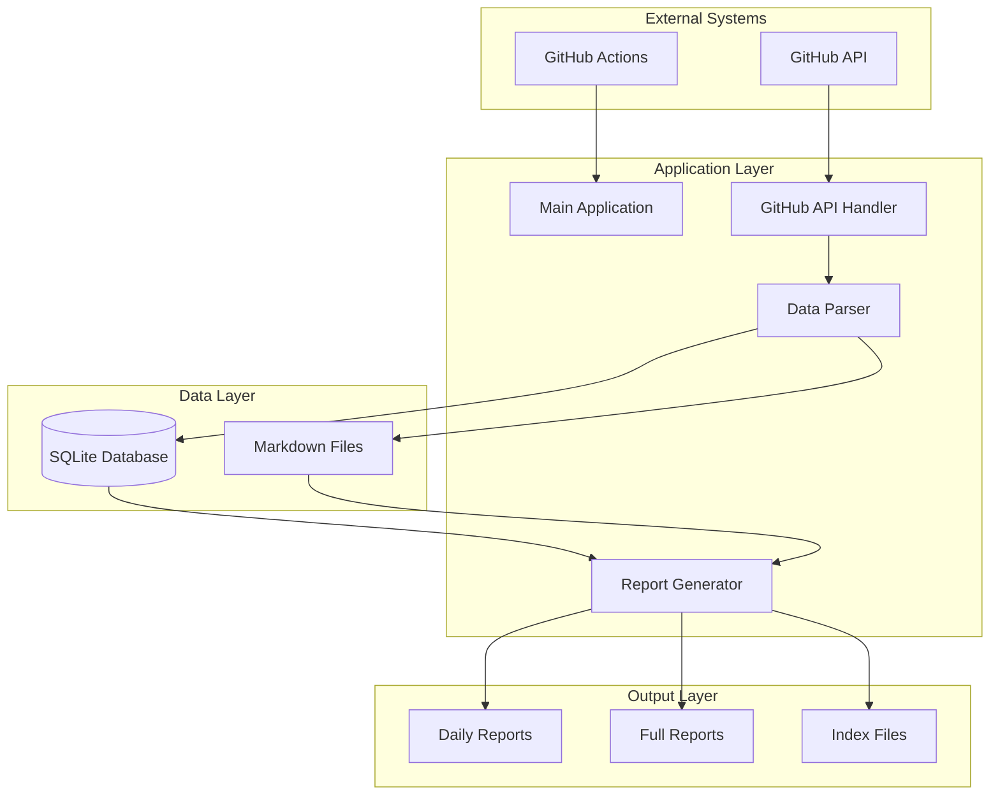
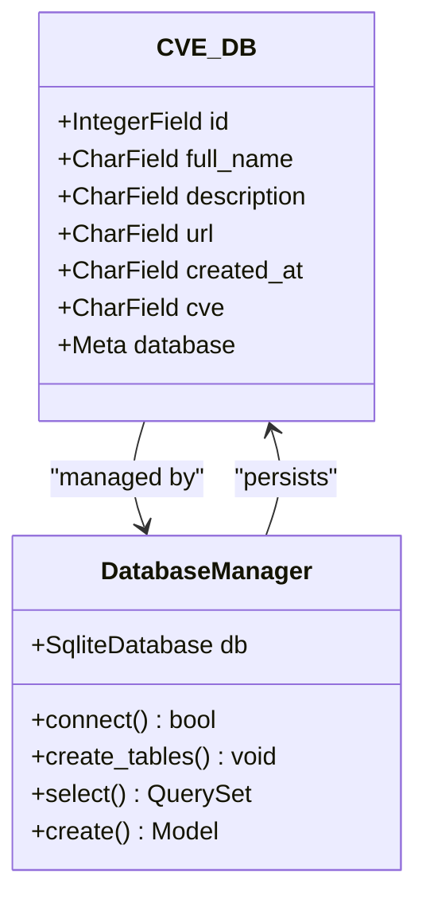
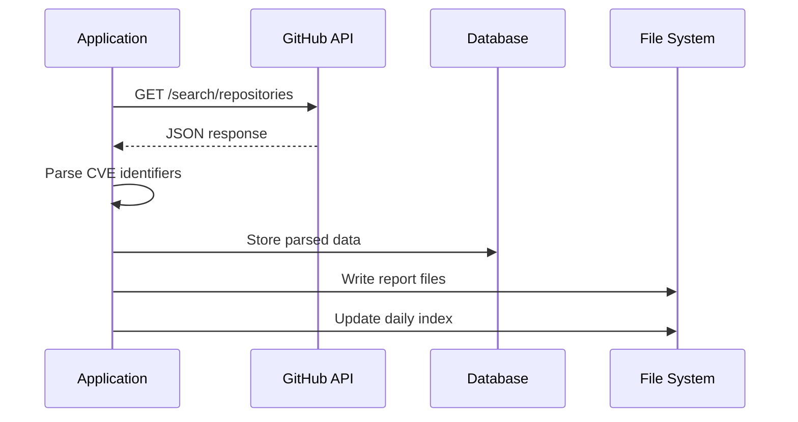
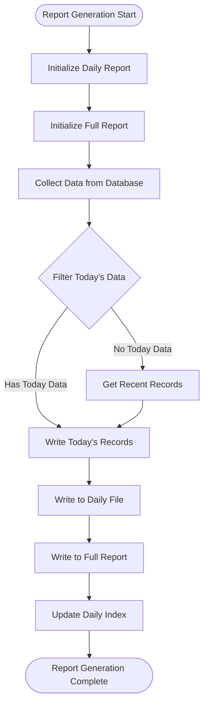
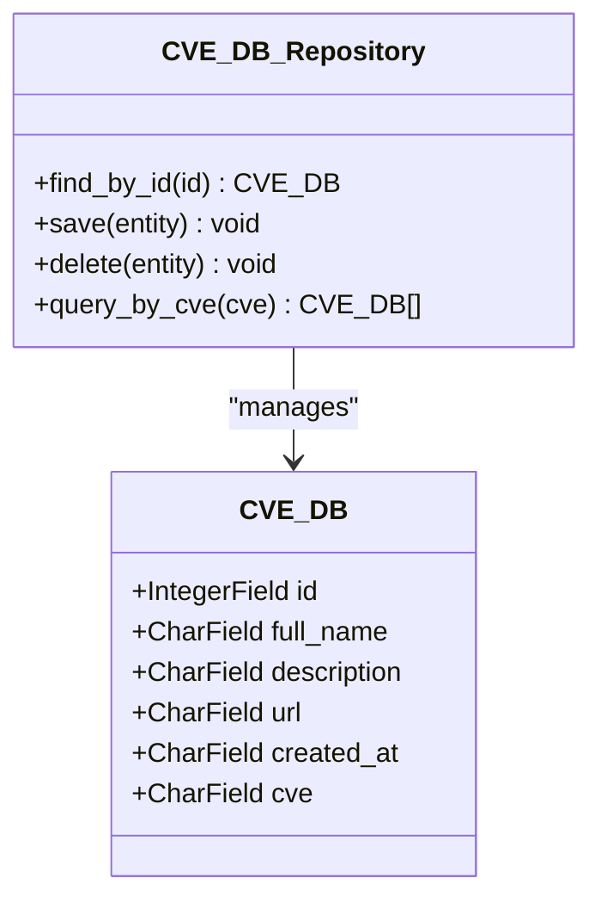
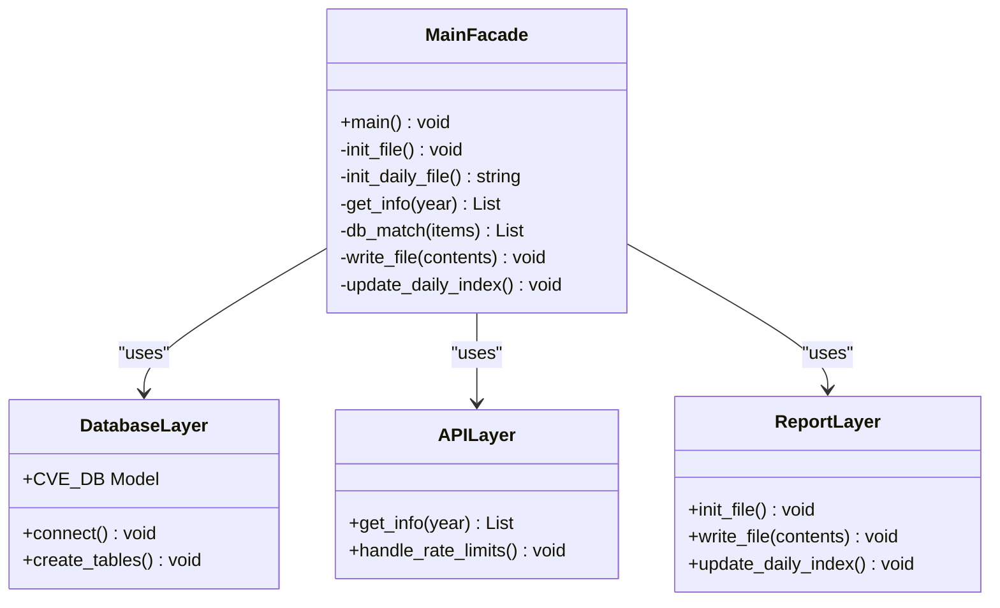
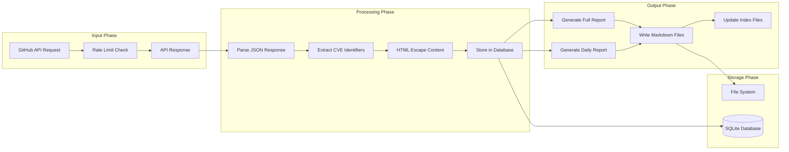

# Technical Design Documentation

<cite>
**Referenced Files in This Document**
- [main.py](file://main.py)
- [README.md](file://README.md)
- [requirements.txt](file://requirements.txt)
</cite>

## Table of Contents
1. [Introduction](#introduction)
2. [System Architecture Overview](#system-architecture-overview)
3. [Core Components Analysis](#core-components-analysis)
4. [Architectural Patterns Implementation](#architectural-patterns-implementation)
5. [Data Flow and Pipeline](#data-flow-and-pipeline)
6. [Design Decisions and Trade-offs](#design-decisions-and-trade-offs)
7. [Scalability Considerations](#scalability-considerations)
8. [Limitations and Future Improvements](#limitations-and-future-improvements)
9. [Conclusion](#conclusion)

## Introduction

The github_cve_monitor is a Python-based monitoring application designed to automatically track and report on GitHub repositories containing CVE (Common Vulnerabilities and Exposures) identifiers. The application serves as a lightweight yet functional solution for security researchers and organizations to stay informed about newly published vulnerability-related code on GitHub.

The system operates through a procedural programming paradigm with function-based organization, implementing several key architectural patterns including Singleton for database connections, Repository pattern for data persistence, Builder pattern for report generation, and Facade pattern for the main application interface. The application demonstrates a pragmatic approach to building monitoring tools with minimal dependencies and maximum usability.

## System Architecture Overview

The github_cve_monitor follows a straightforward pipeline architecture where data flows sequentially from external APIs through local storage to formatted reports. The system is designed around simplicity and reliability, prioritizing ease of deployment and maintenance over complex architectural features.



**Diagram sources**
- [main.py](file://main.py#L1-L50)
- [main.py](file://main.py#L200-L250)

The architecture consists of four primary layers:

1. **External Systems Layer**: Interacts with GitHub API and GitHub Actions for automation
2. **Application Layer**: Contains the core business logic and orchestration
3. **Data Layer**: Manages persistent storage using SQLite and file-based reporting
4. **Output Layer**: Generates human-readable reports in Markdown format

## Core Components Analysis

### Database Management Component

The application implements a Singleton-like database connection pattern through the global `db` variable and `CVE_DB` model class. This design ensures consistent database access across all application functions.



**Diagram sources**
- [main.py](file://main.py#L18-L30)
- [main.py](file://main.py#L32-L34)

The database schema is intentionally simple, focusing on essential fields for CVE tracking:
- `id`: Unique identifier from GitHub
- `full_name`: Repository name with owner
- `description`: Repository description with HTML escaping
- `url`: Direct link to the repository
- `created_at`: Creation timestamp
- `cve`: Extracted CVE identifier

**Section sources**
- [main.py](file://main.py#L18-L30)

### API Integration Component

The `get_info` function serves as the primary interface to GitHub's API, implementing intelligent rate limiting and authentication handling. The function adapts its behavior based on the presence of a GitHub token, switching between authenticated and unauthenticated request modes.



**Diagram sources**
- [main.py](file://main.py#L120-L170)
- [main.py](file://main.py#L180-L220)

The API handler implements sophisticated rate limiting logic:
- Uses GitHub tokens to increase rate limits from 60 to 5000 requests per hour
- Implements random delays for unauthenticated requests to avoid hitting limits
- Handles pagination automatically through recursive API calls
- Provides comprehensive error handling and logging

**Section sources**
- [main.py](file://main.py#L120-L170)

### Report Generation Component

The report generation system utilizes a Builder pattern approach, with separate functions handling different types of reports. The system generates both daily and full reports in Markdown format, maintaining consistent structure and formatting.



**Diagram sources**
- [main.py](file://main.py#L300-L350)
- [main.py](file://main.py#L380-L420)

**Section sources**
- [main.py](file://main.py#L300-L420)

## Architectural Patterns Implementation

### Singleton Pattern - Database Connection

The application implements a Singleton-like pattern for database management through the global `db` variable. While not a formal Singleton implementation, the design ensures that all database operations share the same connection instance.

```python
# Global database instance (Singleton-like)
db = SqliteDatabase("db/cve.sqlite")

# Model definition with shared database
class CVE_DB(Model):
    class Meta:
        database = db
```

This approach provides:
- Consistent database access across all functions
- Simplified connection management
- Reduced resource consumption
- Easy testing and mocking capabilities

### Repository Pattern - Data Persistence

The `CVE_DB` model class implements the Repository pattern, encapsulating data access logic and providing a clean interface for database operations.



**Diagram sources**
- [main.py](file://main.py#L18-L30)

The Repository pattern benefits include:
- Separation of concerns between data access and business logic
- Encapsulation of database operations
- Simplified testing through abstraction
- Flexibility for future database migrations

### Builder Pattern - Report Generation

The report generation system employs a Builder pattern through specialized functions that construct different types of reports incrementally.

Key builder functions:
- `init_file()`: Initializes full report template
- `init_daily_file()`: Creates daily report structure
- `write_file()`: Appends content to reports
- `write_daily_file()`: Adds daily entries

### Facade Pattern - Main Application Interface

The `main()` function serves as a Facade, orchestrating all operations while hiding the complexity of underlying components.



**Diagram sources**
- [main.py](file://main.py#L200-L250)

**Section sources**
- [main.py](file://main.py#L18-L30)
- [main.py](file://main.py#L120-L170)
- [main.py](file://main.py#L300-L420)

## Data Flow and Pipeline

The application follows a linear data flow pipeline that processes GitHub API responses into structured reports:



**Diagram sources**
- [main.py](file://main.py#L180-L220)
- [main.py](file://main.py#L300-L350)

### Data Transformation Process

1. **API Data Collection**: The application queries GitHub's search API for repositories containing CVE identifiers
2. **Data Validation**: Raw API responses undergo validation and sanitization
3. **CVE Extraction**: Regular expressions identify and extract CVE identifiers from URLs and descriptions
4. **Content Processing**: HTML escaping prevents injection attacks and ensures proper Markdown rendering
5. **Database Storage**: Structured data is stored in SQLite with deduplication logic
6. **Report Generation**: Both historical and daily reports are generated in Markdown format
7. **File Organization**: Reports are organized in hierarchical directory structures

**Section sources**
- [main.py](file://main.py#L180-L220)
- [main.py](file://main.py#L300-L420)

## Design Decisions and Trade-offs

### Technology Stack Selection

The application makes deliberate choices about technology stack components:

**SQLite Database Choice**:
- **Advantages**: Zero-configuration, embedded database, excellent for small-scale applications
- **Trade-offs**: Limited concurrent access, no advanced features like replication or clustering
- **Justification**: Sufficient for the application's scale and eliminates external dependencies

**Markdown Reporting Format**:
- **Advantages**: Human-readable, easy to version control, compatible with static site generators
- **Trade-offs**: Limited formatting capabilities compared to rich text formats
- **Justification**: Aligns with the target audience's needs for quick review and sharing

**Environment Variables for Configuration**:
- **Advantages**: Secure credential management, easy CI/CD integration
- **Trade-offs**: Less discoverable than configuration files
- **Justification**: Supports both local development and automated deployment scenarios

### Procedural Programming Style

The application adopts a procedural programming approach with function-based organization:

**Benefits**:
- Simple to understand and maintain
- Minimal overhead for small-scale applications
- Direct control flow without complex object hierarchies

**Limitations**:
- Limited reusability across different contexts
- Difficult to extend for complex business logic
- Challenges in testing isolated components

### File-based vs. Database-driven Architecture

The application balances file-based and database-driven approaches:

**File-based Benefits**:
- Immediate accessibility without database setup
- Version control compatibility
- Simplicity in deployment

**Database Benefits**:
- Efficient querying and filtering capabilities
- Better data integrity controls
- Scalable for larger datasets

The hybrid approach provides the best of both worlds for this specific use case.

**Section sources**
- [main.py](file://main.py#L1-L20)
- [main.py](file://main.py#L120-L170)

## Scalability Considerations

### Current Limitations

The application exhibits several scalability limitations inherent to its design:

**Rate Limiting Constraints**:
- Unauthenticated requests limited to 30 per page
- Authenticated requests limited to 100 per page
- No built-in caching mechanism for repeated queries

**Storage Limitations**:
- SQLite database growth without cleanup mechanisms
- File system organization becomes unwieldy with large datasets
- No compression or archival strategies

**Processing Bottlenecks**:
- Sequential processing of years creates long execution times
- No parallelization of API calls or database operations
- Memory usage grows with dataset size

### Scaling Strategies

Potential scaling improvements include:

**Horizontal Scaling Opportunities**:
- Multi-threaded processing of different years
- Distributed database backend for concurrent access
- Load balancing for API requests

**Vertical Scaling Opportunities**:
- Database indexing for faster queries
- Caching layer for frequently accessed data
- Optimized data structures for memory efficiency

**Operational Scaling**:
- Containerization for easier deployment
- Monitoring and alerting systems
- Automated backup and recovery procedures

## Limitations and Future Improvements

### Current Limitations

The application currently faces several limitations that impact its effectiveness:

**API Limitations**:
- GitHub API pagination limits (100 records per page)
- Rate limiting impacts data freshness
- No support for real-time updates

**Reporting Limitations**:
- Limited statistical analysis capabilities
- No notification systems for critical findings
- Basic Markdown formatting without advanced features

**Development Limitations**:
- Lack of unit testing framework
- Limited error handling granularity
- No configuration file support

### Roadmap and Future Enhancements

Based on the project's roadmap, several enhancements are planned:

**Immediate Improvements (Version 2.1)**:
- Enhanced daily report logic with updated_at field consideration
- UTC-CN timezone issue resolution
- Statistical analysis capabilities
- CVE description translation functionality

**Advanced Features (Version 2.2+)**:
- Notification systems (DingTalk, Feishu integration)
- Enhanced statistical reporting
- Improved user interface options
- Advanced filtering and search capabilities

**Infrastructure Improvements**:
- Migration to containerized deployment
- Automated testing framework
- Comprehensive logging and monitoring
- Backup and disaster recovery procedures

**Section sources**
- [README.md](file://README.md#L40-L75)

## Conclusion

The github_cve_monitor represents a well-designed, pragmatic solution for CVE monitoring on GitHub. Its architecture demonstrates effective use of fundamental design patterns within the constraints of a lightweight, single-purpose application.

### Key Strengths

1. **Simplicity**: The procedural approach and function-based organization make the codebase accessible and maintainable
2. **Reliability**: Robust error handling and graceful degradation ensure consistent operation
3. **Flexibility**: Environment-based configuration supports both development and production deployments
4. **Usability**: Markdown-based reports provide immediate value to users without requiring specialized tools

### Architectural Excellence

The application successfully implements several key architectural patterns:
- **Singleton-like Database Management**: Ensures consistent data access
- **Repository Pattern**: Provides clean data abstraction
- **Builder Pattern**: Enables flexible report generation
- **Facade Pattern**: Simplifies complex operations behind simple interfaces

### Design Philosophy

The project exemplifies the principle of "good enough" architecture—implementing sufficient design patterns and organizational principles to meet current needs without over-engineering for hypothetical future requirements. This approach strikes an optimal balance between development effort and system capability.

### Recommendations for Enhancement

While the current design meets its objectives effectively, several areas present opportunities for enhancement:

1. **Testing Infrastructure**: Implementation of unit tests would improve reliability and facilitate future development
2. **Configuration Management**: Addition of configuration files would enhance flexibility
3. **Monitoring and Logging**: Comprehensive logging would aid operational visibility
4. **Notification Systems**: Integration of modern messaging platforms would improve alerting capabilities
5. **Database Migration**: Planning for potential migration to more robust database solutions

The github_cve_monitor serves as an excellent example of how thoughtful application of basic architectural principles can create a valuable tool with minimal complexity. Its success lies in focusing on core functionality while maintaining clean, maintainable code that can evolve with changing requirements.