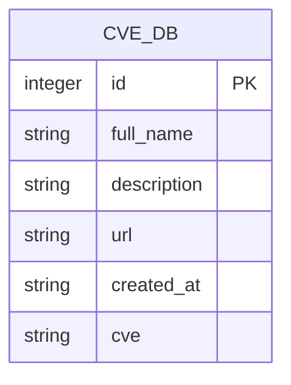
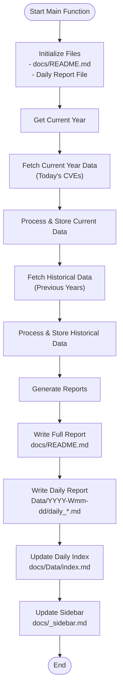

# Usage Guide

<cite>
**Referenced Files in This Document**
- [README.md](file://README.md)
- [main.py](file://main.py)
- [requirements.txt](file://requirements.txt)
</cite>

## Table of Contents
1. [Introduction](#introduction)
2. [Installation](#installation)
3. [Execution Methods](#execution-methods)
4. [File Generation Patterns](#file-generation-patterns)
5. [Main Function Workflow](#main-function-workflow)
6. [Report Types](#report-types)
7. [Environment Configuration](#environment-configuration)
8. [Customization Options](#customization-options)
9. [Troubleshooting](#troubleshooting)
10. [Best Practices](#best-practices)

## Introduction

The Github CVE Monitor is a Python-based tool designed to automatically monitor GitHub repositories containing CVE (Common Vulnerabilities and Exposures) identifiers. It creates comprehensive documentation and daily reports about newly discovered security vulnerabilities across GitHub repositories.

The tool operates through two primary execution methods:
- **Direct Python Invocation**: Running the script locally using `python main.py`
- **Automated GitHub Actions**: Using pre-configured workflows for continuous monitoring

## Installation

### Prerequisites

The tool requires Python 3.6+ and has minimal dependencies:

```bash
pip install -r requirements.txt
```

### Dependencies

The project uses two main libraries:
- **peewee==3.18.2**: Lightweight ORM for SQLite database operations
- **requests==2.31.0**: HTTP client for GitHub API interactions

**Section sources**
- [requirements.txt](file://requirements.txt#L1-L3)

## Execution Methods

### Direct Python Invocation

To run the tool manually:

```bash
python main.py
```

This executes the main() function which performs the following operations:
1. Initializes the SQLite database (`db/cve.sqlite`)
2. Creates the documentation structure in the `docs/` directory
3. Fetches CVE data from GitHub API
4. Processes and stores the data
5. Generates comprehensive reports

### Automated GitHub Actions

The tool includes support for automated execution through GitHub Actions workflows. While the specific workflow file wasn't found in the current repository structure, the README indicates that a `.github/workflows/run.yml` file exists for automated scheduling.

**Section sources**
- [README.md](file://README.md#L16-L16)

## File Generation Patterns

### Directory Structure

The tool generates a specific directory structure under the `docs/` folder:

```
docs/
├── README.md                 # Comprehensive report
├── _sidebar.md               # Navigation sidebar
└── Data/                     # Daily reports organized by date
    ├── YYYY-Www-mm-dd/       # Weekly directory structure
    │   ├── daily_YYYYMMDD.md # Daily report
    │   └── ...
    └── index.md              # Daily reports index
```

### Database Storage

The tool maintains a SQLite database at `db/cve.sqlite` with the following structure:



**Diagram sources**
- [main.py](file://main.py#L18-L26)

**Section sources**
- [main.py](file://main.py#L18-L26)
- [main.py](file://main.py#L40-L46)
- [main.py](file://main.py#L60-L92)

## Main Function Workflow

The main() function orchestrates the entire monitoring process through a structured workflow:



**Diagram sources**
- [main.py](file://main.py#L280-L419)

### Parameter Handling

The tool primarily operates based on the current system date:
- **Year-based Searching**: Automatically searches for CVEs from the current year and historical years (back to 2000)
- **Date Filtering**: Filters records to show only those created on the current day
- **Time Zone Awareness**: Handles UTC time zone differences to ensure accurate daily reporting

**Section sources**
- [main.py](file://main.py#L280-L320)

## Report Types

### Comprehensive README.md

The main report (`docs/README.md`) serves as a complete inventory of all monitored CVE data:

**Features:**
- Complete chronological listing of all CVE entries
- Hyperlinked CVE identifiers to official NIST records
- Repository links with full names and descriptions
- Date stamps for each entry
- Formatted in Markdown for easy navigation

**Structure:**
```
# Github CVE Monitor

> Automatic monitor github cve using Github Actions 

Last generated : YYYY-MM-DD HH:MM:SS

| CVE | 相关仓库（poc/exp） | 描述 | 日期 |
|---|---|---|---|
| [CVE-XXXX-XXXX](https://www.cve.org/CVERecord?id=CVE-XXXX-XXXX) | [repo-name](url) | description | date |
```

### Daily Reports

Daily reports (`docs/Data/YYYY-Www-mm-dd/daily_YYYYMMDD.md`) provide focused snapshots of activity:

**Features:**
- Focused on the current day's discoveries
- Backup mechanism for days with no new data
- Historical context through recent record inclusion
- Automatic organization by weekly date ranges

**Structure:**
```
# 每日 情报速递 报告 (YYYY-MM-DD)

> Automatic monitor Github CVE using Github Actions 

## 报告信息
- **生成时间**: YYYY-MM-DD HH:MM:SS
- **数据来源**: GitHub CVE 数据库

## 今日 情报速递

| CVE | 相关仓库（poc/exp） | 描述 | 日期 |
|:---|:---|:---|:---|
```

### Daily Reports Index

The index file (`docs/Data/index.md`) provides navigation for all daily reports:

**Features:**
- Chronological listing of all daily reports
- Easy navigation between different dates
- Automatic sidebar updates for quick access

**Section sources**
- [main.py](file://main.py#L40-L46)
- [main.py](file://main.py#L60-L92)
- [main.py](file://main.py#L94-L130)

## Environment Configuration

### GitHub Token Authentication

The tool supports GitHub Token authentication to bypass API rate limits:

**Benefits:**
- Unauthenticated requests: 30 items per page
- Authenticated requests: 100 items per page
- Rate limit increase from 60 to 5000 requests per hour

**Configuration:**

```bash
# Linux/Mac
export GITHUB_TOKEN=your_token_here

# Windows
set GITHUB_TOKEN=your_token_here
```

**Implementation Details:**
- Token is automatically detected from environment variable `GITHUB_TOKEN`
- Headers are configured with `Authorization: token YOUR_TOKEN`
- Debug information shows token presence and API rate limits

**Section sources**
- [main.py](file://main.py#L132-L150)

## Customization Options

### Code Modifications

The tool provides several customization points:

**Database Location:**
- Change SQLite database path in `db.connect()` call
- Modify database schema by updating the CVE_DB model

**Output Paths:**
- Adjust file paths in initialization functions
- Customize directory structure in date-based organization

**Report Formatting:**
- Modify Markdown templates in initialization functions
- Adjust column ordering and formatting
- Customize header and footer content

**API Parameters:**
- Change page size from 100 to desired value
- Modify search parameters in API calls
- Adjust rate limiting delays

### Environment Variables

**Key Variables:**
- `GITHUB_TOKEN`: GitHub Personal Access Token for authenticated requests
- System locale settings for Chinese character display

**Section sources**
- [main.py](file://main.py#L132-L150)

## Troubleshooting

### Common Issues

**Empty Reports:**
- **Cause**: No CVE repositories found for the current year
- **Solution**: Check GitHub API connectivity and search parameters
- **Workaround**: Tool automatically falls back to recent records

**API Rate Limits:**
- **Symptom**: Requests blocked or limited responses
- **Solution**: Configure GitHub Token authentication
- **Prevention**: Random sleep intervals between requests

**Database Connection Issues:**
- **Cause**: Permission problems or missing database directory
- **Solution**: Ensure write permissions to `db/` directory
- **Prevention**: Manual directory creation if needed

**Missing Files:**
- **Cause**: First-time execution or manual cleanup
- **Solution**: Tool automatically recreates missing files
- **Verification**: Check `docs/` and `db/` directories are created

### Debug Information

The tool provides comprehensive debug output:
- API rate limit information
- Environment variable inspection
- Token visibility (partial masking)
- Request/response logging

**Section sources**
- [main.py](file://main.py#L132-L150)
- [main.py](file://main.py#L152-L170)

## Best Practices

### Scheduling Regular Monitoring

**Recommended Frequency:**
- **Daily Runs**: Execute the script daily for optimal coverage
- **Weekly Review**: Review the comprehensive report weekly
- **Monthly Archive**: Archive daily reports for long-term tracking

**Automation Setup:**
1. **Local Scheduling**: Use cron jobs (Linux/macOS) or Task Scheduler (Windows)
2. **GitHub Actions**: Configure workflow triggers for automatic execution
3. **Cloud Services**: Deploy to cloud platforms for reliable scheduling

**Example Cron Job:**
```bash
# Run daily at 6 AM
0 6 * * * cd /path/to/github_cve_monitor && python main.py >> log.txt 2>&1
```

### Data Management

**Storage Considerations:**
- Monitor disk space usage for growing database files
- Implement log rotation for debug output
- Consider database backup strategies for production use

**Performance Optimization:**
- Use GitHub Token for higher API limits
- Implement caching strategies for repeated queries
- Monitor API response times and adjust delays accordingly

### Security Considerations

**Token Management:**
- Store GitHub tokens securely using environment variables
- Rotate tokens regularly for enhanced security
- Use least-privilege tokens when possible

**Data Privacy:**
- Review generated reports for sensitive information
- Implement access controls for generated documentation
- Consider redaction policies for public deployments

**Section sources**
- [README.md](file://README.md#L20-L35)