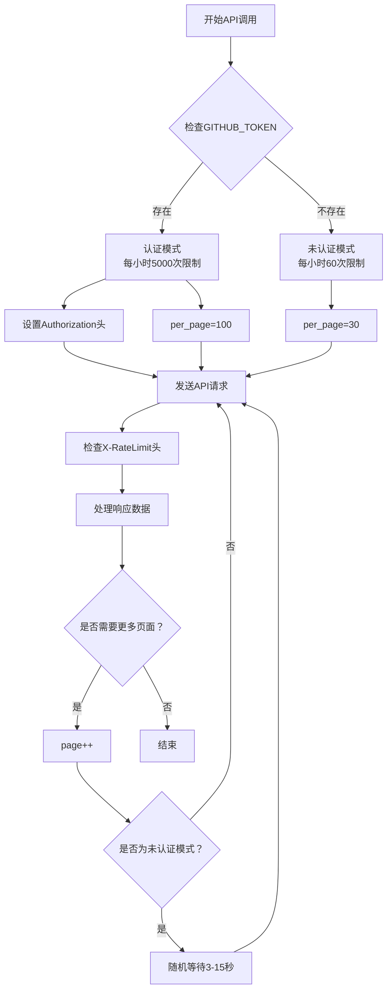
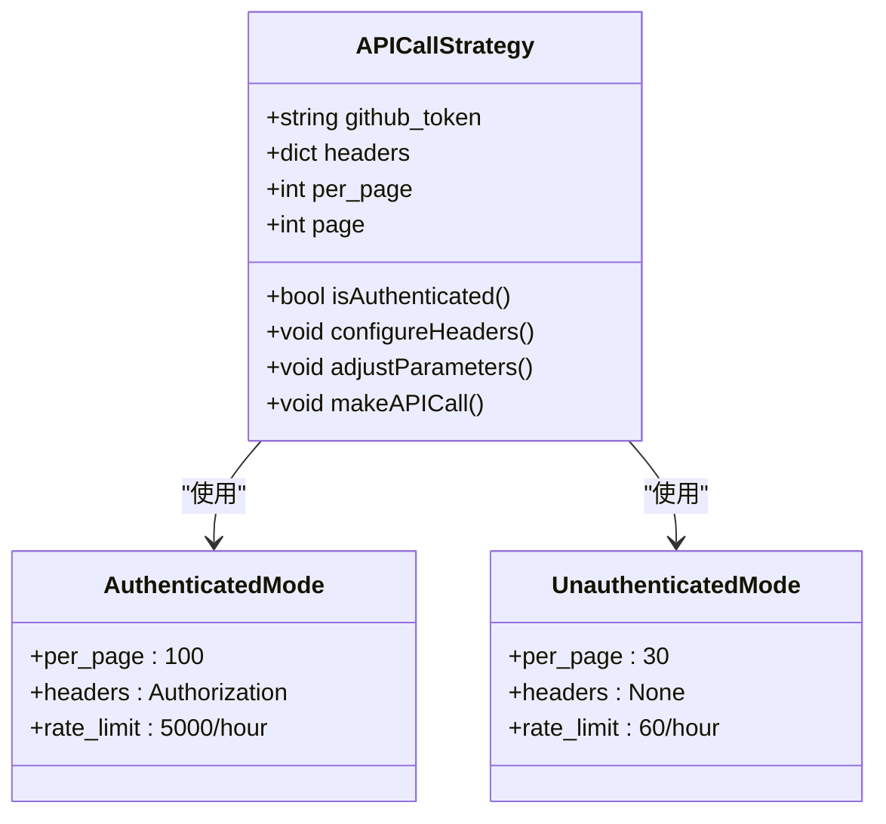
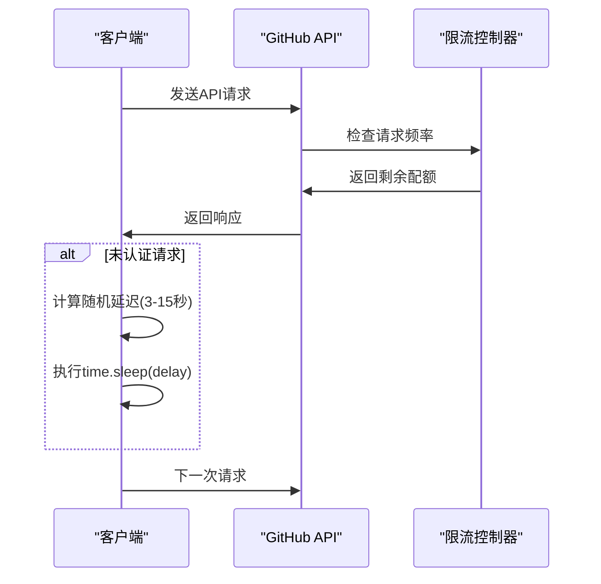
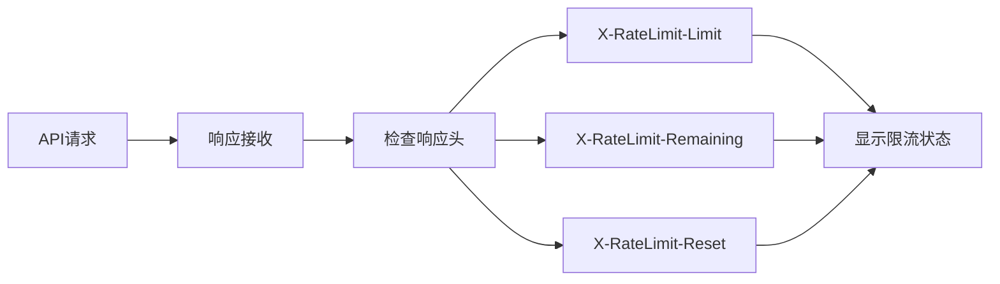
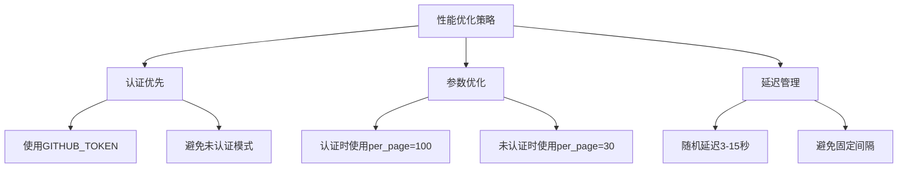

# GitHub API限流处理机制

<cite>
**本文档引用的文件**
- [main.py](file://main.py)
- [README.md](file://README.md)
- [requirements.txt](file://requirements.txt)
</cite>

## 目录
1. [简介](#简介)
2. [GitHub API限流概述](#github-api限流概述)
3. [认证机制与Token配置](#认证机制与token配置)
4. [动态请求参数调整](#动态请求参数调整)
5. [限流规避策略](#限流规避策略)
6. [响应头监控机制](#响应头监控机制)
7. [最佳实践建议](#最佳实践建议)
8. [故障排除指南](#故障排除指南)
9. [总结](#总结)

## 简介

本项目实现了智能的GitHub API限流处理机制，通过检测环境变量GITHUB_TOKEN的存在状态，动态调整API请求策略，确保在不同认证级别下都能高效稳定地获取CVE数据。该机制有效解决了GitHub API的请求限制问题，提供了从每小时60次（未认证）到每小时5000次（认证）的性能提升。

## GitHub API限流概述

### 基础限流规则

GitHub API对未认证和认证请求实施不同的速率限制策略：

- **未认证请求**：每小时最多60次API调用
- **认证请求**：每小时最多5000次API调用

这种差异化的限流策略直接影响了数据采集的效率和可靠性。



**图表来源**
- [main.py](file://main.py#L170-L215)

## 认证机制与Token配置

### Token检测与验证

项目通过环境变量检测机制识别可用的GitHub Token：

```python
github_token = os.environ.get('GITHUB_TOKEN')
headers = {}

if github_token:
    print(f"DEBUG: GITHUB_TOKEN is set. Value: {github_token[:5]}...")
    headers['Authorization'] = f'token {github_token}'
    print(f"Using GitHub Token for authentication (Year: {year})")
else:
    print("DEBUG: GITHUB_TOKEN is NOT set.")
    per_page = 30 # 无token时每页30条
    print(f"No GitHub Token found, using unauthenticated request (Year: {year})")
```

### Token配置方式

#### 本地开发环境配置

1. **创建GitHub Personal Access Token**
   - 访问GitHub设置页面
   - 导航到Developer settings > Personal access tokens
   - 生成新的Token并复制其值

2. **设置环境变量**
   ```bash
   # Linux/Mac
   export GITHUB_TOKEN=your_token_here
   
   # Windows
   set GITHUB_TOKEN=your_token_here
   ```

#### GitHub Actions配置

在GitHub仓库设置中添加名为`GH_TOKEN`的Secret，工作流程会自动使用此令牌。

**章节来源**
- [main.py](file://main.py#L170-L185)
- [README.md](file://README.md#L38-L46)

## 动态请求参数调整

### 请求参数优化策略

项目根据认证状态动态调整关键请求参数：



**图表来源**
- [main.py](file://main.py#L170-L185)

### 参数调整的具体实现

#### 认证模式参数
- **per_page**: 100（最大允许值）
- **headers**: 包含Authorization头
- **rate_limit**: 5000次/小时

#### 未认证模式参数
- **per_page**: 30（减少请求频率）
- **headers**: 无特殊头信息
- **rate_limit**: 60次/小时

**章节来源**
- [main.py](file://main.py#L170-L185)

## 限流规避策略

### 随机延迟机制

对于未认证请求，项目实现了智能的随机延迟机制：

```python
# 随机等待以避免API限制 (仅在无token时等待)
if not github_token:
    count = random.randint(3, 15)
    time.sleep(count)
```

### 延迟策略原理



**图表来源**
- [main.py](file://main.py#L208-L212)

### 页面边界检测

项目通过检测当前页返回的项目数量来判断是否到达最后一页：

```python
# 如果当前页返回的item数量小于per_page，说明已经是最后一页
if len(items) < per_page:
    break
```

**章节来源**
- [main.py](file://main.py#L208-L212)
- [main.py](file://main.py#L195-L197)

## 响应头监控机制

### X-RateLimit头信息监控

项目实时监控GitHub API的响应头信息，提供详细的限流状态反馈：

```python
if 'X-RateLimit-Limit' in response.headers:
    print(f"API Rate Limit: {response.headers.get('X-RateLimit-Remaining')}/{response.headers.get('X-RateLimit-Limit')}")
```

### 监控信息展示

系统会在控制台输出详细的限流状态信息：
- 当前剩余请求数
- 总配额限制
- 时间窗口信息



**图表来源**
- [main.py](file://main.py#L190-L192)

**章节来源**
- [main.py](file://main.py#L190-L192)

## 最佳实践建议

### 推荐配置

1. **始终使用GITHUB_TOKEN**
   - 提供最佳性能（5000次/小时）
   - 减少随机延迟需求
   - 提高数据获取稳定性

2. **合理设置per_page值**
   - 认证用户：使用最大值100
   - 未认证用户：使用较小值30

3. **实施适当的延迟策略**
   - 即使使用Token，也建议添加随机延迟
   - 避免过于频繁的连续请求

### 性能优化建议



### 错误处理建议

1. **网络异常处理**
   ```python
   except Exception as e:
       print("An error occurred in the network request", e)
       return None
   ```

2. **重试机制**
   - 实现指数退避重试
   - 处理临时性网络问题

**章节来源**
- [main.py](file://main.py#L213-L215)

## 故障排除指南

### 常见问题诊断

#### 问题1：未找到GITHUB_TOKEN

**症状**：控制台显示"No GitHub Token found"
**解决方案**：
1. 检查环境变量设置
2. 验证Token有效性
3. 确认Token权限范围

#### 问题2：API请求被限流

**症状**：收到403 Forbidden响应
**解决方案**：
1. 检查剩余配额
2. 实施更长的延迟
3. 考虑使用认证Token

#### 问题3：数据获取不完整

**症状**：只获取到部分数据
**解决方案**：
1. 检查页面边界检测逻辑
2. 验证分页参数设置
3. 确认API响应格式

### 调试工具

项目提供了详细的调试信息输出：

```python
print("DEBUG: os.environ content:")
for key, value in os.environ.items():
    if "GITHUB" in key.upper():
        print(f"  {key}: {value[:10]}...")
```

**章节来源**
- [main.py](file://main.py#L180-L185)
- [main.py](file://main.py#L213-L215)

## 总结

本项目实现了一套完整的GitHub API限流处理机制，通过以下核心特性确保数据采集的稳定性和效率：

1. **智能认证检测**：自动识别Token状态并调整请求策略
2. **动态参数优化**：根据认证状态调整关键参数
3. **限流规避策略**：实施随机延迟机制避免触发限流
4. **实时监控反馈**：提供详细的限流状态信息
5. **灵活的错误处理**：完善的异常处理和恢复机制

这套机制不仅解决了GitHub API的请求限制问题，还为开发者提供了清晰的配置指导和最佳实践建议，确保在各种环境下都能获得最佳的数据采集性能。

通过遵循本文档提供的配置和使用建议，用户可以充分利用GitHub API的功能，同时避免常见的限流问题，实现稳定可靠的数据监控服务。