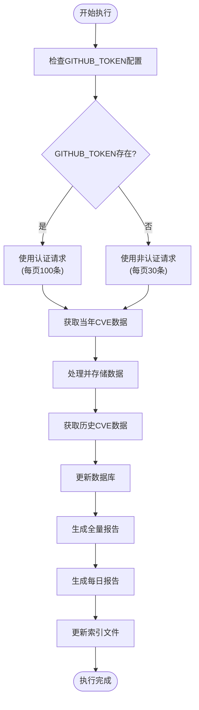
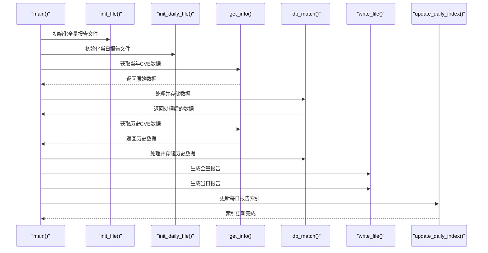

# 使用方法

<cite>
**本文档引用的文件**
- [main.py](file://main.py)
- [README.md](file://README.md)
- [requirements.txt](file://requirements.txt)
</cite>

## 目录
1. [简介](#简介)
2. [项目概述](#项目概述)
3. [本地运行方式](#本地运行方式)
4. [GitHub Actions集成](#github-actions集成)
5. [程序执行流程](#程序执行流程)
6. [报告文件结构](#报告文件结构)
7. [配置要求](#配置要求)
8. [使用示例](#使用示例)
9. [故障排除](#故障排除)
10. [总结](#总结)

## 简介

Github CVE Monitor是一个自动化的CVE监控系统，能够从GitHub搜索API获取CVE相关的仓库数据，并生成全量报告和每日情报速递报告。该系统支持两种主要使用模式：本地手动运行和GitHub Actions自动化运行。

## 项目概述

该项目的核心功能是监控GitHub上的CVE相关信息，通过以下方式实现：
- 自动从GitHub API获取CVE相关仓库数据
- 对数据进行处理、去重和存储
- 生成全量情报速递报告和每日情报速递报告
- 支持本地运行和GitHub Actions自动化



**图表来源**
- [main.py](file://main.py#L280-L420)

## 本地运行方式

### 环境准备

1. **安装Python环境**
   - 确保系统已安装Python 3.6或更高版本
   - 推荐使用虚拟环境隔离依赖

2. **安装依赖包**
   ```bash
   pip install -r requirements.txt
   ```
   依赖包包括：
   - `peewee==3.18.2` - ORM数据库操作
   - `requests==2.31.0` - HTTP请求处理

3. **配置GitHub Token（可选但推荐）**
   - 创建GitHub个人访问令牌
   - 设置环境变量：
     ```bash
     # Linux/Mac
     export GITHUB_TOKEN=your_token_here
     
     # Windows
     set GITHUB_TOKEN=your_token_here
     ```

### 启动程序

执行以下命令启动程序：

```bash
python main.py
```

### 执行过程详解

程序启动后会按照以下步骤执行：

1. **初始化阶段**
   - 创建必要的目录结构（`docs/`、`db/`）
   - 初始化SQLite数据库连接
   - 准备报告文件模板

2. **数据收集阶段**
   - 首先获取当年的CVE数据
   - 然后依次获取历史年份的数据（从当前年份向前追溯至1999年）

3. **数据处理阶段**
   - 提取和验证CVE编号
   - 去重处理，避免重复记录
   - 存储到SQLite数据库

4. **报告生成阶段**
   - 生成全量情报速递报告（`docs/README.md`）
   - 生成当日情报速递报告（`docs/Data/YYYY-Wmm-dd/daily_YYYYMMDD.md`）
   - 更新每日报告索引文件

**章节来源**
- [main.py](file://main.py#L280-L420)
- [requirements.txt](file://requirements.txt#L1-L3)

## GitHub Actions集成

### 工作流配置

项目提供了完整的GitHub Actions工作流配置，位于`.github/workflows/run.yml`文件中。

### 触发条件

工作流可以通过以下方式触发：
- **定时任务**：基于cron表达式定期执行
- **手动触发**：通过GitHub界面手动运行
- **事件触发**：基于特定的仓库事件

### 执行环境

工作流会在GitHub的托管环境中执行，具有以下特点：
- 使用预配置的Python环境
- 自动设置所需的环境变量
- 具备网络访问权限以调用GitHub API

### 配置步骤

1. **设置GitHub Secret**
   - 在仓库设置中添加名为`GH_TOKEN`的Secret
   - 值为你的GitHub个人访问令牌

2. **启用Actions**
   - 确保仓库已启用GitHub Actions功能
   - 验证工作流文件语法正确

3. **监控执行结果**
   - 查看Actions运行历史
   - 检查生成的报告文件

**章节来源**
- [README.md](file://README.md#L15-L17)

## 程序执行流程

### 主要函数分析



**图表来源**
- [main.py](file://main.py#L280-L350)
- [main.py](file://main.py#L25-L50)

### 关键函数说明

1. **init_file()**
   - 初始化全量报告文件
   - 创建标准的Markdown模板
   - 设置报告头部信息

2. **init_daily_file()**
   - 创建每日报告目录结构
   - 格式化日期命名规则
   - 生成每日报告模板

3. **get_info()**
   - 调用GitHub搜索API
   - 支持认证和非认证请求
   - 处理分页和速率限制

4. **db_match()**
   - 数据清洗和验证
   - CVE编号提取
   - 去重处理
   - 数据存储到数据库

5. **update_daily_index()**
   - 更新每日报告索引文件
   - 自动生成导航链接
   - 维护报告目录结构

**章节来源**
- [main.py](file://main.py#L25-L270)

## 报告文件结构

### 目录结构

程序生成的文件结构如下：

```
github_cve_monitor/
├── docs/
│   ├── README.md              # 全量情报速递报告
│   ├── _sidebar.md           # 侧边栏导航（可选）
│   └── Data/
│       ├── YYYY-Wmm-dd/      # 每日报告目录
│       │   ├── daily_YYYYMMDD.md  # 当日情报速递报告
│       │   └── index.md         # 每日报告索引
│       └── index.md          # 所有每日报告索引
├── db/
│   └── cve.sqlite            # SQLite数据库文件
└── main.py                   # 主程序文件
```

### 文件格式说明

1. **全量报告（README.md）**
   - 包含所有历史CVE数据
   - 按CVE编号降序排列
   - 标准Markdown格式
   - 包含详细的数据源信息

2. **每日报告（daily_YYYYMMDD.md）**
   - 仅包含当日新增数据
   - 按创建时间降序排列
   - 包含当日生成时间和数据来源
   - 支持UTC时区转换

3. **索引文件（index.md）**
   - 自动生成的导航链接
   - 按日期顺序排列
   - 方便快速定位特定日期的报告

**章节来源**
- [main.py](file://main.py#L35-L70)
- [main.py](file://main.py#L72-L110)

## 配置要求

### 环境变量

- **GITHUB_TOKEN**：用于认证的GitHub个人访问令牌
  - 提升API请求限制（从60次/小时到5000次/小时）
  - 避免速率限制问题
  - 推荐用于生产环境

### 系统要求

- **操作系统**：Windows、macOS、Linux
- **Python版本**：3.6+
- **内存需求**：最低512MB可用内存
- **磁盘空间**：至少100MB用于存储数据和报告

### 网络要求

- **GitHub API访问**：需要能够访问`https://api.github.com`
- **网络稳定性**：稳定的互联网连接
- **防火墙配置**：允许出站HTTPS连接

## 使用示例

### 本地运行示例

```bash
# 1. 克隆项目
git clone https://github.com/adminlove520/github_cve_monitor.git
cd github_cve_monitor

# 2. 安装依赖
pip install -r requirements.txt

# 3. 设置GitHub Token（可选）
export GITHUB_TOKEN=your_github_token_here

# 4. 运行程序
python main.py

# 5. 查看生成的报告
# 全量报告：docs/README.md
# 当日报告：docs/Data/YYYY-Wmm-dd/daily_YYYYMMDD.md
```

### 预期输出示例

程序执行过程中会输出以下关键信息：

```
DEBUG: GITHUB_TOKEN is set. Value: ghp_...
Using GitHub Token for authentication (Year: 2024)
DEBUG: os.environ content:
  GITHUB_TOKEN: ghp_...
API Rate Limit: 4999/5000
获取当年 (2024) 的CVE数据...
年份: 2024 : 获取到 150 条原始数据
年份 2024 : 更新 120 条记录
生成当日 情报速递 报告，共 15 条记录
成功写入 15 条记录到每日 情报速递 报告
```

### 生成的报告内容示例

**全量报告部分片段：**
```
| CVE | 相关仓库（poc/exp） | 描述 | 日期 |
|:---|:---|:---|:---|
| [CVE-2024-1234](https://www.cve.org/CVERecord?id=CVE-2024-1234) | [user/repo-name](https://github.com/user/repo-name) | Repository description with special characters escaped | 2024-01-15T10:30:45Z |
| CVE NOT FOUND | [user/unknown-cve-repo](https://github.com/user/unknown-cve-repo) | No description available | 2024-01-14T08:20:30Z |
```

**每日报告部分片段：**
```
# 每日 情报速递 报告 (20240115)

> Automatic monitor Github CVE using Github Actions 

## 报告信息
- **生成时间**: 2024-01-15 10:00:00
- **数据来源**: GitHub CVE 数据库

## 今日 情报速递

| CVE | 相关仓库（poc/exp） | 描述 | 日期 |
|:---|:---|:---|:---|
| [CVE-2024-1234](https://www.cve.org/CVERecord?id=CVE-2024-1234) | [user/repo-name](https://github.com/user/repo-name) | Repository description | 2024-01-15T10:30:45Z |
```

## 故障排除

### 常见问题及解决方案

1. **GitHub API速率限制**
   - **问题**：频繁请求导致被限制
   - **解决方案**：设置GITHUB_TOKEN环境变量

2. **数据库连接失败**
   - **问题**：SQLite数据库无法创建或访问
   - **解决方案**：确保程序有写入权限，检查磁盘空间

3. **网络连接超时**
   - **问题**：无法访问GitHub API
   - **解决方案**：检查网络连接，确认防火墙设置

4. **日期时区问题**
   - **问题**：UTC时间与本地时间差异
   - **解决方案**：程序自动处理时区转换

### 调试技巧

1. **启用调试模式**
   - 程序会输出详细的调试信息
   - 包括API请求详情和环境变量

2. **检查生成的文件**
   - 确认报告文件正确生成
   - 验证文件内容格式

3. **监控API限制**
   - 程序会显示当前API限制状态
   - 及时调整请求频率

**章节来源**
- [main.py](file://main.py#L150-L200)

## 总结

Github CVE Monitor提供了一个完整且灵活的CVE监控解决方案，支持本地手动运行和GitHub Actions自动化运行两种模式。通过合理的配置和使用，用户可以获得及时、准确的CVE相关信息，帮助安全研究人员和开发团队更好地跟踪和应对安全威胁。

### 主要优势

- **自动化程度高**：支持完全自动化运行
- **数据质量保证**：去重处理和数据验证
- **格式标准化**：统一的Markdown报告格式
- **易于扩展**：模块化设计便于功能扩展

### 未来发展方向

根据项目路线图，未来的改进方向包括：
- 添加钉钉、飞书推送功能
- 增加翻译功能
- 实现统计分析功能
- 优化UTC时区处理