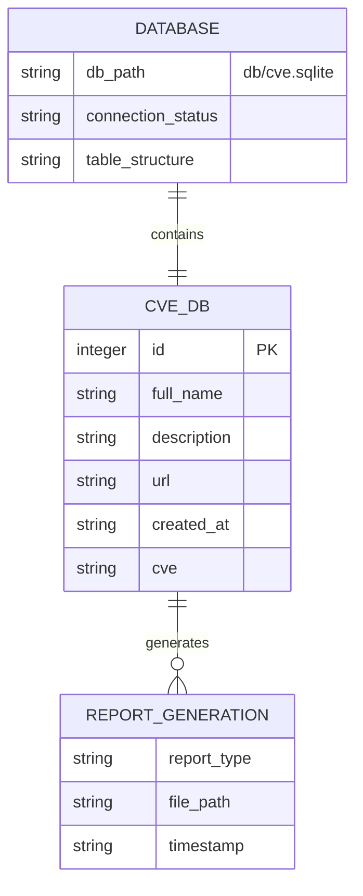
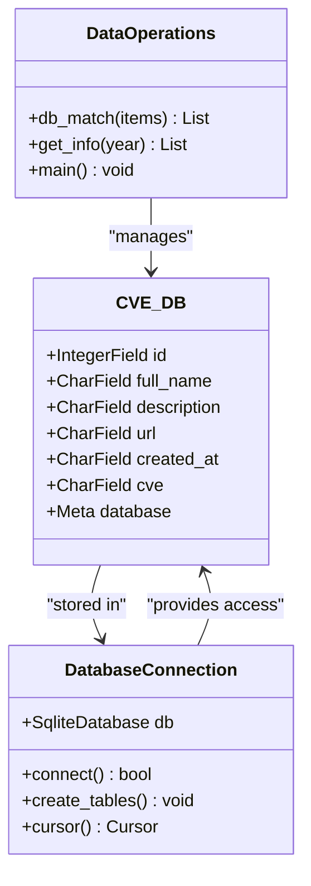
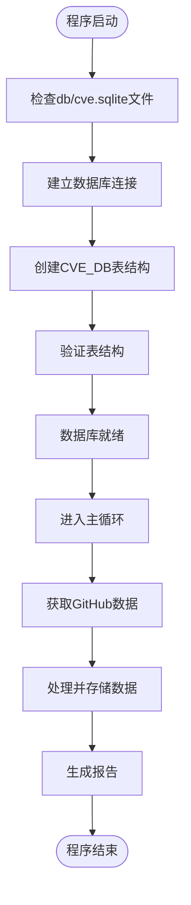
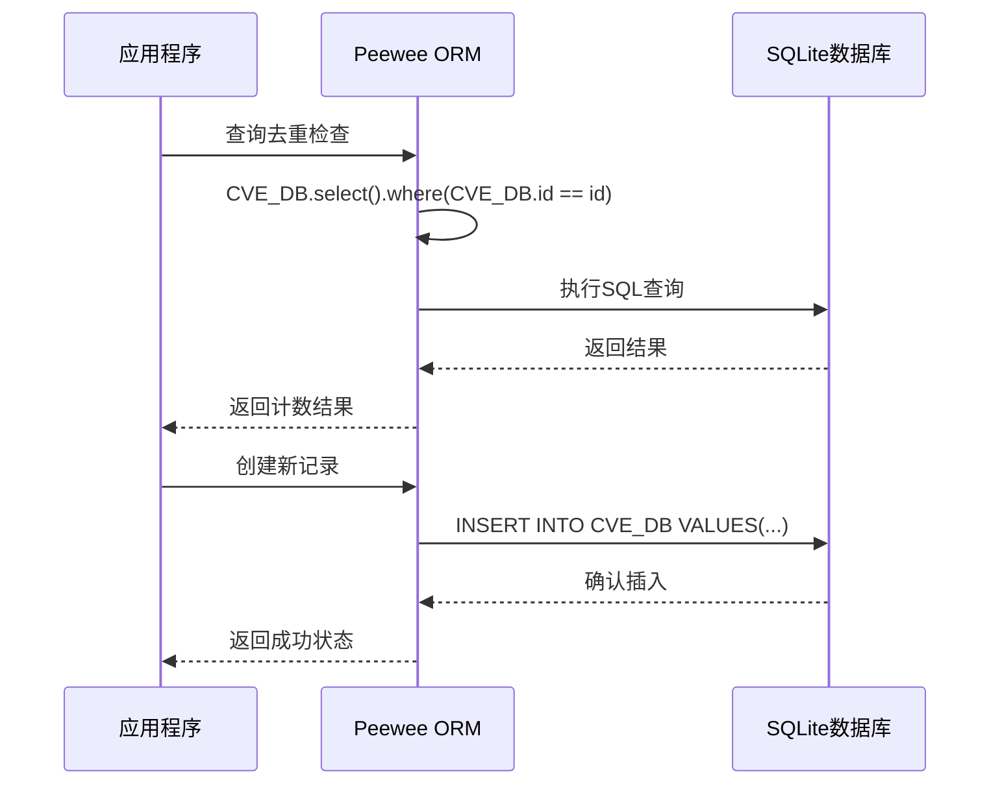
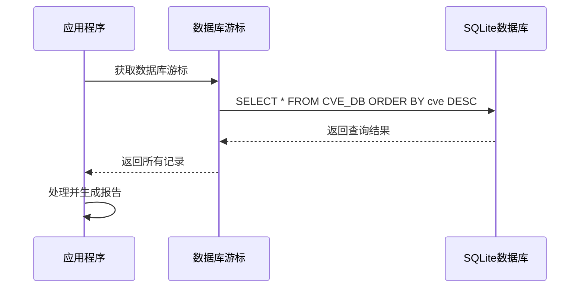
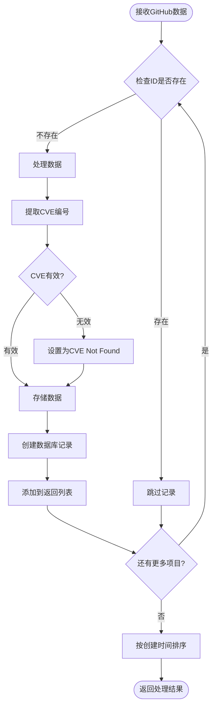
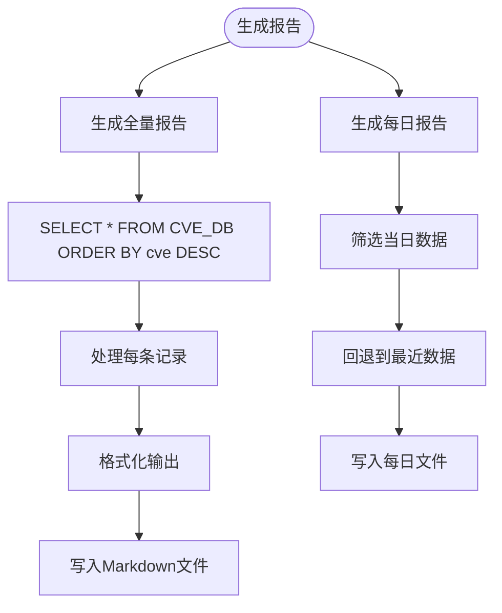

# 数据库设计文档

<cite>
**本文档引用的文件**
- [main.py](file://main.py)
- [README.md](file://README.md)
- [requirements.txt](file://requirements.txt)
</cite>

## 目录
1. [简介](#简介)
2. [数据库架构概览](#数据库架构概览)
3. [核心数据模型](#核心数据模型)
4. [数据库初始化流程](#数据库初始化流程)
5. [数据访问模式](#数据访问模式)
6. [字段详细说明](#字段详细说明)
7. [数据库操作分析](#数据库操作分析)
8. [性能考虑](#性能考虑)
9. [故障排除指南](#故障排除指南)
10. [结论](#结论)

## 简介

该项目使用SQLite数据库作为唯一的持久化存储解决方案，专门用于存储和管理GitHub上的CVE相关信息。数据库的核心是CVE_DB类，它定义了一个包含六个关键字段的表结构，用于跟踪GitHub仓库中的CVE漏洞信息。

该数据库设计专注于以下几个方面：
- **实时监控**：通过GitHub API持续获取最新的CVE相关仓库信息
- **数据去重**：防止重复记录的存储
- **高效查询**：支持快速的数据检索和报告生成
- **扩展性**：为未来的功能扩展预留空间

## 数据库架构概览

**图表来源**
- [main.py](file://main.py#L18-L30)

数据库架构采用简洁的设计理念，主要包含以下组件：

1. **SQLite数据库文件**：位于`db/cve.sqlite`路径
2. **单表结构**：所有数据都存储在CVE_DB表中
3. **PEEWEE ORM**：使用Peewee框架进行数据库操作
4. **自动初始化**：程序启动时自动创建表结构

## 核心数据模型

**图表来源**
- [main.py](file://main.py#L18-L30)
- [main.py](file://main.py#L218-L271)

**章节来源**
- [main.py](file://main.py#L18-L30)

## 数据库初始化流程

数据库初始化是一个自动化的过程，确保应用程序启动时具备可用的数据库结构：

**图表来源**
- [main.py](file://main.py#L30-L32)

初始化过程的关键步骤：

1. **数据库连接**：使用`SqliteDatabase("db/cve.sqlite")`建立连接
2. **表创建**：通过`db.create_tables([CVE_DB])`自动创建表结构
3. **元数据配置**：在`CVE_DB.Meta`中指定数据库连接
4. **自动迁移**：如果表不存在则创建，如果存在则跳过

**章节来源**
- [main.py](file://main.py#L15-L32)

## 数据访问模式

该应用程序采用两种主要的数据访问模式：

### 1. Peewee ORM模式（推荐）

**图表来源**
- [main.py](file://main.py#L218-L271)

### 2. 原生SQL模式（报告生成）

**图表来源**
- [main.py](file://main.py#L328-L330)

**章节来源**
- [main.py](file://main.py#L218-L271)
- [main.py](file://main.py#L328-L330)

## 字段详细说明

### id字段（整型字段）
- **类型**：IntegerField
- **用途**：存储GitHub仓库ID
- **业务含义**：唯一标识每个GitHub仓库
- **特点**：作为主键，确保每条记录的唯一性

### full_name字段（字符字段）
- **类型**：CharField
- **最大长度**：1024字节
- **用途**：存储仓库全名
- **业务含义**：完整的仓库名称，包括用户名或组织名
- **示例**：`adminlove520/github_cve_monitor`

### description字段（字符字段）
- **类型**：CharField
- **最大长度**：4098字节
- **用途**：存储仓库描述
- **业务含义**：仓库的详细描述信息
- **特殊处理**：空值时自动设置为"no description"

### url字段（字符字段）
- **类型**：CharField
- **最大长度**：1024字节
- **用途**：存储仓库URL
- **业务含义**：指向GitHub仓库的完整URL地址
- **格式**：`https://github.com/username/repository`

### created_at字段（字符字段）
- **类型**：CharField
- **最大长度**：128字节
- **用途**：存储仓库创建时间
- **业务含义**：ISO 8601格式的创建时间戳
- **格式示例**：`2024-01-15T10:30:45Z`

### cve字段（字符字段）
- **类型**：CharField
- **最大长度**：64字节
- **用途**：存储提取的CVE编号
- **业务含义**：从仓库名称或描述中提取的漏洞编号
- **格式处理**：自动将下划线替换为连字符，并转换为大写

**章节来源**
- [main.py](file://main.py#L18-L26)

## 数据库操作分析

### 数据匹配与去重机制

**图表来源**
- [main.py](file://main.py#L218-L271)

### 数据提取算法

系统使用正则表达式从多个源提取CVE编号：

1. **URL优先级**：首先从仓库URL中提取
2. **描述备选**：如果URL中未找到，则从描述文本中提取
3. **格式标准化**：将下划线替换为连字符，转换为大写格式
4. **默认值处理**：无法提取时设置为"CVE Not Found"

### 报告生成策略

**图表来源**
- [main.py](file://main.py#L328-L330)
- [main.py](file://main.py#L340-L368)

**章节来源**
- [main.py](file://main.py#L218-L271)
- [main.py](file://main.py#L328-L368)

## 性能考虑

### 数据库性能优化

1. **索引策略**：虽然没有显式创建索引，但ID字段作为主键会自动创建索引
2. **查询优化**：使用ORDER BY子句对大量数据进行排序
3. **批量操作**：一次性处理多个GitHub仓库数据
4. **内存管理**：定期清理不需要的数据结构

### 存储效率

- **字段长度控制**：合理设置字段的最大长度，避免浪费存储空间
- **数据压缩**：使用SQLite的内置压缩功能
- **文件大小**：数据库文件随数据增长而增大，但保持良好的查询性能

### 并发处理

- **单用户模式**：应用程序设计为单用户运行，避免并发冲突
- **文件锁定**：SQLite的文件级锁定机制确保数据一致性
- **临时文件**：报告生成过程中使用临时文件避免数据损坏

## 故障排除指南

### 常见问题及解决方案

#### 1. 数据库连接失败
**症状**：程序启动时报错，无法连接到db/cve.sqlite
**解决方案**：
- 检查db目录是否存在
- 确认程序具有写入权限
- 验证SQLite文件是否被其他进程占用

#### 2. 表结构不匹配
**症状**：数据库表结构异常或缺失
**解决方案**：
- 删除现有的db/cve.sqlite文件
- 重新运行程序，表结构会自动重建
- 检查PEEWEE版本兼容性

#### 3. 数据提取错误
**症状**：CVE编号提取失败或格式不正确
**解决方案**：
- 检查正则表达式是否匹配目标格式
- 验证输入数据的完整性
- 查看日志输出中的调试信息

#### 4. 报告生成失败
**症状**：Markdown文件生成异常
**解决方案**：
- 检查docs目录的写入权限
- 验证文件路径的有效性
- 确认UTF-8编码支持

**章节来源**
- [main.py](file://main.py#L15-L32)

## 结论

该数据库设计体现了简洁性和实用性的完美结合。通过CVE_DB类的六个字段，系统能够有效地存储和管理GitHub CVE相关信息。数据库作为项目的唯一持久化存储，与报告生成功能紧密耦合，形成了一个完整的监控生态系统。

### 设计优势

1. **简单高效**：单一表结构设计降低了复杂度
2. **自动初始化**：程序启动时自动创建数据库结构
3. **数据去重**：通过ID字段确保数据唯一性
4. **灵活查询**：支持多种查询模式满足不同需求
5. **扩展性强**：为未来功能扩展预留了充足空间

### 未来改进方向

1. **索引优化**：为常用查询字段添加索引
2. **数据备份**：实现自动化的数据备份机制
3. **性能监控**：添加数据库性能指标监控
4. **并发支持**：考虑多用户并发访问场景
5. **数据清理**：实现自动的数据老化清理机制

该数据库设计为CVE监控提供了坚实的基础，确保了数据的完整性、一致性和可访问性，同时保持了良好的性能和可维护性。