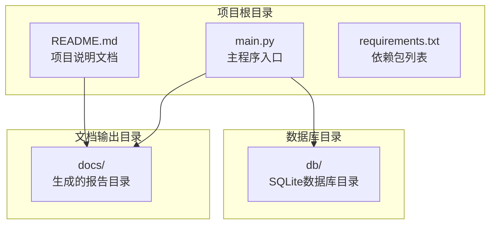
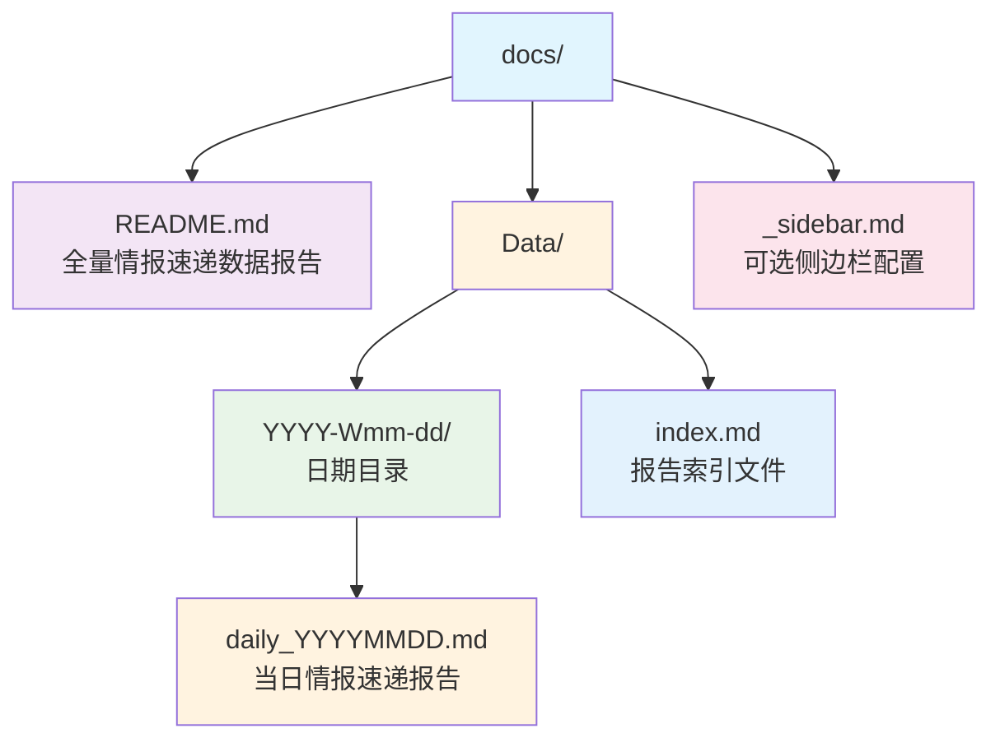
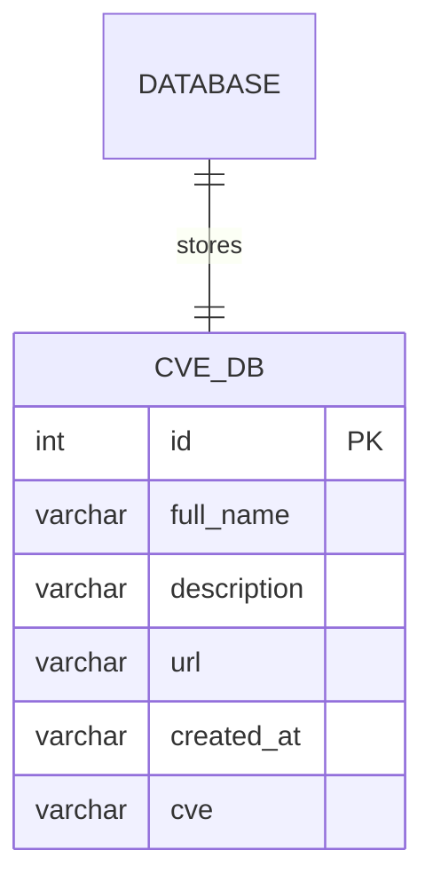
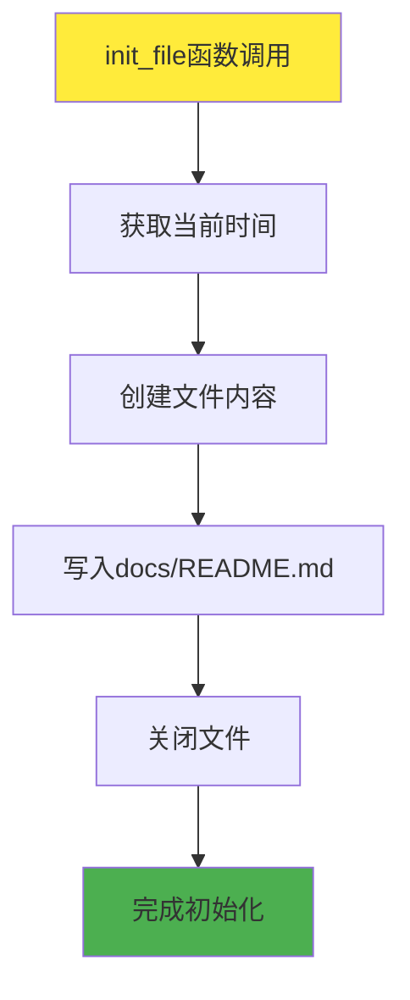
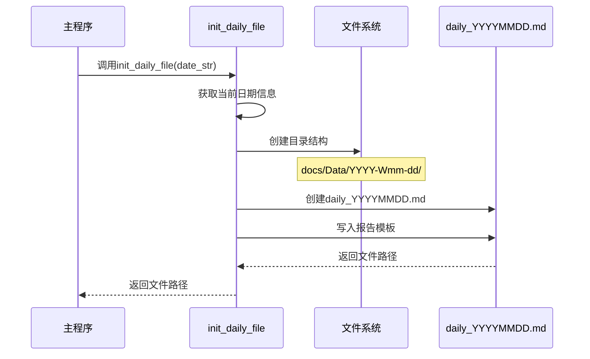
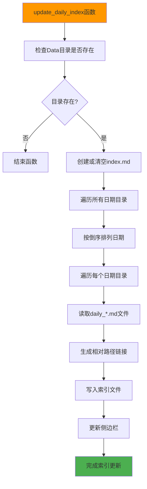
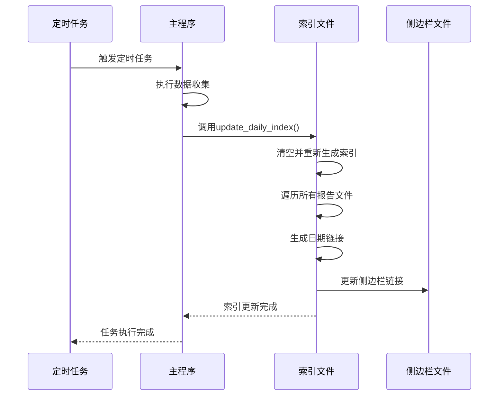

# 文件结构说明

<cite>
**本文档引用的文件**
- [README.md](file://README.md)
- [main.py](file://main.py)
- [requirements.txt](file://requirements.txt)
</cite>

## 目录
1. [项目概述](#项目概述)
2. [静态文件结构](#静态文件结构)
3. [运行时动态文件结构](#运行时动态文件结构)
4. [数据库文件](#数据库文件)
5. [核心函数分析](#核心函数分析)
6. [自动化流程详解](#自动化流程详解)
7. [总结](#总结)

## 项目概述

Github CVE 监控项目是一个基于 Python 的自动化工具，用于监控 GitHub 上的 CVE（通用漏洞披露）信息。该项目通过 GitHub API 自动获取 CVE 相关的仓库信息，并生成详细的报告文档。项目采用模块化设计，具有清晰的文件结构和自动化的工作流程。

## 静态文件结构

### 主要静态文件

项目根目录包含三个核心静态文件：



**图表来源**
- [README.md](file://README.md#L1-L76)
- [main.py](file://main.py#L1-L50)
- [requirements.txt](file://requirements.txt#L1-L3)

**章节来源**
- [README.md](file://README.md#L1-L76)
- [main.py](file://main.py#L1-L50)
- [requirements.txt](file://requirements.txt#L1-L3)

### README.md - 项目说明文档

README.md 是项目的主文档，提供了以下关键信息：

- **项目简介**：使用 GitHub Actions 自动监控 GitHub 上的 CVE 信息
- **安装说明**：包含依赖项安装命令 `pip install -r requirements.txt`
- **使用方法**：提供命令行使用方式 `python main.py` 和 GitHub Actions 配置
- **限制说明**：详细说明 GitHub API 的限制及解决方案
- **路线图**：展示当前开发状态和未来计划

### main.py - 主程序入口

main.py 是整个项目的主程序文件，包含以下核心功能：

- **依赖导入**：包括 requests、peewee、datetime 等必要模块
- **数据库定义**：定义 CVE_DB 模型用于存储 CVE 信息
- **文件操作函数**：init_file()、write_file()、init_daily_file() 等
- **API 调用**：get_info() 函数处理 GitHub API 请求
- **数据处理**：db_match() 函数处理和匹配 CVE 信息
- **主程序逻辑**：main() 函数协调整个数据收集和报告生成流程

### requirements.txt - 依赖包列表

requirements.txt 明确列出了项目所需的 Python 包：

- **peewee==3.18.2**：轻量级 ORM 库，用于数据库操作
- **requests==2.31.0**：HTTP 请求库，用于与 GitHub API 通信

**章节来源**
- [README.md](file://README.md#L1-L76)
- [main.py](file://main.py#L1-L50)
- [requirements.txt](file://requirements.txt#L1-L3)

## 运行时动态文件结构

### docs/ 目录结构

项目运行时会在 docs/ 目录下生成完整的报告体系：



**图表来源**
- [main.py](file://main.py#L40-L70)
- [main.py](file://main.py#L130-L180)

### docs/README.md - 全量情报速递数据报告

这是项目生成的第一个主要报告文件，位于 docs/ 目录下：

- **文件路径**：`docs/README.md`
- **生成时机**：每次运行程序时首先创建
- **内容结构**：
  - 报告标题和基本信息
  - 生成时间和数据来源
  - 表格头部（CVE、相关仓库、描述、日期）

**章节来源**
- [main.py](file://main.py#L30-L35)
- [main.py](file://main.py#L280-L290)

### docs/Data/ 目录组织

Data/ 目录按照特定的时间格式组织每日报告：

#### 目录命名规则
- **格式**：`YYYY-Wmm-dd`
- **组成**：
  - `YYYY`：四位年份
  - `Wmm`：两位周数（从 01 开始）
  - `dd`：两位月份
  - `dd`：两位日期

#### 每日报告文件
- **文件名格式**：`daily_YYYYMMDD.md`
- **生成时机**：每天首次运行时创建
- **内容结构**：
  - 报告标题和基本信息
  - 生成时间和数据来源
  - 当日情报速递表格

**章节来源**
- [main.py](file://main.py#L40-L70)
- [main.py](file://main.py#L72-L85)

### docs/Data/index.md - 自动生成的报告索引

index.md 是自动生成的报告索引文件，提供历史报告的导航功能：

- **文件路径**：`docs/Data/index.md`
- **生成时机**：每次运行 update_daily_index() 函数时
- **内容结构**：
  - 索引标题和基本信息
  - 按日期倒序排列的所有报告链接
  - 每个日期目录下的具体报告链接

**章节来源**
- [main.py](file://main.py#L130-L180)

### docs/_sidebar.md - 可选侧边栏配置

如果存在这个文件，程序会自动更新侧边栏添加每日报告链接：

- **文件路径**：`docs/_sidebar.md`
- **检查条件**：文件存在时才执行更新
- **更新内容**：在主页链接后添加每日报告链接

**章节来源**
- [main.py](file://main.py#L182-L205)

## 数据库文件

### db/cve.sqlite - SQLite 数据库存储

项目使用 SQLite 数据库存储 CVE 信息：



**图表来源**
- [main.py](file://main.py#L15-L25)

#### 数据库特性
- **文件位置**：`db/cve.sqlite`
- **表结构**：单表设计，包含六个字段
- **字段说明**：
  - `id`：GitHub 仓库 ID
  - `full_name`：完整仓库名称
  - `description`：仓库描述
  - `url`：仓库 URL
  - `created_at`：创建时间
  - `cve`：CVE 编号

#### 数据库操作
- **连接建立**：程序启动时自动连接数据库
- **表创建**：如果不存在则自动创建 CVE_DB 表
- **数据存储**：每次获取新数据时自动保存到数据库
- **查询操作**：用于生成全量报告时的数据检索

**章节来源**
- [main.py](file://main.py#L15-L25)
- [main.py](file://main.py#L220-L240)

## 核心函数分析

### init_file() 函数

负责初始化全量情报速递数据报告：



**图表来源**
- [main.py](file://main.py#L30-L35)

### init_daily_file() 函数

负责初始化每日报告文件：



**图表来源**
- [main.py](file://main.py#L40-L70)

### update_daily_index() 函数

负责更新每日报告索引：



**图表来源**
- [main.py](file://main.py#L130-L180)

**章节来源**
- [main.py](file://main.py#L30-L35)
- [main.py](file://main.py#L40-L70)
- [main.py](file://main.py#L130-L180)

## 自动化流程详解

### 目录创建机制

项目使用 `Path().mkdir(parents=True)` 实现自动化目录创建：

```python
# 创建目录结构 /Data/YYYY-W-mm-dd
dir_path = f"docs/Data/{year}-W{week_number}-{month}-{day}"
Path(dir_path).mkdir(parents=True, exist_ok=True)
```

这种实现方式的优势：
- **递归创建**：自动创建所有必要的父目录
- **幂等性**：exist_ok=True 确保重复创建不会出错
- **简洁性**：一行代码完成复杂的目录创建逻辑

### 索引更新自动化

update_daily_index() 函数实现了完全自动化的索引维护：



**图表来源**
- [main.py](file://main.py#L130-L180)
- [main.py](file://main.py#L182-L205)

### 文件操作模式

项目采用两种不同的文件写入模式：

1. **覆盖模式**（overwrite=True）：
   - 用于初始化全量报告
   - 用于首次写入全量数据报告

2. **追加模式**（overwrite=False）：
   - 用于追加新的 CVE 记录
   - 保持现有内容不变

**章节来源**
- [main.py](file://main.py#L40-L70)
- [main.py](file://main.py#L130-L180)
- [main.py](file://main.py#L30-L35)

## 总结

Github CVE 监控项目展现了优秀的文件结构设计和自动化流程：

### 设计优势

1. **清晰的目录层次**：静态文件与动态生成文件分离
2. **自动化的目录管理**：使用 Path 对象实现智能目录创建
3. **完善的索引系统**：自动生成报告索引和导航链接
4. **灵活的配置选项**：支持可选的侧边栏更新

### 运行时特性

- **增量更新**：只添加新的 CVE 记录，避免重复处理
- **错误恢复**：当当日无数据时自动使用最近记录
- **性能优化**：使用数据库缓存避免重复 API 调用
- **国际化支持**：支持中文环境和编码

### 扩展性考虑

项目结构为未来的功能扩展预留了良好的基础：
- 新增报告类型只需添加相应的文件生成逻辑
- 数据库模型可以轻松扩展更多字段
- 可以添加更多的自动化报告和统计功能

这种设计使得项目既易于维护，又具备良好的扩展性和稳定性，为持续监控 GitHub CVE 信息提供了可靠的基础设施。