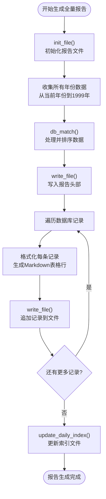
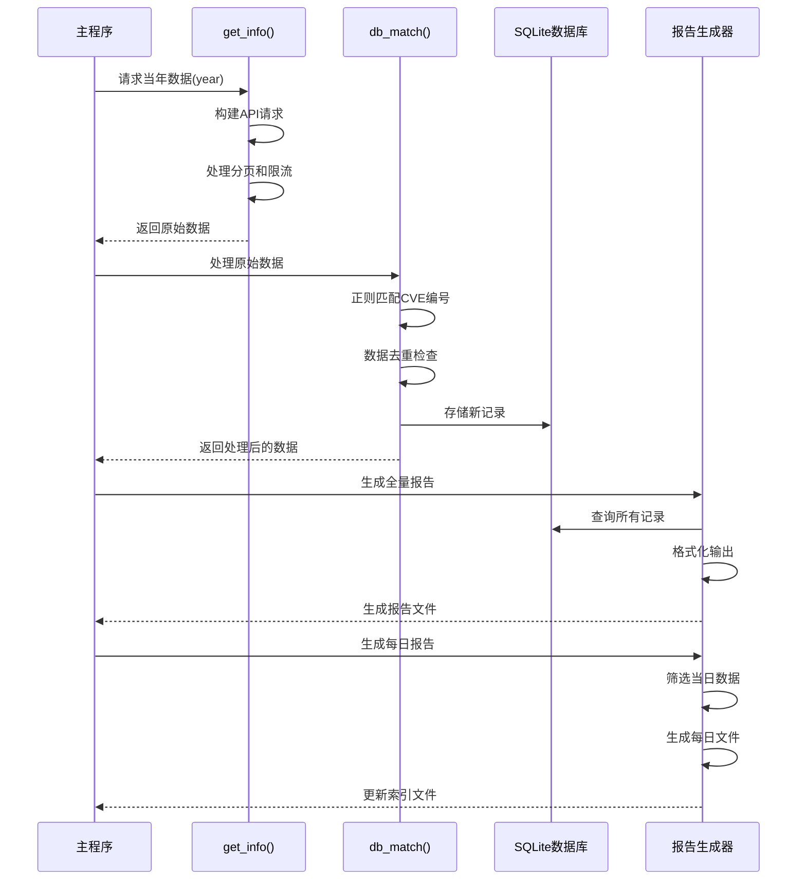
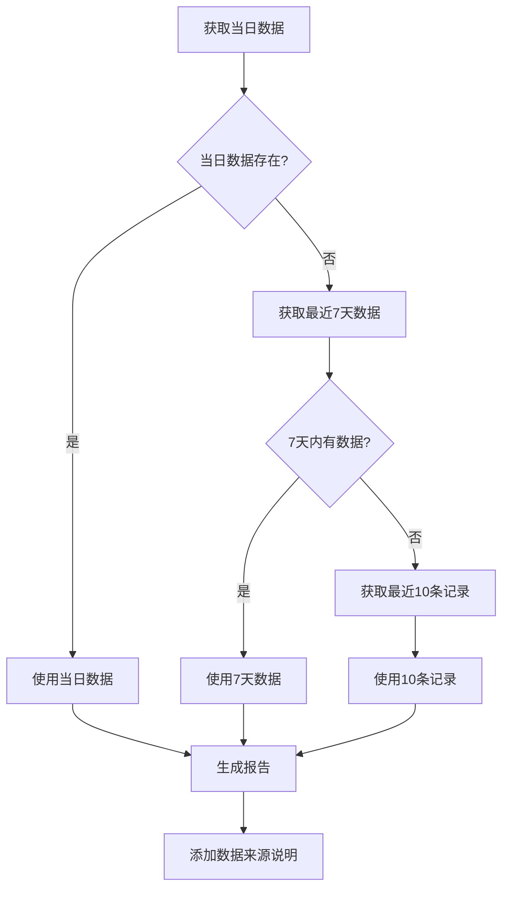

# github_cve_monitor 核心功能模块详解

<cite>
**本文档引用的文件**
- [main.py](file://main.py)
- [README.md](file://README.md)
- [requirements.txt](file://requirements.txt)
</cite>

## 目录
1. [项目概述](#项目概述)
2. [数据采集功能模块](#数据采集功能模块)
3. [数据处理与存储功能模块](#数据处理与存储功能模块)
4. [报告生成功能模块](#报告生成功能模块)
5. [架构设计与组件关系](#架构设计与组件关系)
6. [性能优化策略](#性能优化策略)
7. [容错机制与异常处理](#容错机制与异常处理)
8. [总结](#总结)

## 项目概述

github_cve_monitor 是一个基于 Python 开发的自动化 CVE 监控系统，专门用于从 GitHub 平台收集和分析 CVE 相关的漏洞信息。该项目通过 GitHub API 实现自动化数据采集，利用正则表达式提取 CVE 编号，通过 SQLite 数据库存储和管理数据，并生成详细的报告文档。

系统的核心价值在于：
- **实时监控**：持续跟踪 GitHub 上新增的 CVE 相关仓库
- **智能提取**：自动识别和提取 CVE 编号信息
- **多维度报告**：提供全量报告和每日报告两种形式
- **数据持久化**：确保数据不丢失，支持历史数据分析

## 数据采集功能模块

### get_info() 函数核心实现

数据采集功能是整个系统的基础，负责从 GitHub API 获取 CVE 相关的仓库信息。核心实现位于 `get_info()` 函数中，该函数具有以下关键特性：

#### API 请求构建与参数配置

```python
api = f"https://api.github.com/search/repositories?q=CVE-{year}&sort=updated&page={page}&per_page={per_page}"
```

系统采用精确的查询语句 `q=CVE-{year}`，确保只获取特定年份的 CVE 相关仓库。查询参数包括：
- **sort=updated**：按更新时间排序，优先获取最新数据
- **page**：分页参数，支持大规模数据获取
- **per_page**：每页返回记录数，动态调整

#### 动态配置机制

系统实现了智能的动态配置机制，根据是否存在 GitHub Token 来调整 API 请求策略：

```python
github_token = os.environ.get('GITHUB_TOKEN')
headers = {}

if github_token:
    headers['Authorization'] = f'token {github_token}'
    per_page = 100  # 有Token时每页100条
else:
    per_page = 30   # 无Token时每页30条
```

这种设计的优势：
- **高权限模式**：当提供 GitHub Token 时，可享受更高的 API 限制（5000次/小时）
- **低权限模式**：未提供 Token 时自动降级，避免 API 限制问题
- **安全性考虑**：Token 显示部分信息而非完整值，保护用户隐私

#### 请求频率控制与防限流机制

为了应对 GitHub API 的速率限制，系统实现了智能的等待机制：

```python
if not github_token:
    count = random.randint(3, 15)
    time.sleep(count)
```

这种设计特点：
- **随机性**：每次等待3-15秒的随机时间，避免被检测为机器人
- **条件触发**：仅在无 Token 情况下启用，有 Token 时无需等待
- **平滑处理**：通过分散请求时间，降低对 API 的冲击

#### 分页处理与完整性保证

系统实现了完整的分页处理逻辑，确保获取所有相关数据：

```python
while True:
    response = requests.get(api, headers=headers)
    items = req.get("items")
    
    if not items:
        break
    
    all_items.extend(items)
    
    if len(items) < per_page:
        break
    
    page += 1
```

关键特性：
- **智能终止**：当某页返回的项目数少于 per_page 时，认为已到达最后一页
- **数据累积**：将每页结果合并到统一的列表中
- **内存友好**：一次性加载所有数据，避免多次 API 调用

**章节来源**
- [main.py](file://main.py#L130-L180)

## 数据处理与存储功能模块

### db_match() 函数核心实现

数据处理与存储功能是系统的核心环节，负责从原始数据中提取有价值的信息并进行持久化存储。主要实现位于 `db_match()` 函数中。

#### CVE 编号提取机制

系统采用强大的正则表达式匹配机制来提取 CVE 编号：

```python
regex = r"[Cc][Vv][Ee][-_]\d{4}[-_]\d{4,7}"
```

该正则表达式的匹配能力：
- **大小写兼容**：同时匹配 "CVE-" 和 "cve_" 等变体
- **格式适应**：支持多种分隔符（- 和 _）
- **范围覆盖**：匹配 4 位年份和 4-7 位数字的组合

#### 多源信息提取策略

系统实现了双重信息提取策略，确保 CVE 编号的准确识别：

```python
# 1. 优先从 URL 中提取
matches = re.finditer(regex, url, re.MULTILINE)
for matchNum, match in enumerate(matches, start=1):
    cve = match.group()

# 2. 如果 URL 中未找到，则从描述中提取
if not cve:
    matches = re.finditer(regex, description, re.MULTILINE)
    for matchNum, match in enumerate(matches, start=1):
        cve = match.group()
```

这种设计的优势：
- **优先级明确**：URL 中的 CVE 通常更可靠
- **容错性强**：描述中的 CVE 作为备选方案
- **准确性保障**：确保至少提取到一个有效的 CVE 编号

#### 数据去重与存储机制

系统通过 peewee ORM 实现高效的数据管理和去重：

```python
class CVE_DB(Model):
    id = IntegerField()
    full_name = CharField(max_length=1024)
    description = CharField(max_length=4098)
    url = CharField(max_length=1024)
    created_at = CharField(max_length=128)
    cve = CharField(max_length=64)
```

数据存储的关键特性：
- **唯一性约束**：通过 id 字段确保每条记录的唯一性
- **字段优化**：合理设置字段长度，平衡存储效率和数据完整性
- **类型安全**：使用强类型字段，防止数据格式错误

#### 数据库操作与事务管理

系统实现了完整的数据库操作流程：

```python
for item in items:
    id = item["id"]
    if CVE_DB.select().where(CVE_DB.id == id).count() != 0:
        continue  # 跳过已存在的记录
    
    # 创建新记录
    CVE_DB.create(
        id=id,
        full_name=full_name,
        description=description,
        url=url,
        created_at=created_at,
        cve=cve.upper().replace('_','-')
    )
```

关键特性：
- **重复检查**：在创建前检查记录是否已存在
- **数据清洗**：统一 CVE 编号格式（大写，连字符）
- **批量处理**：高效处理大量数据

#### 排序与输出处理

系统实现了智能的数据排序机制：

```python
return sorted(r_list, key=lambda e: e.__getitem__('created_at'))
```

排序依据：
- **时间顺序**：按创建时间升序排列，便于后续分析
- **逻辑清晰**：新数据优先展示，符合用户阅读习惯
- **性能优化**：使用内置排序算法，时间复杂度 O(n log n)

**章节来源**
- [main.py](file://main.py#L182-L220)

## 报告生成功能模块

### 报告生成系统架构

报告生成功能模块负责将处理后的数据转换为用户友好的 Markdown 格式文档。该模块包含多个协同工作的函数，形成完整的报告生成流水线。

#### 全量报告生成流程

全量报告生成是系统的核心功能之一，负责创建包含所有历史数据的综合报告：



**图表来源**
- [main.py](file://main.py#L222-L280)

#### 每日报告生成机制

每日报告生成实现了智能的时间筛选和数据聚合：

```python
# 筛选当日数据
for entry in sorted_data:
    created_date = datetime.fromisoformat(entry["created_at"].replace("Z", "+00:00"))
    created_date_str = created_date.strftime("%Y-%m-%d")
    today_str = today.strftime("%Y-%m-%d")
    if created_date_str == today_str:
        today_list.append(entry)
```

关键特性：
- **精确时间匹配**：严格匹配日期字符串，确保数据准确性
- **UTC 时间处理**：正确处理 UTC 时间格式，避免时区问题
- **数据过滤**：只保留当天创建的新数据

#### 容错机制与回退策略

当系统无法获取当日数据时，实现了智能的回退机制：

```python
if len(today_list) == 0:
    print("当日无数据，尝试获取最近7天的数据...")
    
    # 获取7天内的数据
    from datetime import timedelta
    seven_days_ago = (today - timedelta(days=7)).strftime("%Y-%m-%d")
    cur.execute(f"SELECT * FROM CVE_DB WHERE created_at >= '{seven_days_ago}' ORDER BY created_at DESC;")
    
    # 如果7天内没有数据，则获取最近的10条记录
    if len(recent_records) == 0:
        cur.execute("SELECT * FROM CVE_DB ORDER BY created_at DESC LIMIT 10;")
```

回退策略的特点：
- **多层次**：先尝试7天数据，再尝试最近10条记录
- **智能选择**：根据可用数据量选择合适的回退方案
- **透明提示**：在报告中明确说明数据来源

#### 文件系统管理

系统实现了完善的文件系统管理机制：

```python
def init_daily_file(date_str):
    """初始化每日报告文件"""
    today = datetime.now()
    year = today.year
    week_number = today.strftime("%W")
    month = today.strftime("%m")
    day = today.strftime("%d")
    
    # 创建目录结构 /Data/YYYY-Wmm-dd
    dir_path = f"docs/Data/{year}-W{week_number}-{month}-{day}"
    Path(dir_path).mkdir(parents=True, exist_ok=True)
    
    # 创建每日报告文件
    file_path = f"{dir_path}/daily_{date_str}.md"
```

目录结构设计：
- **层次化组织**：按年份、周数、日期组织目录
- **标准化命名**：使用 YYYY-Wmm-dd 格式确保排序一致性
- **自动创建**：递归创建所需的所有目录层级

#### 索引文件维护

系统实现了自动化的索引文件维护机制：

```python
def update_daily_index():
    """更新每日情报速递报告索引文件"""
    data_dir = Path("docs/Data")
    if not data_dir.exists():
        return
    
    # 遍历所有日期目录
    date_dirs = sorted([d for d in data_dir.glob("*-W*-*-*")], reverse=True)
    
    for date_dir in date_dirs:
        # 处理每个日期目录下的daily报告
        daily_files = sorted([f for f in date_dir.glob("daily_*.md")], reverse=True)
        
        # 生成相对路径和格式化日期
        relative_path = f"Data/{date_dir.name}/{file_name}"
        date_str = file_name.replace("daily_", "").replace(".md", "")
```

索引维护的特点：
- **自动发现**：扫描所有符合条件的目录和文件
- **智能排序**：按时间倒序排列，最新数据优先显示
- **格式化处理**：将文件名转换为易读的日期格式

#### 侧边栏自动更新

系统实现了智能的侧边栏更新机制：

```python
def update_sidebar():
    """更新侧边栏，添加每日报告链接"""
    sidebar_path = Path("docs/_sidebar.md")
    if not sidebar_path.exists():
        return
    
    # 检查是否已有每日报告链接
    daily_report_exists = False
    for line in lines:
        if "每日报告" in line:
            daily_report_exists = True
            break
    
    # 如果没有每日报告链接，添加到侧边栏
    if not daily_report_exists:
        new_lines = []
        for line in lines:
            new_lines.append(line)
            if "- [主页](README.md)" in line:
                new_lines.append("- [每日报告](/Data/index.md)\n")
```

侧边栏更新的特点：
- **幂等性**：确保不会重复添加链接
- **位置智能**：在主页链接后添加新的导航项
- **文件保护**：保持原有文件内容不变

**章节来源**
- [main.py](file://main.py#L25-L120)
- [main.py](file://main.py#L281-L350)

## 架构设计与组件关系

### 系统架构概览

github_cve_monitor 采用了模块化的架构设计，各功能模块职责明确，相互协作完成完整的 CVE 监控任务。

```mermaid
graph TB
subgraph "输入层"
GitHubAPI[GitHub API]
ENV[环境变量<br/>GITHUB_TOKEN]
end
subgraph "数据采集层"
GetInfo[get_info()<br/>API请求与解析]
RateLimit[速率限制控制]
end
subgraph "数据处理层"
DBMatch[db_match()<br/>数据提取与验证]
Regex[CVE正则匹配]
Dedup[数据去重]
end
subgraph "存储层"
SQLite[(SQLite数据库<br/>CVE_DB表)]
Metadata[元数据存储]
end
subgraph "报告生成层"
InitFile[init_file()<br/>初始化报告]
WriteFile[write_file()<br/>文件写入]
DailyReport[每日报告生成]
IndexUpdate[索引更新]
end
subgraph "输出层"
FullReport[全量报告<br/>docs/README.md]
DailyFiles[每日报告<br/>docs/Data/...]
Sidebar[侧边栏更新<br/>docs/_sidebar.md]
end
GitHubAPI --> GetInfo
ENV --> GetInfo
GetInfo --> RateLimit
RateLimit --> DBMatch
DBMatch --> Regex
DBMatch --> Dedup
Dedup --> SQLite
SQLite --> Metadata
SQLite --> InitFile
InitFile --> WriteFile
WriteFile --> DailyReport
DailyReport --> IndexUpdate
IndexUpdate --> FullReport
IndexUpdate --> DailyFiles
IndexUpdate --> Sidebar
```

**图表来源**
- [main.py](file://main.py#L1-L420)

### 核心类与数据模型

系统定义了简洁而高效的数据库模型：

```python
class CVE_DB(Model):
    id = IntegerField()                    # GitHub仓库ID
    full_name = CharField(max_length=1024) # 完整仓库名称
    description = CharField(max_length=4098)# 描述信息
    url = CharField(max_length=1024)       # 仓库URL
    created_at = CharField(max_length=128) # 创建时间
    cve = CharField(max_length=64)         # CVE编号
```

模型设计原则：
- **字段精简**：只存储必要的字段，减少存储开销
- **类型安全**：使用强类型字段，确保数据一致性
- **扩展性**：预留足够空间，支持未来字段扩展

### 组件间交互关系



**图表来源**
- [main.py](file://main.py#L130-L220)
- [main.py](file://main.py#L222-L350)

## 性能优化策略

### API 请求优化

系统实现了多项性能优化策略来提高数据采集效率：

#### 动态分页策略

```python
per_page = 100  # 有Token时每页100条
if not github_token:
    per_page = 30   # 无Token时每页30条
```

优化效果：
- **吞吐量提升**：有Token时单次请求获取更多数据
- **成本控制**：无Token时减少API调用次数
- **资源平衡**：根据权限级别自动调整策略

#### 智能等待机制

```python
if not github_token:
    count = random.randint(3, 15)
    time.sleep(count)
```

性能优势：
- **负载均衡**：分散API请求，避免峰值压力
- **随机性保护**：降低被识别为爬虫的风险
- **用户体验**：保持系统响应性，避免长时间阻塞

### 数据处理优化

#### 批量处理与内存管理

```python
all_items = []
while True:
    # 批量处理，减少循环开销
    all_items.extend(items)
    if len(items) < per_page:
        break
    page += 1
```

优化特点：
- **内存效率**：一次性加载所有数据，避免频繁分配
- **计算优化**：减少循环条件判断次数
- **网络优化**：减少不必要的API调用

#### 数据库操作优化

```python
if CVE_DB.select().where(CVE_DB.id == id).count() != 0:
    continue  # 跳过已存在的记录
```

优化策略：
- **查询优化**：使用 select().count() 而非全表扫描
- **早期退出**：在确认重复后立即跳过处理
- **批量操作**：支持批量插入，提高存储效率

### 文件 I/O 优化

#### 流式写入机制

```python
mode = 'w' if overwrite else 'a'
with open('docs/README.md', mode, encoding='utf-8') as f:
    f.write(new_contents)
```

优化效果：
- **增量更新**：支持追加写入，避免重复读取
- **编码一致性**：统一使用UTF-8编码，确保跨平台兼容
- **资源管理**：使用上下文管理器，确保文件正确关闭

## 容错机制与异常处理

### 网络请求容错

系统实现了完善的网络请求容错机制：

```python
try:
    api = f"https://api.github.com/search/repositories?q=CVE-{year}&sort=updated&page={page}&per_page={per_page}"
    response = requests.get(api, headers=headers)
    
    if 'X-RateLimit-Limit' in response.headers:
        print(f"API Rate Limit: {response.headers.get('X-RateLimit-Remaining')}/{response.headers.get('X-RateLimit-Limit')}")
    
    req = response.json()
    items = req.get("items")
    
    if not items:
        break
except Exception as e:
    print("An error occurred in the network request", e)
    return None
```

容错特性：
- **异常捕获**：捕获所有网络异常，防止程序崩溃
- **状态监控**：实时监控API限流状态
- **优雅降级**：遇到错误时返回None，允许上层处理

### 数据处理容错

#### 日期解析容错

```python
try:
    created_date = datetime.fromisoformat(entry["created_at"].replace("Z", "+00:00"))
    created_date_str = created_date.strftime("%Y-%m-%d")
    today_str = today.strftime("%Y-%m-%d")
    if created_date_str == today_str:
        today_list.append(entry)
except Exception as e:
    print(f"日期解析错误: {e}")
```

容错策略：
- **异常隔离**：单条记录解析失败不影响整体处理
- **错误记录**：记录具体的解析错误信息
- **数据完整性**：确保其他有效数据不受影响

#### 数据格式容错

```python
description = item["description"]
if description == "" or description == None:
    description = 'no description'
else:
    description = html.escape(description.strip())
```

格式处理：
- **空值处理**：为null或空字符串提供默认值
- **HTML转义**：防止XSS攻击和格式破坏
- **数据清理**：去除多余空白字符

### 回退机制设计

系统实现了多层次的回退机制：



**图表来源**
- [main.py](file://main.py#L351-L380)

回退策略的优势：
- **数据连续性**：确保每天都有可用的报告
- **透明性**：明确告知用户数据来源
- **灵活性**：根据可用数据自动调整策略

**章节来源**
- [main.py](file://main.py#L130-L180)
- [main.py](file://main.py#L351-L390)

## 总结

github_cve_monitor 项目展现了优秀的软件工程实践，通过三个核心功能模块的协同工作，实现了高效的 CVE 信息监控和报告生成系统。

### 核心功能总结

1. **数据采集模块**：通过智能的 API 请求策略和速率控制机制，确保稳定高效地获取 GitHub CVE 数据
2. **数据处理模块**：利用强大的正则表达式匹配和数据库去重机制，保证数据质量和完整性
3. **报告生成模块**：提供全量报告和每日报告两种形式，支持智能回退和自动索引维护

### 技术亮点

- **智能权限适配**：根据 GitHub Token 状态自动调整 API 请求策略
- **强大的正则匹配**：支持多种 CVE 编号格式的自动识别
- **完善的容错机制**：多层次的回退策略确保系统稳定性
- **模块化设计**：清晰的功能分离便于维护和扩展

### 应用价值

该系统为安全研究人员和团队提供了：
- **实时监控**：及时获取最新的 CVE 相关漏洞信息
- **历史追踪**：完整的数据历史记录，支持趋势分析
- **自动化报告**：减少人工工作量，提高工作效率
- **开源共享**：开放源码，促进社区协作和改进

github_cve_monitor 不仅是一个实用的工具，更是展示了如何通过合理的架构设计和最佳实践，构建一个稳定、高效、易用的安全监控系统。其设计理念和实现方式对于类似项目的开发具有重要的参考价值。