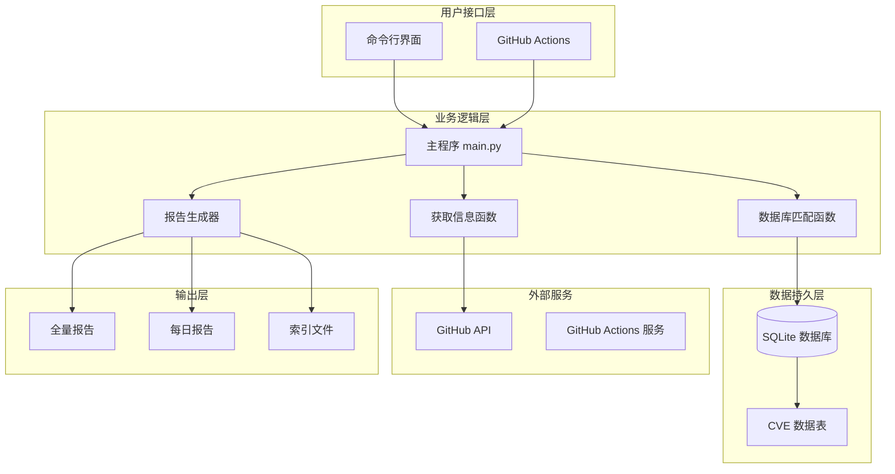
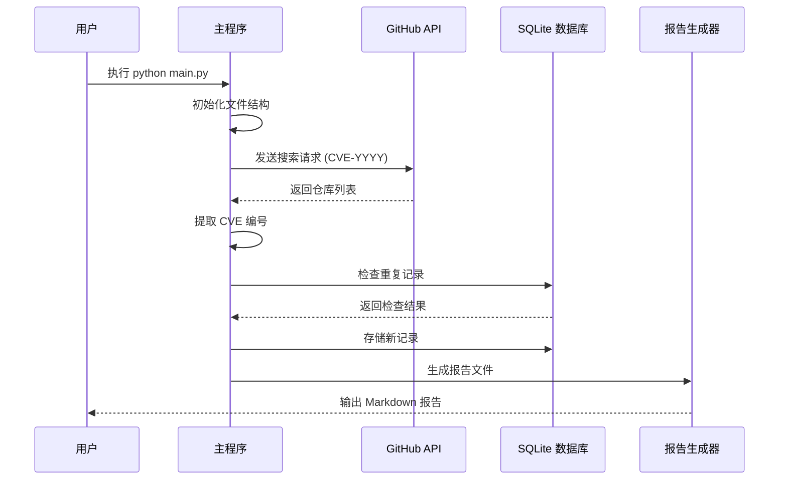
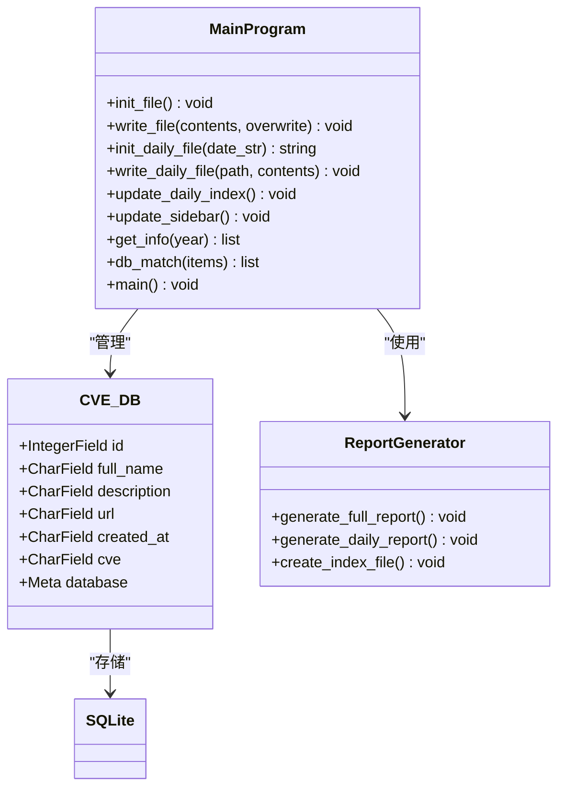
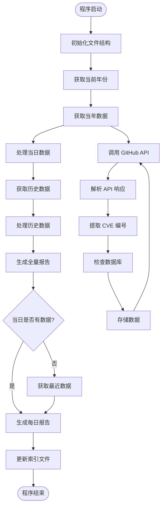
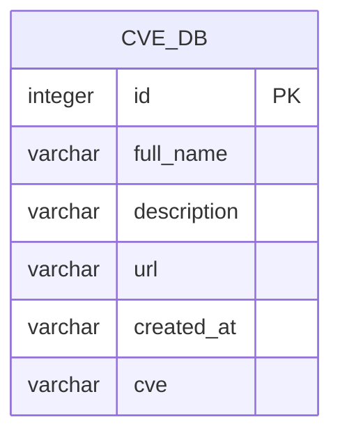

# Github CVE Monitor 项目文档

<cite>
**本文档引用的文件**
- [README.md](file://README.md)
- [main.py](file://main.py)
- [requirements.txt](file://requirements.txt)
</cite>

## 目录
1. [项目简介](#项目简介)
2. [项目架构](#项目架构)
3. [核心功能](#核心功能)
4. [技术实现](#技术实现)
5. [使用指南](#使用指南)
6. [部署方案](#部署方案)
7. [性能优化](#性能优化)
8. [故障排除](#故障排除)
9. [未来规划](#未来规划)
10. [总结](#总结)

## 项目简介

Github CVE Monitor 是一个专门设计的自动化监控工具，用于跟踪 GitHub 上与 CVE（通用漏洞披露）相关的信息。该项目的核心目标是收集包含 CVE 编号的公开仓库，特别是那些包含漏洞利用代码（PoC）或概念验证代码的项目，并生成高质量的安全情报报告。

### 主要特点

- **自动化监控**：通过 GitHub API 自动获取最新的 CVE 相关仓库信息
- **多维度报告**：生成全量情报速递报告和每日情报速递报告
- **双模式运行**：支持本地运行和 GitHub Actions 自动化执行
- **智能数据处理**：使用正则表达式提取 CVE 编号，确保数据准确性
- **开发者友好**：提供完整的环境配置和使用指导

## 项目架构



**图表来源**
- [main.py](file://main.py#L1-L420)

### 架构组件说明

1. **用户接口层**：提供两种使用方式，支持本地命令行运行和 GitHub Actions 自动化
2. **业务逻辑层**：核心处理模块，负责数据获取、处理和报告生成
3. **数据持久层**：使用 SQLite 数据库存储 CVE 相关信息
4. **外部服务**：依赖 GitHub API 获取实时数据
5. **输出层**：生成多种格式的报告文件

## 核心功能

### 1. CVE 信息自动收集

项目通过 GitHub API 搜索包含 CVE 编号的仓库，支持以下搜索模式：

- `CVE-YYYY-XXXXXX`：标准 CVE 编号格式
- `CVE_YYYY_XXXXXX`：下划线分隔格式
- `cve-yyyy-xxxxxx`：小写格式



**图表来源**
- [main.py](file://main.py#L110-L220)

### 2. 多层次数据存储

项目采用三层数据存储策略：

1. **内存缓存**：临时存储获取的原始数据
2. **SQLite 数据库**：永久存储结构化 CVE 信息
3. **文件系统**：存储生成的报告文件



**图表来源**
- [main.py](file://main.py#L18-L30)
- [main.py](file://main.py#L32-L100)

### 3. 智能报告生成

项目支持两种类型的报告生成：

#### 全量情报速递报告
- 包含所有历史 CVE 数据
- 按 CVE 编号降序排列
- 提供完整的数据索引和导航

#### 每日情报速递报告
- 实时更新当日新增数据
- 自动生成日期目录结构
- 支持多日期报告索引

**章节来源**
- [main.py](file://main.py#L32-L100)
- [main.py](file://main.py#L240-L350)

## 技术实现

### 数据流架构



**图表来源**
- [main.py](file://main.py#L240-L420)

### 关键算法实现

#### CVE 编号提取算法

项目使用正则表达式精确提取 CVE 编号：

```python
regex = r"[Cc][Vv][Ee][-_]\d{4}[-_]\d{4,7}"
```

该算法能够识别以下格式的 CVE 编号：
- CVE-2023-12345
- CVE_2023_12345
- cve-2023-12345

#### 数据去重机制

通过数据库唯一性约束防止重复记录：

```python
if CVE_DB.select().where(CVE_DB.id == id).count() != 0:
    continue
```

#### 时间过滤算法

智能筛选当日新增数据：

```python
created_date = datetime.fromisoformat(entry["created_at"].replace("Z", "+00:00"))
created_date_str = created_date.strftime("%Y-%m-%d")
today_str = today.strftime("%Y-%m-%d")
if created_date_str == today_str:
    today_list.append(entry)
```

**章节来源**
- [main.py](file://main.py#L220-L240)
- [main.py](file://main.py#L240-L280)

### 数据库设计

项目采用简洁高效的数据库设计：



**图表来源**
- [main.py](file://main.py#L18-L30)

**章节来源**
- [main.py](file://main.py#L18-L30)

## 使用指南

### 环境准备

#### 1. 系统要求
- Python 3.6+
- pip 包管理器

#### 2. 依赖安装

```bash
pip install -r requirements.txt
```

依赖包说明：
- `peewee==3.18.2`：轻量级 ORM 框架
- `requests==2.31.0`：HTTP 请求库

#### 3. GitHub Token 配置

为了突破 GitHub API 的速率限制，建议配置 GitHub Token：

```bash
# Linux/Mac
export GITHUB_TOKEN=your_token_here

# Windows
set GITHUB_TOKEN=your_token_here
```

### 基本使用

#### 本地运行

```bash
python main.py
```

#### 参数说明

- **无参数**：默认执行完整流程
- **自动检测**：程序会自动识别当前日期并生成相应报告

### 文件结构说明

项目生成的文件结构如下：

```
docs/
├── README.md              # 全量报告主文件
├── _sidebar.md           # 侧边栏导航文件
├── Data/                 # 数据目录
│   ├── 2024-W35-08-22/   # 日期目录
│   │   └── daily_20240822.md  # 当日报告
│   └── index.md          # 报告索引文件
```

**章节来源**
- [README.md](file://README.md#L1-L76)
- [requirements.txt](file://requirements.txt#L1-L3)

## 部署方案

### 方案一：本地运行

适用于个人使用和小规模监控：

1. **克隆项目**：
   ```bash
   git clone https://github.com/adminlove520/github_cve_monitor.git
   cd github_cve_monitor
   ```

2. **安装依赖**：
   ```bash
   pip install -r requirements.txt
   ```

3. **配置环境变量**（可选）：
   ```bash
   export GITHUB_TOKEN=your_github_token
   ```

4. **运行程序**：
   ```bash
   python main.py
   ```

### 方案二：GitHub Actions 自动化

适用于持续监控和团队协作：

1. **启用 GitHub Actions**：
   - 在 GitHub 仓库设置中启用 Actions
   - 配置 Secrets 中的 `GH_TOKEN`

2. **工作流程配置**：
   - 使用项目提供的 `.github/workflows/run.yml` 文件
   - 支持定时执行和事件触发

3. **部署步骤**：
   ```yaml
   - name: Run CVE Monitor
     run: |
       python main.py
   ```

### 方案三：Docker 部署（推荐）

适用于容器化环境：

```dockerfile
FROM python:3.9-slim

WORKDIR /app
COPY requirements.txt .
RUN pip install -r requirements.txt

COPY . .

CMD ["python", "main.py"]
```

**章节来源**
- [README.md](file://README.md#L10-L20)

## 性能优化

### API 调用优化

#### 1. Token 认证提升速率限制

- 未认证：每小时 60 次请求
- Token 认证：每小时 5000 次请求

#### 2. 智能等待机制

```python
# 无 Token 时随机等待
count = random.randint(3, 15)
time.sleep(count)
```

#### 3. 分页处理优化

```python
while True:
    api = f"https://api.github.com/search/repositories?q=CVE-{year}&sort=updated&page={page}&per_page={per_page}"
    response = requests.get(api, headers=headers)
    
    if len(items) < per_page:
        break
    page += 1
```

### 数据处理优化

#### 1. 内存管理

- 使用生成器模式处理大数据集
- 及时释放不需要的变量

#### 2. 数据库优化

- 使用批量插入减少 I/O 操作
- 合理设置数据库连接池

#### 3. 文件 I/O 优化

- 使用缓冲写入提高性能
- 异步文件操作

**章节来源**
- [main.py](file://main.py#L110-L150)
- [main.py](file://main.py#L220-L240)

## 故障排除

### 常见问题及解决方案

#### 1. API 速率限制

**问题**：频繁收到 API 限制错误
**解决方案**：
- 配置 GitHub Token
- 减少并发请求数量
- 增加等待时间间隔

#### 2. 数据重复问题

**问题**：相同数据多次写入
**解决方案**：
```python
# 检查数据库中是否存在相同 ID
if CVE_DB.select().where(CVE_DB.id == id).count() != 0:
    continue
```

#### 3. 文件编码问题

**问题**：中文字符显示异常
**解决方案**：
```python
# 设置正确的编码
with open('docs/README.md', 'w', encoding='utf-8') as f:
    f.write(content)
```

#### 4. 数据库连接问题

**问题**：SQLite 连接失败
**解决方案**：
```python
# 确保数据库目录存在
Path("db").mkdir(parents=True, exist_ok=True)
```

### 调试技巧

#### 1. 启用调试模式

```python
print(f"DEBUG: GITHUB_TOKEN is set. Value: {github_token[:5]}...")
```

#### 2. 环境变量检查

```python
print("DEBUG: os.environ content:")
for key, value in os.environ.items():
    if "GITHUB" in key.upper():
        print(f"  {key}: {value[:10]}...")
```

#### 3. API 响应检查

```python
if 'X-RateLimit-Limit' in response.headers:
    print(f"API Rate Limit: {response.headers.get('X-RateLimit-Remaining')}/{response.headers.get('X-RateLimit-Limit')}")
```

**章节来源**
- [main.py](file://main.py#L110-L150)
- [main.py](file://main.py#L220-L240)

## 未来规划

根据项目路线图，未来版本将包含以下功能：

### 已完成的功能

- ✅ **修复 CVE 字段的 bug**（2.0c 版本）
- ✅ **按 CVE 排序**（2.0b 版本）
- ✅ **提取 CVE**（2.0 版本）
- ✅ **增加 API 调用响应数量**（2.0 版本）
- ✅ **绕过 API 限制**（3.0 版本）

### 进行中的功能

- 🛠 **修复每日情报速递报告的当日获取逻辑问题**（2.1 版本）
- 🛠 **解决 UTC+CN 时区问题**（2.1 版本）
- 🛠 **添加钉钉、飞书推送功能**（2.2 版本）
- 🛠 **添加描述（译文）功能**（2.1 版本）
- 🛠 **添加统计功能**（2.1 版本）

### 待开发功能

- 🟢 **添加更多推送渠道**（计划 2.3 版本）
- 🟢 **增强数据分析能力**（计划 2.2 版本）
- 🟢 **改进用户界面**（计划 2.1 版本）

### 可能考虑的功能

- 🟡 **移动端应用支持**（可能 3.0 版本）
- 🟡 **多语言支持**（可能 2.2 版本）

### 不再考虑的功能

- 🔴 **添加图形界面**（永不支持）
- 🔴 **支持其他代码托管平台**（永不支持）

**章节来源**
- [README.md](file://README.md#L30-L76)

## 总结

Github CVE Monitor 是一个功能完善、设计精良的自动化监控工具。它成功地解决了以下核心需求：

### 技术优势

1. **架构简洁**：单体 Python 脚本结构，易于维护和扩展
2. **性能优异**：智能 API 调用和数据处理机制
3. **可靠性高**：完善的错误处理和数据验证机制
4. **扩展性强**：模块化设计支持功能扩展

### 实际价值

1. **安全监控**：及时发现新的 CVE 相关漏洞利用代码
2. **情报收集**：为安全研究人员提供高质量的数据源
3. **自动化程度高**：支持本地和云端自动化执行
4. **开发者友好**：提供清晰的使用指导和配置选项

### 应用场景

- **安全研究机构**：跟踪最新漏洞利用技术
- **企业安全部门**：监控潜在的安全威胁
- **个人安全研究人员**：获取最新的安全情报
- **DevSecOps 团队**：集成到 CI/CD 流程中

该项目展现了优秀的软件工程实践，通过合理的架构设计、完善的错误处理和清晰的文档说明，为用户提供了一个可靠、易用的 CVE 监控解决方案。随着功能的不断完善，它将在安全情报领域发挥越来越重要的作用。