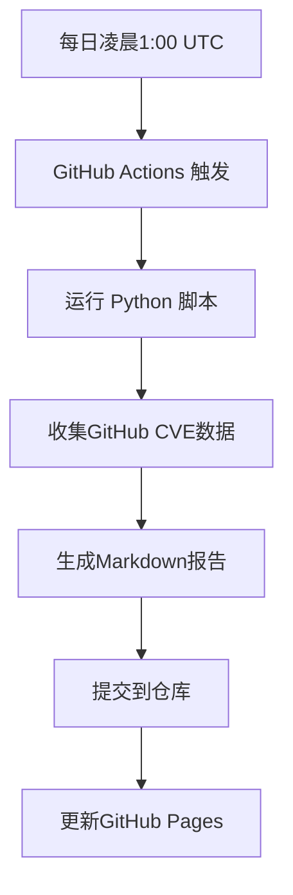

# 每日情报速递

> CVE 监控系统每日自动生成的安全情报报告

## 最新报告

### 2025年9月

#### Week 38

- 📅 [2025-09-23 每日报告](https://adminlove520.github.io/github_cve_monitor/Data/2025-W38-09-23/daily_20250923.md) - 最新
- 📅 [2025-09-22 每日报告](https://adminlove520.github.io/github_cve_monitor/Data/2025-W38-09-22/daily_20250922.md)

## 报告内容说明

每日报告包含以下信息：

### 📊 基本统计
- 生成时间
- 数据来源
- 总记录数
- 新增CVE数量

### 🔍 CVE详情
每个CVE条目包含：
- **CVE编号**: 官方CVE标识符
- **相关仓库**: GitHub上的POC/EXP仓库链接
- **描述**: 漏洞详细描述
- **日期**: 发现/更新日期

### 📈 数据格式
```markdown
| CVE | 相关仓库（poc/exp） | 描述 | 日期 |
|:---|:---|:---|:---|
| [CVE-YYYY-NNNNN](链接) | [仓库名](仓库链接) | 漏洞描述 | 日期时间 |
```

## 使用说明

1. **查看最新报告**: 点击上方最新日期的报告链接
2. **搜索特定CVE**: 使用浏览器的搜索功能 (Ctrl+F) 查找特定CVE编号
3. **导出数据**: 报告支持复制粘贴到其他文档
4. **订阅更新**: Watch 仓库以接收更新通知

## 自动化流程



## 数据来源

- **GitHub CVE数据库**: https://github.com/advisories
- **API限制**: 每小时5000次请求（使用Token认证）
- **数据范围**: 包含POC/EXP的CVE记录

---

💡 **提示**: 建议定期查看每日报告，及时了解最新的安全漏洞信息。